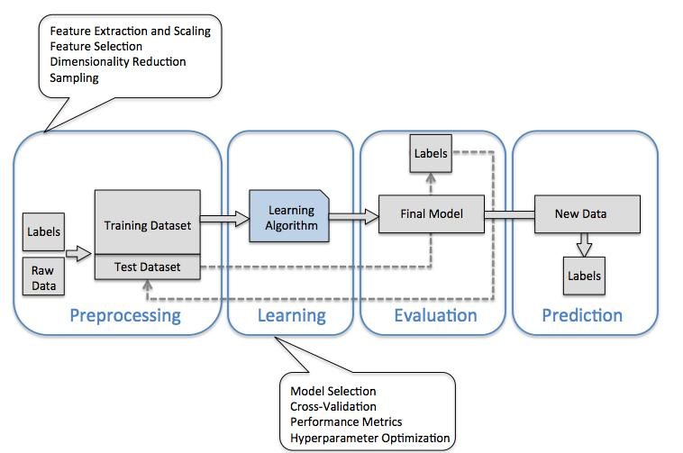

/*
Title: ML - Machine Learning
Decription: Machine Learning
Author: Bhaskar Mangal
Date:
Last Updated: 12th Jun 2018
Tags: Machine Leaning, ML, Machine Learning in Python
*/

# Machine Learning

## scikit-learn: machine learning in Python: `sklearn` python package
> scikit-learn: machine learning in Python

- Scikit-learn also implements a large variety of different performance metrics that are available via the metrics module. For example, we can calculate the classification accuracy of the perceptron on the test set
```python
from sklearn.cross_validation import train_test_split # deprecated and use model_selection module instead
from sklearn.model_selection import train_test_split
```
```python
from sklearn.metrics import accuracy_score
print('Accuracy: %.2f' % accuracy_score(y_test, y_pred))
#
# Here, y_test are the true class labels and y_pred are the class labels that we predicted previously
```

## sklearn
**scikit_learn_data**
* http://scikit-learn.org/stable/modules/generated/sklearn.datasets.get_data_home.html
- Return the path of the scikit-learn data dir: `sklearn.datasets.get_data_home`
- This folder is used by some large dataset loaders to avoid downloading the data several times
- By default the data dir is set to a folder named `scikit_learn_data` in the user home folder
- If the folder does not already exist, it is automatically created
- can be set by the `SCIKIT_LEARN_DATA` environment variable


### References
* ScipyLectures-simple.pdf
* [Check the Refresher in Python and related packages](https://github.com/mangalbhaskar/pragmatic-approach-4-learning-data-visualisation/blob/master/chapter-1/python-in-nutshell.md)
* [islr-book-notes (Introduction to Statistical Learning Using R)](https://github.com/mangalbhaskar/technotes/blob/master/islr-book-notes.md)

### Documentation
* http://scikit-learn.org

### Tutorials
* https://www.youtube.com/watch?v=r4bRUvvlaBw
* https://github.com/jakevdp/sklearn_tutorial

### Courses
* https://www.nvidia.co.uk/deep-learning-ai/education/

### What is machine learning?
- Machine Learning is about building programs with tunable parameters that are adjusted automatically so as to improve their behavior by adapting to previously seen data
- Machine Learning can be considered a subfield of Artificial Intelligence since those algorithms can be seen as building blocks to make computers learn to behave more intelligently by somehow generalizing rather that just storing and retrieving data items like a database system would do

**Two very simple machine learning tasks:**
1. First is a **classification** task
	- A classification algorithm may be used to draw a dividing boundary between the two clusters of points
2. Second is **regression** task
	- A simple best-fit line to a set of data
	- This is an example of fitting a model to data, but our focus here is that the model can make generalizations about new data

**data matrix**
- Machine learning algorithms implemented in scikit-learn expect data to be stored in a two-dimensional array or matrix
- arrays can be either numpy arrays, or in some cases `scipy.sparse` matrices
- The size of the array is expected to be `[n_samples, n_features]`
	* **n_samples**: The number of samples
		- each sample is an item to process (e.g. classify)
		- A sample can be a document
		- a picture
		- a sound
		- a video
		- an astronomical object
		- a row in database or CSV file
		- or whatever you can describe with a fixed set of quantitative traits
	* **n_features**: The number of features or distinct traits that can be used to describe each item in a quantitative manner
		- Features are generally real-valued
		- but may be boolean or discrete-valued in some cases
		- The number of features must be fixed in advance
		- there must be a fixed number of features for each sample
		- feature number `i` must be a similar kind of quantity for each sample
		- However it can be very high dimensional (e.g. millions of features) with most of them being zeros for a given sample. This is a case where scipy.sparse matrices can be useful, in that they are much more memory-efficient than numpy arrays
- `scikit-learn` is imported as `sklearn`
- http://www.scipy-lectures.org/packages/scikit-learn/auto_examples/plot_iris_scatter.html
```python
from sklearn.datasets import load_iris
iris = load_iris()
iris.feature_names
n_samples, n_features = iris.data.shape
#
# The information about the class of each sample is stored in the target attribute of the dataset:
iris.target
#
# The names of the classes are stored in the last attribute, namely target_names
iris.target_names
#
# This data is four-dimensional, but we can visualize two of the dimensions at a time using a scatter plot:
```
* scikit-learn already support multiclass classification by default via the One-vs.-Rest (OvR) method
* The Iris dataset contains the measurements of 150 iris flowers from three different species: Setosa, Versicolor, and Virginica
* Iris dataset, consisting of 150 samples and 4 features, can then be written as a 150 × 4 matrix $x \epsilon  R^{150*4}$
```python
from sklearn import datasets
datasets.load_iris()
#
from sklearn.model_selection import train_test_split
train_test_split(X, y, test_size=0.3, random_state=0)
#
from sklearn.preprocessing import StandardScaler
StandardScaler()
#
from sklearn.metrics import accuracy_score
accuracy_score(y_test, y_pred)
```


## Basic principles of machine learning with scikit-learn
- Every algorithm is exposed in scikit-learn via an **Estimator** object
- linear regression is: `sklearn.linear_model.LinearRegression`
- Estimator parameters: All the parameters of an estimator can be set when it is instantiated
```python
from sklearn.linear_model.LinearRegression import LinearRegression
import numpy as np
model = LinearRegression(normalize=True)
# LinearRegression(copy_X=True, fit_intercept=True, n_jobs=1, normalize=True)
x,y = np.array([0,1,2]), np.array([0,1,2])
X = x[:,np.newaxis]
model.fit(X,y)
model.coef_
```
- Fitting on data
- Estimated parameters:
	* When data is fitted with an estimator, parameters are estimated from the data at hand
	* All the estimated parameters are attributes of the estimator object ending by an underscore

## **Supervised Learning: Classification and regression**
- In Supervised Learning, we have a **dataset consisting of both features and labels**
- The **task is to construct an estimator** which is able to **predict the label of an object given the set of features**
- There is one or more unknown quantities associated with the object which needs to be determined from other observed quantities
- Supervised learning is further broken down into two categories:
	* **classification**
		- In classification, the **label is discrete**
		- K nearest neighbors (kNN) is one of the simplest learning strategies
			* given a new, unknown observation, look up in your reference database which ones have the closest features and assign the predominant class
```python
from sklearn.linear_model.LinearRegression import LinearRegression
model = LinearRegression(normalize=True)
model.fit
model.predict
#
from sklearn import neighbors
knn = neighbors.KNeighborsClassifier(n_neoghbors=1)
knn.fit
knn.predict
```
	* **regression**
		- In regression, the **label is continuous**

- **Scikit-learn strives to have a uniform interface across all methods.**
	- Given a scikit-learn estimator object named model , the following methods are available:
		* `model.fit`: fit training data
		* **For supervised learning** applications, this accepts two arguments: the **data** `X` and the **labels** `y`
		* **For unsupervised learning** applications, this accepts only a single argument, the **data** `X`
	```python
	model.fit(X,y)
	model.fit(X)
	```
	- In supervised estimators:
		* `model.predict`
			- given a trained model, predict the label of a new set of data
			- This method accepts one argument, the new data and returns the learned label for each object in the array
		* `model.predict_proba`
			- For classification problems, some estimators also provide this method
			- returns the probability that a new observation has each categorical label
		* `model.score`
			- For classification or regression problems
			- Scores are between 0 and 1
			- with a larger score indicating a better fit
	- In unsupervised estimators:
		* `model.transform`
			- given an unsupervised model, transform new data into the new basis
		* `model.fit_transform`
			- more efficiently performs a fit and a transform on the same input data

**Regularization: what it is and why it is necessary**
The core idea behind regularization is that we are going to **prefer models that are simpler**, for a certain definition of "simpler", even if they lead to more errors on the train set
* Train errors Suppose you are using a 1-nearest neighbor estimator. How many errors do you expect on your train set?
	- Train set error is not a good measurement of prediction performance. You need to leave out a test set
	- In general, we should accept errors on the train set
* Regularization is ubiquitous in machine learning
* Most scikit-learn estimators have a parameter to tune the amount of regularization
	- For instance, with k-NN, it is ‘k’, the number of nearest neighbors used to make the decision
	- k=1 amounts to no regularization: 0 error on the training set, whereas large k will push toward smoother decision boundaries in the feature space
* For classification models (linear separation, non-linear separation), the decision boundary, that separates the class expresses the complexity of the model. For instance, a linear model, that makes a decision based on a linear combination of features, is more complex than a non-linear one.

## **Estimators: Classifiers and Regressors**
**Properties**
- The classifier or regressor essentially “memorizes” all the samples it has already seen
- To really test how well this algorithm does, we need to try some samples it hasn’t yet seen

### **Classifier**
**Different classifiers**
* K-nearest neighbors: `from sklearn.neighbors import KNeighborsClassifier`
	- The K-neighbors classifier is an instance-based classifier
	- The K-neighbors classifier predicts the label of an unknown point based on the labels of the K nearest points in the parameter space
* Gaussian Naives: `from sklearn.naive_bayes import GaussianNB`
* support vectors machines: `from sklearn.svm import LinearSVC`

### **Regressor**
**Properties**

**Different regressors**
* LinearRegression is: `sklearn.linear_model.LinearRegression`
* GradientBoostingRegressor : `from sklearn.ensemble import GradientBoostingRegressor`
* DecisionTreeRegressor: `from sklearn.tree import DecisionTreeRegressor`
	- instance-based model named “decision tree”
* Regularized linear models: `from sklearn.linear_model import Ridge, Lasso`
	- Ridge Regression, which uses l2 regularlization
	- Lasso Regression, which uses l1 regularization

## **FAQs**
* **What is instance-based model named “decision tree”?**
	- https://en.wikipedia.org/wiki/Instance-based_learning
	- In machine learning, instance-based learning (sometimes called memory-based learning[1]) is a family of learning algorithms that, instead of performing explicit generalization, compares new problem instances with instances seen in training, which have been stored in memory.
	- Examples of instance-based learning algorithm are the k-nearest neighbor algorithm, kernel machines and RBF networks.[3]:ch. 8 These store (a subset of) their training set; when predicting a value/class for a new instance, they compute distances or similarities between this instance and the training instances to make a decision.
	- To battle the memory complexity of storing all training instances, as well as the risk of overfitting to noise in the training set, instance reduction algorithms have been proposed


* [how-to-list-all-attributes-of-sklearn-datasets-object](https://stackoverflow.com/questions/35105474/how-to-list-all-attributes-of-sklearn-datasets-object)
```python
from sklearn.datasets load_iris, load_digits
iris = load_iris()
iris.keys()
## ['target_names', 'data', 'target', 'DESCR', 'feature_names']
#
digits = load_digits()
digits.keys()
## ['images', 'data', 'target_names', 'DESCR', 'target']
```

## Case Studies

### 1. [Netflix_Prize](https://en.wikipedia.org/wiki/Netflix_Prize)

### 2. Iris: What kind of iris has 3cm x 5cm sepal and 4cm x 2cm petal?
```python
from sklearn.datasets load_iris
iris = load_iris()
iris.feature_names
n_samples, n_features = iris.data.shape
iris.target
iris.target_names
#
from sklearn import neighbors
X,y = iris.data, iris.target
knn = neighbors.KNeighborsClassifier(n_neoghbors=1)
knn.fit(X,y)
iris.target_names[knn.predict([[3,5,4,2]])]
#
# KNN - plot the decision boundaries for each class
```

### 3. [Supervised Learning: Classification of Handwritten Digits](http://www.scipy-lectures.org/packages/scikit-learn/auto_examples/plot_digits_simple_classif.html)

* Plot the first few samples of the digits dataset and a 2D representation built using PCA, then do a simple classification
* **Plot the data: images of digits**
```python
from sklearn.datasets import load_digits
digits = load_digits()
#
from matplotlib import pyplot as plt
fig = plt.figure(figsize=(6, 6))  # figure size in inches
fig.subplots_adjust(left=0, right=1, bottom=0, top=1, hspace=0.05, wspace=0.05)
#
for i in range(64):
  ax = fig.add_subplot(8, 8, i + 1, xticks=[], yticks=[])
  ax.imshow(digits.images[i], cmap=plt.cm.binary, interpolation='nearest')
  # label the image with the target value
  ax.text(0, 7, str(digits.target[i]))
plt.imshow()
```
*  **Visualizing the Data on its principal components**
	- A good first-step for many problems is to visualize the data using a **Dimensionality Reduction technique**
	- [Principal Component Analysis (PCA)](https://en.wikipedia.org/wiki/Principal_component_analysis)
	- PCA seeks orthogonal linear combinations of the features which show the greatest variance, and as such, can help give you a good idea of the structure of the data set
	- Plot a projection on the 2 first principal axis
```python
plt.figure()
from sklearn.decomposition import PCA
pca = PCA(n_components=2)
proj = pca.fit_transform(digits.data)
plt.scatter(proj[:, 0], proj[:, 1], c=digits.target, cmap="Paired")
plt.colorbar()
```
* **Classification**
	- For most classification problems, it’s nice to have a **simple**, **fast** method to provide a **quick baseline classification**
	- If the simple and fast method is sufficient, then we don’t have to waste CPU cycles on more complex models
	- If not, we can use the results of the simple method to give us clues about our data
	- One good method to keep in mind is Gaussian Naive Bayes: `sklearn.naive_bayes.GaussianNB`
		* Gaussian Naive Bayes fits a Gaussian distribution to each training label independantly on each feature, and uses this to quickly give a rough classification.
		* It is generally not sufficiently accurate for real-world data, but can perform surprisingly well, for instance on text data
	- **STEPS:**
		* split the data into training and validation sets
			- Why did we split the data into training and validation sets?
		* train the model
		* use the model to predict the labels of the test data
```python
from sklearn.naive_bayes import GaussianNB
from sklearn.model_selection import train_test_split
#
## split the data into training and validation sets
X_train, X_test, y_train, y_test = train_test_split(digits.data, digits.target)
#
## train the model
clf = GaussianNB()
clf.fit(X_train, y_train)
#
## use the model to predict the labels of the test data
predicted = clf.predict(X_test)
expected = y_test
#
## Plot the prediction
fig = plt.figure(figsize=(6, 6))  # figure size in inches
fig.subplots_adjust(left=0, right=1, bottom=0, top=1, hspace=0.05, wspace=0.05)
#
## plot the digits: each image is 8x8 pixels
for i in range(64):
    ax = fig.add_subplot(8, 8, i + 1, xticks=[], yticks=[])
    ax.imshow(X_test.reshape(-1, 8, 8)[i], cmap=plt.cm.binary,
              interpolation='nearest')
#
    ## label the image with the target value
    if predicted[i] == expected[i]:
        ax.text(0, 7, str(predicted[i]), color='green')
    else:
        ax.text(0, 7, str(predicted[i]), color='red')
```
* **Quantitative Measurement of Performance**
	- We’d like to measure the performance of our estimator without having to resort to plotting examples.
	- A simple method might be to simply compare the number of matches
	- there are other more sophisticated metrics that can be used to judge the performance of a classifier: several are available in the `sklearn.metrics` submodule
		* **classification_report**
			- One of the most useful metrics is the `sklearn.metrics.classification_report`
			- Which combines several measures and prints a table with the results
		* **confusion matrix**
			- Another enlightening metric **for this sort of multi-label classification** is a `sklearn.metrics.confusion_matrix`
			- It helps us visualize which labels are being interchanged in the classification errors
	- **STEPS:**
		1. First print the number of correct matches
		2. The total number of data points
		3. And now, the ration of correct predictions
		4. Print the classification report
		5. Print the confusion matrix
```python
# 1
matches = (predicted == expected)
print(matches.sum())
# 2
print(len(matches))
# 3
matches.sum() / float(len(matches))
#
# 4
from sklearn import metrics
print(metrics.classification_report(expected, predicted))
# 5
print(metrics.confusion_matrix(expected, predicted))
#
plt.show()
```

### 4. Supervised Learning: Regression of Housing Data
- regression problem: learning a continuous value from a set of features
- simple Boston house prices set, available in scikit-learn
- This records measurements of 13 attributes of housing markets around Boston, as well as the median price
- **can you predict the price of a new market given its attributes?**
- It often helps to **quickly visualize pieces of the data** using **histograms**, **scatter plots**, or **other plot types**
```python
from sklearn.datasets import load_boston
data = load_boston()
import matplotlib.pyplot as plt
plt.figure(figsize=(4, 3))
plt.hist(data.target)
plt.xlabel('price ($1000s)')
plt.ylabel('count')
plt.tight_layout()
```

**Feature Selection**
- Sometimes, in Machine Learning it is useful to use feature selection to decide which features are the most useful for a particular problem
- Automated methods exist which quantify this sort of exercise of choosing the most informative features

**Predicting Home Prices: a Simple Linear Regression**
- There are many possibilities of regressors to use
- A particularly simple one is **LinearRegression: this is basically a wrapper around an ordinary least squares calculation**

### 5. Diabetes dataset - Hyperparameter optimization with cross-validation
- The diabetes data consists of 10 physiological variables (age, sex, weight, blood pressure) measure on 442 patients, and an indication of
disease progression after one year: `from sklearn.datasets import load_diabetes`
```python
from sklearn.model_selection import cross_val_score
from sklearn.datasets import load_diabetes
data = load_diabetes()
data.keys()
X,y = data.data, data.target
print(X.shape)
print(y.shape)
#
# With the default hyper-parameters: we compute the cross-validation score:
#
from sklearn.linear_model import Ridge, Lasso
for Model in [Ridge, Lasso]:
	model = Model()
	print('%s %s' % (Model.__name__, cross_val_score(model, X, y).mean()))
```
**Basic Hyperparameter Optimization**
- compute the cross-validation score as a function of alpha, the strength of the regularization for Lasso and Ridge
- choose 20 values of alpha between 0.0001 and 1


## **Measuring prediction performance**
- The **averaged f1-score** is often used as a convenient measure of the overall performance of an algorithm. It appears in the bottom row of the classification report; it can also be accessed directly: `metrics.f1_score`
- **Regression metrics** In the case of regression models, we need to use different metrics, such as **explained variance**

### **Train-Test Split - Using a validation set: Avoiding Overfitting**
- Learning the parameters of a prediction function and testing it on the same data is a methodological mistake: a model that would just repeat the labels of the samples that it has just seen would have a perfect score but would fail to predict anything useful on yet-unseen data
- To avoid over-fitting, we have to define two different sets
	* a training set X_train, y_train which is used for learning the parameters of a predictive model
	* a testing set X_test, y_test which is used for evaluating the fitted predictive model
	* In scikit-learn such a random split can be quickly computed with the `sklearn.model_selection.train_test_split` function

### Model Selection via Validation
- different validation tools (estimators), eg: Gaussian Naives, support vectors machines, and K-nearest neighbors classifiers to the
digits dataset
* For KNeighborsClassifier we use n_neighbors between 1 and 10
* For LinearSVC , use loss='l2' and loss='l1'
* Note that GaussianNB does not have any adjustable hyperparameters

**hyperparameters** are the parameters set when you instantiate the classifier: for example, the n_neighbors in `clf = KNeighborsClassifier(n_neighbors=1)`

* **With the default hyper-parameters for each estimator, which gives the best f1 score on the validation set?**
* **For each classifier, which value for the hyperparameters gives the best results for the digits data?**

- When evaluating different settings (“hyperparameters”) for estimators, hyperparameters must be manually set for instance 'C' for an SVM: `clf = svm.SVC(kernel='linear', C=1).fit(X_train, y_train)`, there is still a risk of overfitting on the test set because the parameters can be tweaked until the estimator performs optimally
- To solve this problem, yet another part of the dataset can be held out as a so-called “validation set”: training proceeds on the training set, after which evaluation is done on the validation set, and when the experiment seems to be successful, final evaluation can be done on the test set
- However, by partitioning the available data into three sets, we drastically reduce the number of samples which can be used for learning the model, and the results can depend on a particular random choice for the pair of (train, validation) sets
- A solution to this problem is a procedure called **cross-validation (CV for short)**

### Cross-validation
- Cross-validation consists in repetively splitting the data in pairs of train and test sets, called **'folds'**
- Scikit-learn comes with a function to automatically compute score on all these folds.
- A test set should still be held out for final evaluation, but the validation set is no longer needed when doing CV.
- In the basic approach, called k-fold CV, the training set is split into k smaller sets (other approaches generally follow the same principles)
- There are different statategies:
	* **KFlod**: `from sklearn.model_selection import cross_val_score`
		- A model is trained using `k-1` of the folds as training data
		- the resulting model is validated on the remaining part of the data
			- i.e., it is used as a test set to compute a performance measure such as accuracy
			- The performance measure reported by k-fold cross-validation is then the average of the values computed in the loop
		- this is a major advantage in problem such as inverse inference where the number of samples is very small
	* **random splitting**: `from sklearn.model_selection import ShuffleSplit`
- http://scikit-learn.org/stable/modules/cross_validation.html#cross-validation-iterators
- http://scikit-learn.org/stable/modules/generated/sklearn.model_selection.KFold.html#sklearn.model_selection.KFold
- to use cross-validation is to **call the `cross_val_score` helper function on the estimator and the dataset**
- mean score and confidance (standard deviation) to be calculated from score array
- By default, the score computed at each CV iteration is the score method of the estimator. It is possible to change this by using the scoring parameter
```python
from sklearn.model_selection import cross_val_score
from sklearn.datasets import load_iris
from sklearn import svm
iris = load_iris()
clf = svm.SVC(kernel='linear', C=1)
scores = cross_val_score(clf, iris.data, iris.target, cv=5)
scores
print("Accuracy: %0.2f (+/- %0.2f)" % (scores.mean(), scores.std() * 2))
scores = cross_val_score(clf, iris.data, iris.target, cv=5, scoring='f1_macro')
```
- http://scikit-learn.org/stable/modules/model_evaluation.html#scoring-parameter
- It is also possible to use other cross validation strategies by passing a cross validation iterator instead, ex: `sklearn.model_selection.ShuffleSplit`
```python
from sklearn.model_selection import ShuffleSplit
n_samples = iris.data.shape[0]
cv = ShuffleSplit(n_splits=3, test_size=0.3, random_state=0)
cross_val_score(clf, iris.data, iris.target, cv=cv)
```


### Hyperparameter optimization with cross-validation

**Regularized linear models**
- `sklearn.linear_model.Ridge`, `sklearn.linear_model.Lasso`

**Automatically Performing Grid Search**
- `GridSearchCV` is constructed with an estimator, as well as a dictionary of parameter values to be searched `fsklearn.grid_search.GridSearchCV`
- `gscv = GridSearchCV(Model(), dict(alpha=alphas), cv=3).fit(X, y)`

**Built-in Hyperparameter Search**
- For some models within scikit-learn, cross-validation can be performed more efficiently on large datasets
- In this case, a cross-validated version of the particular model is included: `sklearn.linear_model.RidgeCV`, `sklearn.linear_model.LassoCV`
- Parameter search on these estimators can be performed as: `model = Model(alphas=alphas, cv=3).fit(X, y) # Model.__name__, model.alpha_`

**Nested cross-validation**
- How do we measure the performance of these estimators?
- We have used data to set the hyperparameters, so we need to test on actually new data. We can do this by running cross_val_score() on our CV objects.
- Here there are 2 cross-validation loops going on, this is called ‘nested cross validation’
- `scores = cross_val_score(Model(alphas=alphas, cv=3), X, y, cv=3)`
- setting the hyper-parameter is harder for Lasso, thus the estimation error on this hyper-parameter is larger

## Unsupervised Learning: Dimensionality Reduction and Visualization
- Unsupervised learning is applied on X without y: data without labels
- A typical use case is to find hidden structure in the data

### Dimensionality Reduction
**Principal Component Analysis (PCA)**
	- a dimensionality reduction that strives to retain most of the variance of the original data
	- http://scikit-learn.org/stable/modules/generated/sklearn.decomposition.PCA.html#sklearn.decomposition.PCA
	- PCA computes linear combinations of the original features using a truncated Singular Value Decomposition of the matrix X, to project the data onto a base of the top singular vectors
	- PCA normalizes and whitens the data, which means that the data is now centered on both components with unit variance
	- `sklearn.decomposition.PCA`
```python
from sklearn.decomposition import PCA
from sklearn.datasets load_iris
iris = load_iris()
pca = PCA(n_components=2, whiten=True)
X = iris.data
y = iris.target
pca.fit(X)
pca.components_
# find out more about pcca and all other attributes to it
help(pca)
#
# project the iris dataset along those first two dimensions
X_pca = pca.transform(X)
X_pca.shape
```
- Furthermore, the samples components do no longer carry any linear correlation:
- With a number of retained components 2 or 3, PCA is useful to visualize the dataset:
- http://www.scipy-lectures.org/packages/scikit-learn/auto_examples/plot_pca.html
```python
import numpy as np
np.corrcoef(X_pca.T)
#
target_ids = range(len(iris.target_names))
from matplotlib import pyplot as plt
plt.figure(figsize=(6, 5))
for i, c, label in zip(target_ids, 'rgbcmykw', iris.target_names):
	plt.scatter(X_pca[y == i, 0], X_pca[y == i, 1], c=c, label=label)
plt.legend()
plt.show()
```
- this projection was determined without any information about the labels (represented by the colors): this is the sense in which the learning is unsupervised
- the projection gives us insight into the distribution

**Visualization with a non-linear embedding: tSNE**
- http://scikit-learn.org/stable/modules/generated/sklearn.manifold.TSNE.html#sklearn.manifold.TSNE
- `sklearn.manifold.TSNE`
- tSNE is often a good solution, as it groups and separates data points based on their local relationship.
- As TSNE cannot be applied to new data, we need to use its fit_transform method
```python
#
# Load the iris data
#
from sklearn import datasets
digits = datasets.load_digits()
#
# Take the first 500 data points: it's hard to see 1500 points
#
X = digits.data[:500]
y = digits.target[:500]
#
# Fit and transform with a TSNE
#
from sklearn.manifold import TSNE
tsne = TSNE(n_components=2, random_state=0)
#
# Project the data in 2D
#
X_2d = tsne.fit_transform(X)
#
# Visualize the data
#
target_ids = range(len(digits.target_names))
from matplotlib import pyplot as plt
plt.figure(figsize=(6, 5))
colors = 'r', 'g', 'b', 'c', 'm', 'y', 'k', 'w', 'orange', 'purple'
for i, c, label in zip(target_ids, colors, digits.target_names):
    plt.scatter(X_2d[y == i, 0], X_2d[y == i, 1], c=c, label=label)
plt.legend()
plt.show()
```
- `sklearn.manifold.TSNE` separates quite well the different classes of digits eventhough it had no access to the class information
- `sklearn.manifold` has many other non-linear embeddings
- http://scikit-learn.org/stable/modules/classes.html#module-sklearn.manifold

**The eigenfaces example: chaining PCA and SVMs**
Show how an unsupervised method and a supervised one can be chained for better prediction!
- http://scikit-learn.org/stable/modules/generated/sklearn.datasets.fetch_lfw_people.html#sklearn.datasets.fetch_lfw_people
- http://vis-www.cs.umass.edu/lfw/

## Case Studies

### Simple Facial Recognition Example - LFW dataset
> The eigenfaces example: chaining PCA and SVMs
**Preprocessing: Principal Component Analysis**
- LFW dataset: `sklearn.datasets.fetch_lfw_people`, Subset of LFW: `sklearn.datasets.fetch_olivetti_faces`
- downloading Olivetti faces from http://cs.nyu.edu/~roweis/data/olivettifaces.mat to `/home/bhaskar/scikit_learn_data`
- faces have already been localized and scaled to a common size. This is an important preprocessing piece for facial recognition, and is a process that can require a large collection of training data
- This can be done in scikit-learn, but the challenge is gathering a sufficient amount of training data for the
algorithm to work
- Fortunately, this piece is common enough that it has been done. One good resource is OpenCV, the Open Computer Vision Library

* **perform a Support Vector classification of the images with train-test split on the images**
	- load data and visualize images
	- split data into train and test set
	- Preprocessing: Principal Component Analysis
		* 1850 dimensions is a lot for SVM
		* use PCA to reduce these 1850 features to a manageable size, while maintaining most of the information in the dataset.
		* One interesting part of PCA is that it computes the “mean” face, which can be interesting to examine
```python
from sklearn import datasets
faces = datasets.fetch_olivetti_faces()
faces.data.shape
#
# vissualize faces
from matplotlib import pyplot as plt
fig = plt.figure(figsize=(8, 6))
# plot several images
for i in range(15):
ax = fig.add_subplot(3, 5, i + 1, xticks=[], yticks=[])
ax.imshow(faces.images[i], cmap=plt.cm.bone)
#
# train-test split on the images*
from sklearn.model_selection import train_test_split
X_train, X_test, y_train, y_test = train_test_split(faces.data, faces.target, random_state=0)
```
**Doing the Learning: Support Vector Machines**
- we’ll perform support-vector-machine classification on this reduced dataset
```python
# perform support-vector-machine classification on this reduced dataset
from sklearn import svm
clf = svm.SVC(C=5., gamma=0.001)
clf.fit(X_train_pca, y_train)
#
# can evaluate how well this classification did
import numpy as np
fig = plt.figure(figsize=(8, 6))
for i in range(15):
	ax = fig.add_subplot(3, 5, i + 1, xticks=[], yticks=[])
	ax.imshow(faces.images[i], cmap=plt.cm.bone)
#
from sklearn.model_selection import train_test_split
X_train, X_test, y_train, y_test = train_test_split(faces.data,
faces.target, random_state=0)
from sklearn import decomposition
pca = decomposition.PCA(n_components=150, whiten=True)
pca.fit(X_train)
plt.imshow(pca.mean_.reshape(faces.images[0].shape),cmap=plt.cm.bone)
#
fig = plt.figure(figsize=(16, 6))
for i in range(30):
	ax = fig.add_subplot(3, 10, i + 1, xticks=[], yticks=[])
	ax.imshow(pca.components_[i].reshape(faces.images[0].shape),cmap=plt.cm.bone)
X_train_pca = pca.transform(X_train)
X_test_pca = pca.transform(X_test)
print(X_train_pca.shape)
#
from sklearn import svm
clf = svm.SVC(C=5., gamma=0.001)
clf.fit(X_train_pca, y_train)
import numpy as np
fig = plt.figure(figsize=(8, 6))
for i in range(15):
	ax = fig.add_subplot(3, 5, i + 1, xticks=[], yticks=[])
	ax.imshow(X_test[i].reshape(faces.images[0].shape),cmap=plt.cm.bone)
	y_pred = clf.predict(X_test_pca[i, np.newaxis])[0]
	color = ('black' if y_pred == y_test[i] else 'red')
	ax.set_title(faces.target[y_pred],fontsize='small', color=color)
#
from sklearn import metrics
y_pred = clf.predict(X_test_pca)
print(metrics.classification_report(y_test, y_pred))
cm = metrics.confusion_matrix(y_test, y_pred)
print(cm)
import numpy as np
np.diag(cm)
```
- quantify this effectiveness using one of several measures from `sklearn.metrics`
- first we can do the classification report, which shows the precision: `metrics.classification_report(y_test, y_pred)`
- confusion matrix, which indicates how often any two items are mixed-up: `metrics.confusion_matrix(y_test, y_pred)`
- The confusion matrix of a perfect classifier would only have nonzero entries on the diagonal, with zeros on the off-diagonal: `np.diag(cm)`
**Pipelining**
- Above we used PCA as a pre-processing step before applying our support vector machine classifier.
- Plugging the output of one estimator directly into the input of a second estimator is a commonly used pattern; for this reason scikit-learn provides a **Pipeline object which automates this process**
```python
from sklearn.pipeline import Pipeline
clf = Pipeline([('pca', decomposition.PCA(n_components=150, whiten=True)), ('svm', svm.LinearSVC(C=1.0))])
clf.fit(X_train, y_train)
y_pred = clf.predict(X_test)
cm = metrics.confusion_matrix(y_pred, y_test)
print(cm)
import numpy as np
np.diag(cm)
```

## Parameter selection, Validation, and Testing
**Hyperparameters, Over-fitting, and Under-fitting**
- Selecting the optimal model for your data is vital
- If our estimator is underperforming, how should we move forward?
	- Use simpler or more complicated model?
	- Add more features to each observed data point?
	- Add more training samples?
- In particular, Sometimes using a more complicated model will give worse results
- Sometimes adding training data will not improve your results
- Given a particular dataset and a model (e.g. a polynomial), we’d like to understand whether bias (underfit) or variance limits prediction, and how to tune the hyperparameter (here d , the degree of the polynomial) to give the best fit.
- **The ability to determine what steps will improve your model is what separates the successful machine learning practitioners from the unsuccessful**

**Bias-variance trade-off**
- what matters is choosing the tradeoff between bias and variance that leads to the best prediction performance
- Visualizing the Bias/Variance Tradeof
- The model too simplistic: no straight line will ever be a good fit to this data. In this case, we say that the model suffers from high bias
- Under-fit: The model itself is biased, and this will be reflected in the fact that the data is poorly fit
- Over-fit: he model has too many free parameters which can be adjusted to perfectly fit the training data
- The reason for the term “high variance” is that if any of the input points are varied slightly, it could result in a very different model
- What we would like is a way to quantitatively identify bias and variance, and optimize the metaparameters (in this case, the polynomial degree d) in order to determine the best algorithm
- A polynomial regression is built by pipelining `PolynomialFeatures` and a `LinearRegression`
- http://www.scipy-lectures.org/packages/scikit-learn/auto_examples/plot_bias_variance.html
```python
from sklearn.pipeline import make_pipeline
from sklearn.preprocessing import PolynomialFeatures
from sklearn.linear_model import LinearRegression
model = make_pipeline(PolynomialFeatures(degree=2), LinearRegression())
```
**Validation curve**
- A validation curve consists in varying a model parameter that controls its complexity (here the degree of the polynomial) and measures both error of the model on training data, and on test data (eg with cross-validation)
- The model parameter is then adjusted so that the test error is minimized
- `sklearn.model_selection.validation_curve()` to compute train and test error, and plot it
```python
plt.plot(degrees, validation_scores.mean(axis=1), label='cross-validation')
plt.plot(degrees, train_scores.mean(axis=1), label='training')
```
**Learning curves**
- http://scikit-learn.org/stable/modules/generated/sklearn.model_selection.learning_curve.html#sklearn.model_selection.learning_curve
- how can you determine for a given model whether more training points will be helpful?
- As a general rule of thumb, the more training points used, the more complicated model can be used.
- But how can you determine for a given model whether more training points will be helpful?
- A useful diagnostic for this are learning curves
- A learning curve shows the training and validation score as a function of the number of training points
- when we train on a subset of the training data, the training score is computed using this subset, not the full training set
- **This curve gives a quantitative view into how beneficial it will be to add training samples**
- Questions:
	* As the number of training samples are increased, what do you expect to see for the training score? For the validation score?
	* Would you expect the training score to be higher or lower than the validation score? Would you ever expect this to change?
- `sklearn.model_selection.learning_curve()`
- Plot the mean train score and validation score across folds
- the validation score generally increases with a growing training set, while the training score generally decreases with a growing training set

**High-bias (i.e. underfit) model**
- **When the learning curves have converged to a low score, we have a high bias model**
- As the training size increases, they will converge to a single value
- Increasing the number of samples, however, does not improve a high-bias model
- **A high-bias model can be improved by:**
	* Add more features
		- Gather more features for each sample
		- Adding features to the training and test sets can improve a high-bias estimator
	* Use a more sophisticated model
		- Adding complexity to the model can help improve on bias
		- For a polynomial fit, this can be accomplished by increasing the degree d
		- Each learning technique has its own methods of adding complexity
	* Use fewer samples
		- this will not improve the classification
		- a high-bias algorithm can attain nearly the same error with a smaller training sample
		- reducing the training sample size can lead to very large improvements in speed
	* Decrease regularization
		- Decrease regularization in a regularized model
		- Decreasing the effect of regularization can lead to better results
		- Regularization is a technique used to impose simplicity in some machine learning models, by adding a penalty term that depends on the characteristics of the parameters

**High-variance (i.e. over-fit) model**
- **A high-variance model can be improved by:**
	* Use fewer features
		- Using a feature selection technique may be useful, and decrease the over-fitting of the estimator
	* Use a simpler model
		- Model complexity and over-fitting go hand-in-hand
	* Use more training samples
		- Adding training samples can reduce the effect of over-fitting, and lead to improvements in a high variance estimator
	* Increase Regularization
		- Regularization is designed to prevent over-fitting. In a high-variance model, increasing regularization can lead to better results

- These choices become very important in real-world situations
- Determining which is more important for a particular learning task can inform the observing strategy that the practinioner should employ

**Separate validation and test set**
- Using validation schemes to determine hyper-parameters means that we are fitting the hyper-parameters to the particular validation set
- In the same way that parameters can be over-fit to the training set, hyperparameters can be over-fit to the validation set
- Because of this, the validation error tends to under-predict the classification error of new data
- For this reason, it is recommended to split the data into three sets:
	* The training set, used to train the model (usually ~60% of the data)
	* The validation set, used to validate the model (usually ~20% of the data)
	* The test set, used to evaluate the expected error of the validated model (usually ~20% of the data)
- If your goal is to gauge the error of a model on unknown data, using an independent test set is vital

## Scikit-Lear ML Datasets and Code Examples
- http://scikit-learn.org/stable/datasets/mldata.html
- http://ai.stanford.edu/~amaas/data/sentiment/
- https://github.com/amueller/introduction_to_ml_with_python


# SzeliskiBook_20100903_draft.pdf
- http://szeliski.org/Book/
- https://homes.cs.washington.edu/~seitz/
- https://www.microsoft.com/en-us/research/research-area/computer-vision/

## Recognition

1. Introduce a number of machine-learning techniques such as:
	-boosting
	- neural networks
	- support vector machines
2. study face recognition
	- Introduction to approaches to recognition and classification:
		* PCA (subspace approaches) models
		* Bayesian
3. Instance recognition
	- i.e., the re-recognition of known objects such as locations or planar objects, is the other most successful application of general image recognition
	- based on feature detection, matching, and geometric alignment
	- In the general domain of biometrics, i.e., identity recognition, specialized images such as irises and fingerprints perform even better

* applications in information and document retrieval
	- concepts: frequency vectors, feature quantization, and inverted indices
* applications of location recognition
* most challenging variant of recognition, namely the problem of category recognition
	- approaches that use bags of features, parts and segmentation
* automate photo editing tasks
	- how to automate photo editing tasks, such as 3D modeling, scene completion, and creating collages

## Pre-processing Images and Why?
1. subtracting an average gradient (linear function) from the image
	- to compensate for global shading effects
2. histogram equalization
	- to compensate for varying camera contrast
3. Augmentation the images by small amounts
	- to make the detectors less sensitive to such effects
	- by artificially mirroring
	- rotating
	- scaling
	- and, translating

## Face Detection
- Face detectors, which are some of the more successful examples of recognition.
- For example, such algorithms are built into most of today’s digital cameras to enhance auto-focus and into video conferencing systems to control pan-tilt heads
- face detection techniques can be classified as
	* feature-based
		- attempt to find the locations of distinctive image features such as the eyes, nose, and mouth, and then verify whether these features are in a plausible geometrical arrangement
		- include some of the early approaches to face recognition
		- also include more recent approaches based on:
			* modular eigenspaces
			* local filter jets
			* support vector machines
			* boosting
	* template-based
		- can deal with a wide range of pose and expression variability
		- they require good initialization near a real face and are therefore not suitable as fast face detectors
		- approaches includes:
			* active appearance models (AAMs)
	* appearance-based
		- scan over small overlapping rectangular patches of the image searching for likely face candidates, which can then be refined using a cascade of more expensive but selective detection algorithms
		- In order to deal with scale variation, the image is usually converted into a sub-octave pyramid and a separate scan is performed on each level
		- Most appearance-based approaches today rely heavily on training classifiers using sets of labeled face and non-face patches

**After Pre-processing**
* Clustering and PCA
* Neural networks
* Support vector machines
	- Instead of using a neural network to classify patches one can use a support vector machine (SVM)
	- An SVM searches for a series of maximum margin separating planes in feature space between different classes (in face-detector case, face and non-face patches)
	- In those cases where linear classification boundaries are insufficient, the feature space can be lifted into higher-dimensional features using kernels
	- SVMs have been used by other researchers for both face detection and face recognition
* Boosting
	- Viola and Jones (2004)
	- This technique involves training a series of increasingly discriminating simple classifiers and then blending their outputs
	- boosting involves constructing a classifier h(x) as a sum of simple weak learners where each of the weak learners h j (x) is an extremely simple function of the input, and hence is not expected to contribute much (in isolation) to the classification performance
	- the weak learners are threshold functions which are also known as decision stumps (basically, the simplest possible version of decision trees)

## Face Recognition
- Their ability to distinguish among a small number of family members and friends has found its way into consumer-level photo applications, such as:
	* Picasa and iPhoto,
	* desktop login
	* parental controls
	* patient monitoring
- Face recognition can also be used in a variety of additional applications, including human–computer interaction (HCI), identity verification
- earliest approaches to face recognition involved finding the locations of distinctive image features, such as the eyes, nose, and mouth, and measuring the distances between these feature locations
- recent approaches rely on comparing gray-level images projected onto lower dimensional subspaces called **eigenfaces** and jointly modeling shape and appearance variations (while discounting pose variations) using active appearance models

**Eigenfaces**
- an arbitrary face image x can be compressed and reconstructed by starting with a mean image m, and adding a small number of scaled signed images u i, where the signed basis images can be derived from an ensemble of training images using principal component analysis (also known as eigenvalue analysis or the Karhunen–Loève transform)
- that facial appearance and identifiability depend as much on shape as they do on color or texture (which is what eigenfaces capture)


**Active Appearance Models (AAMs)**
- the most widely used for face recognition and tracking
- an AAM models both the variation in the shape of an image s, which is normally encoded by the location of key feature points on the image where the eigenvectors in U s and U t have been pre-scaled (whitened) so that unit vectors in a represent one standard deviation of variation observed in the training dat

## Pedestrian Detection
- example of more general methods for object detection
- Such detectors can be used in automotive safety applications, e.g., detecting pedestrians and other cars from moving vehicles
- techniques:
	- overlapping histogram of oriented gradients (HOG) descriptors fed into a support vector machine
	- non-overlapping multi-resolution HOG descriptors and a histogram intersection kernel SVM based on a spatial pyramid match kernel
- When video sequences are available, the additional information present in the optic flow and motion discontinuities can greatly aid in the detection task

## Cars Detection

## Instance Recognition
- Instance recognition techniques are relatively mature and are used in commercial applications
- General object recognition falls into two broad categories:
	* Instance recognition
		- involves re-recognizing a known 2D or 3D rigid object, potentially being viewed from a novel viewpoint, against a cluttered background, and with partial occlusions
	* Class recognition / Category-level / Generic object recognition
		- is the much more challenging problem of recognizing any instance of a particular general class such as “cat”, “car”, or “bicycle”
- many different algorithms have been developed for instance recognition
- earlier approaches, which focused on extracting lines, contours, or 3D surfaces from images and matching them to known 3D object models
- Another popular approach was to acquire images from a large set of viewpoints and illuminations and to represent them using an eigenspace decomposition
- More recent approaches to use viewpoint-invariant 2D features, after extracting informative sparse 2D features from both the new image and the images in the database, image features are matched against the object database, using one of the sparse feature matching strategies. Whenever a sufficient number of matches have been found, they are verified by finding a geometric transformation that aligns the two sets of features. Some of the techniques that have been proposed for representing the geometric relationships between such features:-
	* Geometric alignment
	* Large databases
- how to make the feature matching process more efficient using ideas from text and information retrieval


**Application: Location recognition**
- large-scale image matching and (implicit) location recognition
- where did I take this holiday snap?
- not only finding out your current location based on a cell-phone image but also providing you with navigation directions or annotating your images with useful information, such as building names and restaurant reviews (i.e., a portable form of augmented reality).
- approaches to location recognition:
	* some assume that the photos consist of architectural scenes for which vanishing directions can be used to pre-rectify the images for easier matching
	* others, use general affine covariant interest points to perform wide baseline matching

**Application: automatic discovery of landmarks**
- Another variant on location recognition is the automatic discovery of landmarks, i.e., frequently photographed objects and locations
	* these kinds of objects can be discovered simply by analyzing the matching graph constructed as part of the 3D modeling process in Photo Tourism
	* extended this approach to larger data sets using efficient clustering techniques as well as combining meta-data such as GPS and textual tags with visual search

**Application:Automatic mining, annotation, and localization of community photo collection**
- It is now even possible to automatically associate object tags with images based on their co-occurrence in multiple loosely tagged images
- visual category recognition is an extremely challenging problem; no one has yet constructed a system that approaches the performance level of a two-year-old child

## Category recognition
- Generic category (class) recognition is still a largely unsolved problem

**Number of approaches to solving category recognition:**
- While historically, part-based representations and recognition algorithms were the preferred approach
- We begin by describing simpler bag-of-features approaches that represent objects and images as unordered collections of feature descriptors
- We then look at the problem of simultaneously segmenting images while recognizing objects and also present some applications of such techniques to photo manipulation
- We look at how context and scene understanding, as well as machine learning, can improve overall recognition results

### 1. Bag of words
- One of the simplest algorithms for category recognition is the bag of words (also known as bag of features or bag of keypoints) approach
- this algorithm simply computes the distribution (histogram) of visual words found in the query image and compares this distribution to those found in the training images
- A typical processing pipeline for a bag-of-words category recognition system:
	* Features are first extracted at keypoints and then quantized to get a distribution (histogram) over the learned visual words(feature cluster centers)
	* The feature distribution histogram is used to learn a decision surface using a classification algorithm, such as a support vector machine.
	* Steps:
		1. key-patch detection
		2. Feature Extraction
		3. Histogram Computation
		4. Classification

**Feature Detectors**
- Harris–Laplace
- Laplacian
- descriptors (SIFT, RIFT, and SPIN)
- SVM kernel functions

**Types of Feature Descriptors**
- quantized feature descriptors or continuous descriptors

**Characteristics of different pipelines**
- The debate about whether to use quantized feature descriptors or continuous descriptors and also whether to use sparse or dense features continues to this day.
- If query images are compared to all the features representing a given class, rather than just each class image individually, nearest-neighbor matching followed by a naı̈ve Bayes classifier outperforms quantized visual words
- Instead of using generic feature detectors and descriptors, some authors have been investigating learning class-specific features often using randomized forests or combining the feature generation and image classification stages
- Some used hierarchies of dense feature transforms inspired by biological (visual cortical) processing combined with SVMs for final classification

### 2. Part-based models
- Recognizing an object by finding its constituent parts and measuring their geometric relationships is one of the oldest approaches to object recognition
- part-based approaches being used for face recognition and pedestrian detection

**central issues in part-based recognition**
- the representation of geometric relationships
- the representation of individual parts
- algorithms for learning such descriptions and recognizing them at run time

- The earliest approaches to representing geometric relationships were dubbed pictorial structures and consisted of spring-like connections between different feature locations
- To fit a pictorial structure to an image, an energy function is minimized over all potential part locations or poses {l i } and pairs of parts (i, j) for which an edge (geometric relationship) exists in E
- This energy is closely related to that used with Markov random fields which can be used to embed pictorial structures in a probabilistic framework that makes parameter learning easier
- Part-based models can have different topologies for the geometric connections between the parts

A large number of different graphical models have been proposed for part-based recognition:
- simplest model is **bag of words** where there are no geometric relationships between the different parts or features
- trees and start
- Directed acyclic graphs
- sparse field flexible model
- k-fans
- Fully connected constellation models
- Simultaneous learning of appearance and shape models from scale-invariant keypoint detections
- The part-based approach to recognition has also been extended to learning new categories from small numbers of examples, building on recognition components developed for other classes
- More complex hierarchical part-based models can be developed using the concept of grammars

### 3. Recognition with segmentation
- The most challenging version of generic object recognition is to simultaneously perform recognition with accurate boundary segmentation
- This can sometimes be achieved by backprojecting the object model into the scene or matching portions of the new scene to pre-learned (segmented) object models
- For more complex (flexible) object models, such as those for humans a different approach is to pre-segment the image into larger or smaller pieces and then match such pieces to portions of the model
- An alternative approach is to votes for potential object locations and scales based on the detection of features corresponding to pre-clustered visual codebook entries. To support segmentation, each codebook entry has an associated foreground–background mask, which is learned as part of the codebook clustering process from pre-labeled object segmentation masks. During recognition, once a maximum in the voting space is found, the masks associated with the entries that voted for this instance are combined to obtain an object segmentation
- A more holistic approach to recognition and segmentation is to formulate the problem as one of labeling every pixel in an image with its class membership, and to solve this problem using energy minimization or Bayesian inference techniques, i.e., conditional random fields
- The **TextonBoost** system uses unary (pixel-wise) potentials based on image-specific color distributions, location information (e.g., foreground objects are more likely to be in the middle of the image, sky is likely to be higher, and road is likely to be lower), and novel texture-layout classifiers trained using shared boosting. It also uses traditional pairwise potentials that look at image color gradients. The texton-layout features first filter the image with a series of 17 oriented filter banks and then cluster the responses to classify each pixel into 30 different texton classes. The responses are then filtered using offset rectangular regions trained with joint boosting to produce the texton-layout features used as unary potentials.
- The TextonBoost conditional random field framework has been extended to **LayoutCRFs**
- **LayoutCRFs** incorporated additional constraints to recognize multiple object instances and deal with occlusions, futher to incorporate full 3D models
- **Conditional random fields** continue to be widely used and extended for **simultaneous recognition and segmentation applications**

**Application: Intelligent photo editing**
- Photo Clip Art system which recognizes and segments objects of interest, such as pedestrians, in Internet photo collections and then allows users to paste them into their own photos
- Another is the scene completion system which tackles the same inpainting problem
	* Given an image in which we wish to erase and fill in a large section where do you get the pixels to fill in the gaps in the edited image?
	* Traditional approaches either use smooth continuation
	* or borrowing pixels from other parts of the image
	* With the advent of huge repositories of images on the Web it often makes more sense to find a different image to serve as the source of the missing pixels
	* compute the gist of each image to find images with similar colors and composition. They then run a graph cut algorithm that minimizes image gradient differences and composite the new replacement piece into the original image using Poisson image blending

**Application: Infer 3D structure from a single photo**
- A different application of image recognition and segmentation is to infer 3D structure from a single photo by recognizing certain scene structures
- Example: detect vanishing points and have the user draw basic structures, such as walls, in order infer the 3D geometry
- uses a variety of classifiers and statistics learned from labeled images to classify each pixel as either ground, vertical, or sky. To do this, they begin by computing superpixels and then group them into plausible regions that are likely to share similar geometric labels. After all the pixels have been labeled, the boundaries between the vertical and ground pixels can be used to infer 3D lines along which the image can be folded into a “pop-up” (after removing the sky pixels)
- Face detection and localization can also be used in a variety of photo editing applications:
	* to being used in-camera to provide better focus, exposure, and flash settings
	* to register facial features for creating automated morphs
	* use face and sky detection to determine regions of interest in order to decide which pieces from a collection of images to stitch into a collage
	* to matche a given face image to a large collection of Internet face images, which can then be used (with careful relighting algorithms) to replace the face in the original image
	* de-identification and getting the best possible smile from everyone in a “burst mode” group shot
	* “beautifying” the image without completely losing a person’s identity: accurately locating facial features using an active shape model can be used to warp such features (and hence the image) towards configurations resembling those found in images whose facial attractiveness was highly rated
- Most of these techniques rely either on a set of labeled training images, which is an essential component of all learning techniques, or the even more recent explosion in images available on the Internet
- In "computational photography", speech recognition, synthesis, and translation - “simple machine learning algorithms often
outperform more sophisticated ones if trained on large enough databases.”


## Context and scene understanding
- we have mostly considered the task of recognizing and localizing objects in isolation from that of understanding the scene (context) in which the object occur. This is a severe limitation, as context plays a very important role in human object recognition
- context can greatly improve the performance of object recognition algorithms as well as providing useful semantic clues for general scene understanding
- A simple way to incorporate spatial information into a recognition algorithm is to compute feature statistics over different regions, as in the spatial pyramid system use a kind of local context, where various parts need to be arranged in a proper geometric relationship to constitute an object
- The biggest difference between part-based and context models is that the latter combine objects into scenes and the number of constituent objects from each class is not known in advance
- It is possible to combine part-based and context models into the same recognition architecture
- If we have enough training images with labeled regions, such as buildings, cars, and roads or monitors, keyboards, and mice, we can develop a geometric model for describing their relative positions
- **Two-level constellation model**
	* At the top level, the distributions of objects relative to each other (say, buildings with respect to cars) is modeled as a Gaussian
	* At the bottom level, the distribution of parts (affine covariant features) with respect to the object center is modeled using a mixture of Gaussians
	* since the number of objects in the scene and parts in each object is unknown, a latent Dirichlet process (LDP) is used to model object and part creation in a generative framework
	* The distributions for all of the objects and parts are learned from a large labeled database and then later used during inference (recognition) to label the elements of a scene
- Another example of context is in simultaneous segmentation and recognition, where the arrangements of various objects in a scene are used as part of the labeling process
	* a conditional random field where the estimated locations of building and roads influence the detection of cars, and where boosting is used to learn the structure of the CRF
	* Further, use context to improve the results of CRF segmentation by noting that certain adjacencies (relationships) are more likely than others, e.g., a person is more likely to be on a horse than on a dog.
- 3D inference from single images using computer vision techniques for labeling pixels as belonging to the ground, vertical
surfaces, or sky
- A number of approaches use the gist of a scene to determine where instances of particular objects are likely to occur.
	* For example, train a regressor to predict the vertical locations of objects such as pedestrians, cars, and buildings (or screens and keyboard for indoor office scenes) based on the gist of an image.
	* These location distributions are then used with classic object detectors to improve the performance of the detectors.
	* Gists can also be used to directly match complete images

### Learning and large image collections
> Influence of large image databases on object recognition and scene understanding

- **Trying to build a recognition system without lots of training data for anything other than a basic pattern such as a UPC code has proven to be a dismal failure**
- Uses lots of techniques borrowed from:
	* machine learning
	* statistics
	* pattern recognition
- These include:
	* principal component
	* subspace, and discriminant analysis
	* discriminative classification algorithms:
		- neural networks
		- support vector machines
		- boosting
- Some of the best-performing techniques on challenging recognition benchmarks rely heavily on the latest machine learning techniques,
whose development is often being driven by challenging vision problems
- A distinction sometimes made in the recognition community is between problems where most of the variables of interest (say, parts) are already (partially) labeled and systems that learn more of the problem structure with less supervision
	* demonstration of the ability to learn visual hierarchies (hierarchies of object parts with related visual appearance) and scene segmentations in a totally unsupervised framework
- most dramatic change in the recognition community has been the appearance of very large databases of training images
	* The existence of such large databases opens up the possibility of matching directly against the training images rather than using them to learn the parameters of recognition algorithms.
	* When the database of images becomes large enough, it is even possible to directly match complete images with the expectation of finding a good match
- Torralba, Freeman, and Fergus
(2008) start with a database of 80 million tiny (32 × 32) images and compensate for the poor
accuracy in their image labels, which are collected automatically from the Internet, by using
a semantic taxonomy (Wordnet) to infer the most likely labels for a new image. Somewhere
in the 80 million images, there are enough examples to associate some set of images with
each of the 75,000 non-abstract nouns in Wordnet that they use in their system.
- Another example of a large labeled database of images is ImageNet which is collecting images for the 80,000 nouns (synonym sets) in WordNet

the existence of large databases of partially labeled
Internet imagery has given rise to a new sub-field of Internet computer vision, with its own
workshops 21 and a special journal issue

**Application: Image search**
- the retrieval of images from the Web using combinations of keywords and visual similarity.
- Today, most image search engines rely mostly on textual keywords found in captions, nearby text, and filenames, augmented by user click-through data
- searching by visual similarity, content-based image retrieval (CBIR), query by image content (QBIC)
- were based primarily on simple whole-image similarity metrics, such as color and texture
- use a feature-based learning and recognition algorithm to re-rank the outputs from a traditional keyword-based image search engine
- cluster the results returned by image search using an extension of probabilistic latest semantic analysis (PLSA) and then select the clusters associated with the highest ranked results as the representative images for that category
- recent work relies on carefully annotated image databases such as LabelMe
	* a system that, given a query image, can find similar LabelMe images
	* combine feature-based correspondence algorithms with the labeled database to perform simultaneous recognition and segmentation

## Recognition databases and test sets
- rapid advances in machine learning and statistical modeling techniques
- continued improvement of recognition algorithms
- increased availability and quality of image recognition databases
	* database being matched increases, it becomes more efficient to quantize the visual descriptors into words and to then use information-
retrieval techniques, such as inverted indices, query expansion,and min hashing to perform efficient retrieval and clustering
	* emergence of Web-based annotation and data collection tools
	* use of search and recognition algorithms to build up databases
	* most interesting work in human annotation of images comes from a series of interactive multi-person games such as ESP and Peekaboom
		- In these games, people help each other guess the identity of a hidden image by giving textual clues as to its contents, which implicitly labels either the whole image or just regions
	* A more “serious” volunteer effort is the LabelMe database, in which vision researchers contribute manual polygonal region annotations in return for gaining access to the database
	* Whatever methods are used to collect and validate recognition databases, they will continue to grow in size, utility, and difficulty from year to year
	* They will also continue to be an essential component of research into the recognition and scene understanding problems, which remain, as always, the grand challenges of computer vision

**Some Examples:**
* face recognition and localization
* PASCAL database
* accurate localization or segmentation information is available and expected

## Reading References
- no specialized textbooks on image recognition and scene understanding
- some surveys nd collections of papers can be found that describe the latest approaches
- Other good sources of recent research are courses on this topic, such as the ICCV 2009 short course and Antonio Torralba’s more comprehensive MIT course
- The PASCAL VOC Challenge Web site contains workshop slides that summarize today’s best performing algorithms
- The literature on face, pedestrian, car, and other object detection is quite extensive
	* http://www.face-rec.org/
	* While some of the earliest approaches to face recognition involved finding the distinctive image features and measuring the distances between them more recent approaches rely on comparing gray-level images, often projected onto lower dimensional subspaces
	* Additional details on principal component analysis (PCA) and its Bayesian counterparts
	* subspace learning, local distance functions, and metric learning
- An alternative to directly matching gray-level images or patches is to use non-linear local transforms such as local binary patterns
- In order to boost the performance of what are essentially 2D appearance-based models, a variety of shape and pose deformation models have been developed including:
	* Active Shape Models
	* Elastic Bunch Graph Matching
	* Active Appearance Models
- Head pose estimation
- Algorithms for instance recognition i.e.,
	* the detection of static man-made objects that only vary slightly in appearance but may vary in 3D pose, are mostly based on detecting 2D points of interest and describing them using viewpoint-invariant descriptors
- It is also possible to recognize objects based on their contours, e.g., using shape contexts
- Many object recognition algorithms use part-based decompositions to provide greater invariance to articulation and pose
- Early algorithms focused on the relative positions of the parts while newer algorithms use more sophisticated models of appearance
- Graphical models used for part-based recognition, which include:
	* Trees and stars
	* k-fans
	* constellations
- Combining object recognition with scene segmentation can yield strong benefits
	* One approach is to pre-segment the image into pieces and then match the pieces to portions of the model
	* Another is to vote for potential object locations and scales based on object detection
	* One of the currently most popular approaches is to use conditional random fields which produce some of the best results on the difficult PASCAL VOC segmentation challenge
- Rough three-dimensional models are also making a comeback for recognition
- the latest conferences on computer vision are your best reference for the newest algorithms in this rapidly evolving field

**Courses**
- Computer vision draws on a wide variety of sub-disciplines, which makes it challenging to cover in a one-semester course, let alone to achieve mastery during a course of graduate studies
	* http://people.csail.mit.edu/torralba/shortCourseRLOC/
		- http://people.csail.mit.edu/torralba/courses/6.869/lectures/lecture1/lecture1.pdf
	* https://cs.nyu.edu/~fergus/icml_tutorial/
	* http://vision.stanford.edu/index.html
	* http://web.mit.edu/torralba/
	* http://people.csail.mit.edu/torralba/courses/6.870/6.870.recognition.htm
	* http://opencv-python-tutroals.readthedocs.io/en/latest/py_tutorials/py_feature2d/py_table_of_contents_feature2d/py_table_of_contents_feature2d.html
	* https://web.cs.hacettepe.edu.tr/~pinar/courses/VBM683/lectures/ensemble_learning.pdf
- **Discipline founded on principles  from engineering, science, and statistics**
	* The **engineering approach** to problem solving is:
		- to first carefully define the overall problem being tackled and to question the basic assumptions and goals inherent in this process
		- Once this has been done, a number of alternative solutions or approaches are implemented and carefully tested, paying attention to issues such as reliability and computational cost
		- Finally, one or more solutions are deployed and evaluated in real-world settings
	* The **scientific approach** builds upon a basic understanding of physical principles.
		- In the case of computer vision, this includes the physics of man-made and natural structures, image formation, including lighting and atmospheric effects, optics, and noisy sensors
		- The task is to then invert this formation using stable and efficient algorithms to obtain reliable descriptions of the scene and other quantities of interest
		- The scientific approach also encourages us to formulate and test hypotheses, which is similar to the extensive testing and evaluation inherent in engineering disciplines
	* A **statistical approach** because so much about the image formation process is inherently uncertain and ambiguous.
		- A statistical approach that models both (is often essential):
			* uncertainty in the world (e.g., the number and types of animals in a picture)
			* noise in the image formation process
		- Machine learning techniques can be used to create the probabilistic models in the first place
		- Bayesian inference techniques can then be used to combine prior and measurement models to estimate the unknowns and to model their uncertainty
		- Efficient learning and inference algorithms, such as dynamic programming, graph cuts, and belief propagation, often play a crucial role in this process

**Exercises**
* How images can be pre-processed to remove noise or blur, segmented into regions, or converted into feature descriptors?
* How multiple images can be matched and registered, with the results used to estimate motion, track people, reconstruct 3D models, or merge images into more attractive and interesting composites and renderings?
* How images can also be analyzed to produce semantic descriptions of their content?
* Wide range of mathematical techniques
	- signal processing
	- variational approaches
	- three-dimensional and projective geometry
	- linear algebra
	- least squares
* Topics in discrete mathematics and computer science
	- graph algorithms
	- combinatorial optimization
	- database techniques for information retrieval
* many problems in computer vision are inverse problems that involve estimating unknown quantities from noisy input data to learn probabilistic models from large amounts of training data
	- Bayesian statistical inference techniques
	- machine learning techniques

**What new developments are we likely to see in the future?**
- One of the recent trends in computer vision is using the massive amounts of partially labeled visual data on the Internet as sources for learning visual models of scenes and objects
- We have already seen data-driven approaches succeed in related fields such as speech recognition, machine translation, speech and music synthesis, and even computer graphics (both in image-based rendering and animation from motion capture).
- A similar process has been occurring in computer vision, with some of the most exciting new work occurring at the intersection of the object recognition and machine learning fields.
- More traditional quantitative techniques in computer vision all benefit from better prior models for images, motions, and disparities, as well as efficient statistical inference techniques such as those for inhomogeneous and higher-order Markov random fields, such as:
	* motion estimation
	* stereo correspondence
	* image enhancement
- Some techniques, such as feature matching and structure from motion, have matured to where they can be applied to almost arbitrary collections of images of static scenes. This has resulted in an explosion of work in 3D modeling from Internet datasets, which again is related to visual recognition from massive amounts of data
- Combining vision algorithms with general inference techniques that reason about the real world will likely lead to more breakthroughs, although some of the problems may turn out to be “AI-complete”, in the sense that a full emulation of human experience and intelligence may be necessary
- Computer vision is already having a tremendous impact in many areas, including:
	- digital photography
	- visual effects
	- medical imaging
	- safety and surveillance
	- Web-based search
- The breadth of the problems and techniques inherent in this field, combined with the richness of the mathematics and the utility of the resulting algorithms, will ensure that this remains an exciting area of study for years to come

## e-books
- http://szeliski.org/Book/
- http://homepages.inf.ed.ac.uk/rbf/CVonline/books.htm
- http://www.gaussianprocess.org/gpml/chapters/
- Learning OpenCV 3 by Gary Bradski, Adrian Kaehler
- https://www.safaribooksonline.com/library/view/learning-opencv-3/9781491937983/ch01.html

## Slides & Lectures, Online Resources
* http://homepages.inf.ed.ac.uk/rbf/CVonline/
* http://visionbib.com/index.php
* https://computervisiononline.com/
* https://cvlab.epfl.ch/
* http://www.vision.deis.unibo.it/
* https://ic.epfl.ch/
* https://cs.unc.edu/
* http://vision.middlebury.edu/
* http://www.isprs.org/education/default.aspx
* http://www.isprs.org/education/tutorials.aspx
* Image formation
	- http://www1.cs.columbia.edu/CAVE/software/curet/
	- http://vision.middlebury.edu/color/data/
* Feature detection and matching
	- http://www.robots.ox.ac.uk/~vgg/research/affine/
	- https://cvlab.epfl.ch/~brown/patchdata/patchdata.html
* Segmentation
	- http://www.eecs.berkeley.edu/Research/Projects/CS/vision/grouping/segbench/
	- http://www.wisdom.weizmann.ac.il/~vision/Seg_Evaluation_DB/index.html
* Dense motion estimation
	- http://vision.middlebury.edu/flow/data/
	- http://people.csail.mit.edu/celiu/motionAnnotation/
* Computational photography
	- http://www.pauldebevec.com/Research/HDR/
	- http://alphamatting.com/
	- http://graphics.cs.cmu.edu/courses/15-463/
	- http://stellar.mit.edu/S/course/6/sp09/6.815/materials.html
	- http://graphics.stanford.edu/courses/cs448a-10/
	- http://web.media.mit.edu/~raskar/photo/
	- http://www.cs.washington.edu/education/courses/577/04sp/
* Internet Vision
	- http://www.tamaraberg.com/teaching/Fall_08/
* Bibliography
	- http://iris.usc.edu/Vision-Notes/bibliography/contents.html
* Stereo correspondence
	- http://vision.middlebury.edu/stereo/
	- http://www.vision.deis.unibo.it/
	- http://vision.middlebury.edu/mview/data/
	- https://cvlab.epfl.ch/data/strechamvs/
* 3D reconstruction
* HDR Encodings
	- http://www.anyhere.com/gward/hdrenc/hdr_encodings.html
* Image-based rendering
	- http://lightfield.stanford.edu/
	- https://www.microsoft.com/en-us/research/group/interactive-visual-media/
* Recognition
	- http://people.csail.mit.edu/torralba/courses/6.870/6.870.recognition.htm
	- http://www.robots.ox.ac.uk/~vgg/data/buffy_pose_classes/
	- http://www.robots.ox.ac.uk/~vgg/data/stickmen/index.html
	- https://people.eecs.berkeley.edu/~lbourdev/h3d/
	- http://www.cs.berkeley.edu/projects/vision/action
	- http://www.nada.kth.se/cvap/actions/
* Detection
	- http://people.csail.mit.edu/torralba/shortCourseRLOC/boosting/boosting.html
* http://homepages.inf.ed.ac.uk/rbf/CVonline/LOCAL_COPIES/OWENS/LECT10/lect10.html
* OpenCV References
	- image processing and transforms (filtering, morphology, pyramids)
	- geometric image transformations (rotations, resizing);
	- miscellaneous image transformations (Fourier transforms, distance transforms);
	- histograms;
	- segmentation (watershed, mean shift);
	- feature detection (Canny, Harris, Hough, MSER, SURF);
	- motion analysis and object tracking (Lucas–Kanade, mean shift);
	- camera calibration and 3D reconstruction;
	- machine learning (k nearest neighbors, support vector machines, decision trees, boosting, random trees, expectation-maximization, and neural networks).
* IPP - https://software.intel.com/en-us/intel-ipp/
* https://www.mathworks.com/products/image.html
* http://www.vlfeat.org/
- http://vision.stanford.edu/teaching/cs223b/syllabus.html
- http://people.csail.mit.edu/torralba/courses/6.869/6.869.computervision.htm
- http://www.cs.cmu.edu/~efros/courses/LBMV07/
- http://cs.brown.edu/courses/cs143/
- https://people.eecs.berkeley.edu/~trevor/CS280.html
- http://www.cs.unc.edu/~lazebnik/spring10/
- http://www.cs.cmu.edu/~./avrim/courses.html
- Machine Learning
	* CSCI 0451 - Machine Learning
- Image Processing
	* CSCI 0452 - Image Processing
- Computer Vision
	* CSCI 0453 - Computer Vision
- http://www.cs.middlebury.edu/~schar/

## Industry, Companies research Focus
**[Facebook AI](https://research.fb.com/category/facebook-ai-research/)**
- Object Detection
- Hand Tracking
- Facial Detection
- Image captioning
- SLAM - Simultaneous Localization and Mapping
- Depth map inference
- Skeletal Pose Estimation
- Perception
- Understanding and Learning
- Prediction and Planning


## Data Collection/Scarping
* Scrapy
https://www.codementor.io/ayushgupta/building-an-image-crawler-using-python-and-scrapy-aatchcqtr

## Datasets

### Open Data
https://deeplearning4j.org/opendata
https://github.com/awesomedata/awesome-public-datasets

## Competitions
* PASCAL Visual Object Classes Challenge


## Problem Statements
1. Extraction of text from image using tesseract-ocr engine
https://tasdikrahman.me/2016/04/04/extraction-of-text-from-image-using-tesseract-ocr-engine/
https://github.com/foodoh
2. https://pix4d.com/machine-learning-meets-photogrammetry/
3. 3D Machine Learning, 3D Deep Learning, point cloud
	- https://github.com/timzhang642/3D-Machine-Learning
	- https://www.youtube.com/watch?v=WUOSmAfeXIw
	- https://www.youtube.com/watch?v=8CenT_4HWyY

## Search Phrases
- point clouds and machine learning


## Future Infrastructure of ML/AI Datacenters
https://cloud.google.com/compute/
https://cloud.google.com/compute/pricing

blog > /dev/null 2>&1

## Blogs - Case Studies
http://blog.thepixelary.com/post/174286685782/blender-for-computer-vision-machine-learning
* Object classification, more commonly known as object recognition, is simple: supply the computer with enough photos of something, along with a descriptor of exactly where it is in each photo, and the computer will learn how to recognize it. This process takes thousands or even tens of thousands of photos.
* So the main challenge is, how to you find enough images to feed the ML algorithm?
While it might be possible to rely on a Google Image search, we still need to tag individual photos with the outline of the toilet seat. This tagging is a manual process that has to happen for each of the photos we need

Rather than collecting real photos and tagging them manually, we decided it would be faster to generate all the images with CGI, and then feed those images back into the computer. This approach has a few distinct advantages over crowd-sourced photo labelling:

* We can generate pixel-perfect masks and depth data for the ML system automatically.
* We can cover a comprehensive range of washroom design, layout, lighting and colors.
* The image generation system we build can be used for other things in the future.


## Supervised Learning
> Making predictions about the future

* The main goal in supervised learning is to learn a model from labeled training data that allows us to make predictions about unseen or future data.
* we know the right answer beforehand when we train our model

### Key concepts
* One of the key ingredients of supervised machine learning algorithms is to define an objective function that is to be optimized during the learning process.
* This objective function is often a cost function that we want to minimize.

#### Chapter 2
* understanding of the basic concepts of linear classifiers for supervised learning
* implemented a perceptron
* how we can train adaptive linear neurons efficiently via a vectorized implementation of gradient descent and on-line learning via stochastic gradient descent

#### Chapter 3
* Introduction to the concepts of popular classification algorithms
	- differences between several supervised learning algorithms for classification
* Using the scikit-learn machine learning library
* Questions to ask when selecting a machine learning algorithm

#### Chapter 4

#### Chapter 5
* useful techniques, including graphical analysis such as learning curves, to detect and prevent overfitting.

**Choosing a classification algorithm**
Choosing an appropriate classification algorithm for a particular problem task requires practice: each algorithm has its own quirks and is based on certain assumptions.
* no single classifier works best across all possible scenarios
* In practice, it is always recommended that you **compare the performance of at least a handful of different learning algorithms** to select the best model for the particular problem. These may **differ in**:
	* the number of features or samples
	* the amount of noise in a dataset
	* and whether the classes are linearly separable or not
* the performance of a classifier, computational power as well as predictive power, **depends heavily on the underlying data that are available for learning**


**SSE (Sum of Squared Errors)**
* The main advantage of this continuous linear activation function is—in contrast to the unit step function—that the cost function becomes differentiable.
* Another nice property of this cost function is that it is convex;
* thus, we can use a simple, yet powerful, optimization algorithm called gradient descent to find the weights that minimize our cost function to classify the samples in the given dataset.

**Gradient Descent**
* the principle behind gradient descent as climbing down a hill until a local or global cost minimum is reached.
* In each iteration, we take a step away from the gradient where the step size is determined by the value of the learning rate as well as the slope of the gradient
* In practice, it often requires some experimentation to find a good learning rate $\eta$ for optimal convergence.
* different learning rates $\eta= 0.1$ and $\eta= 0.0001$ to start with and plot the cost functions versus the number of epochs to see how well the Adaline implementation learns from the training data.
* The **learning rate $\eta$** , as well as the **number of epochs n_iter**, are the so-called **hyperparameters** of the perceptron and Adaline learning algorithms.
* different techniques to automatically find the values of different hyperparameters that yield optimal performance of the classification model.
* Many machine learning algorithms that we will encounter throughout this book require some sort of feature scaling for optimal performance.
* Gradient descent is one of the many algorithms that benefit from feature scaling.
* **feature scaling method called ++standardization++**, which gives data the property of a standard normal distribution. The mean of each feature is centered at value 0 and the feature column has a standard deviation of 1.
* For example, to standardize the j th feature, we simply need to subtract the sample mean $\mu_j$ from every training sample and divide it by its standard deviation $\sigma_j$:
* $\hat x_j=\frac{x_j-\mu_j}{\sigma_j}$
* minimize a cost function by taking a step into the opposite direction of a gradient that is calculated from the whole training set, this is why this approach is sometimes also referred to as batch gradient descent.

**Stochastic Gradient Descent (SGD)**
* alternative to the batch gradient descent algorithm is **stochastic gradient descent**, sometimes also called **iterative or on-line gradient descent**.
* Instead of updating the weights based on the sum of the accumulated errors over all samples x^i^. We update the weights incrementally for each training sample.
* Stochastic gradient descent can be considered as an approximation of gradient descent, it typically reaches convergence much faster because of the more frequent weight updates.
* gradient is calculated based on a single training example, the error surface is noisier than in gradient descent, which can also have the advantage that stochastic gradient descent can escape shallow local minima more readily
* To obtain accurate results via stochastic gradient descent, it is important to present it with data in a random order, which is why we want to shuffle the training set for every epoch to prevent cycles
* In stochastic gradient descent implementations, the fixed learning rate η is often replaced by an adaptive learning rate that decreases over time.
* Stochastic gradient descent does not reach the global minimum but an area very close to it. By using an adaptive learning rate, we can achieve further annealing to a better global minimum
* Another advantage of stochastic gradient descent is that we can use it for online learning.
* random_state parameter for reproducibility of the initial shuffling of the training dataset after each epoch

**mini-batch learning**
* A compromise between batch gradient descent and stochastic gradient descent is the so-called mini-batch learning.
* Mini-batch learning can be understood as applying batch gradient descent to smaller subsets of the training data—for example, 50 samples at a time.
* The advantage over batch gradient descent is that convergence is reached faster via mini-batches because of the more frequent weight updates.
* mini-batch learning allows us to replace the for-loop over the training samples in Stochastic Gradient Descent (SGD) by vectorized operations, which can further improve the computational efficiency of our learning algorithm.

**online learning**
* In online learning, model is trained on-the-fly as new training data arrives.
* This is especially useful if we are accumulating large amounts of data—for example, customer data in typical web applications.
* Using online learning, the system can immediately adapt to changes and the training data can be discarded after updating the model if storage space in an issue.


### Classification

A supervised learning task with discrete class labels, such as in the previous e-mail spam-filtering example, is also called a classification task.

Classification for predicting class labels Classification is a subcategory of supervised learning where the goal is to predict the categorical class labels of new instances based on past observations. Those class labels are discrete, unordered values that can be understood as the
group memberships of the instances.

### Regression

Another subcategory of supervised learning is regression, where the outcome signal is a continuous value. The prediction of continuous outcomes, is also called regression analysis.

In regression analysis, we are given a number of predictor (explanatory) variables and a continuous response variable (outcome), and we try to find a relationship between those variables that allows us to predict an outcome.

## Reinforcement Learning
> Solving interactive problems

In reinforcement learning, the goal is to develop a system (agent) that improves its performance based on interactions with the environment.
Since the information about the current state of the environment typically also includes a so-called reward signal, we can think of reinforcement learning as a field related to supervised learning. However, in reinforcement learning this feedback is not the correct ground truth label or value, but a measure of how well the action was measured by a reward function. Through the interaction with the environment, an agent can then use reinforcement learning to learn a series of actions that maximizes this reward via an exploratory trial-and-error approach or deliberative planning.

* we define a measure of reward for particular actions by the agent

## Unsupervised Learning
> Discovering hidden structures

* we are dealing with unlabeled data or data of unknown structure
* we are able to explore the structure of our data to extract meaningful information without the guidance of a known outcome variable or reward function

### Clustering/Unsupervised Classification
> Finding subgroups

* Clustering is an exploratory data analysis technique that allows us to organize a pile of information into meaningful subgroups (clusters) without having any prior knowledge of their group memberships.

### Dimensionality Reduction
> Data compression, Visualization

* Often we are working with data of high dimensionality—each observation comes with a high number of measurements—that can present a challenge for limited storage space and the computational performance of machine learning algorithms.
* commonly used approach in feature preprocessing to remove noise from data, which can also degrade the predictive performance of certain algorithms, and compress the data onto a smaller dimensional subspace while retaining most of the relevant information.
* useful for visualizing data

## Roadmap for building Machine Learning System


### Preprocessing – getting data into shape
* Raw data rarely comes in the form and shape that is necessary for the optimal performance of a learning algorithm.
* Many machine learning algorithms also require that the selected features are on the **same scale for optimal performance**
	* often achieved by transforming the features in the range [0, 1]
	* a standard normal distribution with zero mean and unit variance
* Some of the selected features may be highly correlated and therefore redundant to a certain degree
	* dimensionality reduction techniques are useful for compressing the features onto a lower dimensional subspace
		* less storage space is required
		* and the learning algorithm can run much faster
* randomly divide the dataset into a separate training and test set
	* performs well on the training set but also generalizes well to new data
	* use the training set to train and optimize machine learning model
	* keep the test set until the very end to evaluate the final model

### Learning/Training
* each classification algorithm has its inherent biases, and no single classification model enjoys superiority if we don't make any assumptions about the task
* In practice, it is therefore essential to compare at least a handful of different algorithms in order to train and select the best performing model
* But before we can compare different models, we first have to decide upon a metric to measure performance. One commonly used metric is classification accuracy, which is defined as the proportion of correctly classified instances.
* **how do we know which model performs well on the final test dataset and real-world data if we don't use this test set for the model selection but keep it for the final model evaluation?**
	- different cross-validation techniques can be used where the training dataset is further divided into training and validation subsets in order to estimate the generalization performance of the model
* we also cannot expect that the default parameters of the different learning algorithms provided by software libraries are optimal for our specific problem task.
	* make use of hyperparameter optimization techniques that help us to fine-tune the performance of the model
	* Intuitively, think of those hyperparameters as parameters that are not learned from the data but represent the knobs of a model that we can turn to improve its performance

**The five main steps that are involved in training a machine learning algorithm can be summarized as follows:-**
1.	 Selection of features.
2.	 Choosing a performance metric.
3.	 Choosing a classifier and optimization algorithm.
4.	 Evaluating the performance of the model.
5.	 Tuning the algorithm.

### Evaluating models and predicting unseen data instances
* use the test dataset to estimate how well it performs on this unseen data to estimate the generalization error
* Note that the parameters for the previously mentioned procedures—such as feature scaling and dimensionality reduction—are solely obtained from the training dataset, and the same parameters are later re-applied to transform the test dataset, as well as any new data samples—the performance measured on the test data may be overoptimistic otherwise.
* If satisfied with its performance, we can now use this model to predict new, future data

## Neural networks
* **single-layer neural network**
	- Perceptron
		* it never converges if the classes are not perfectly linearly separable
	- Adaline (ADAptive LInear NEuron)
		* the **identity function**  $\phi(z)=z$ as the **activation function**
* **Logistic Regression**
	- simple yet more powerful algorithm for linear and binary classification problems: logistic regression. Note that, in spite of its name, logistic regression is a model for classification, not regression
	- linear model for binary classification that can be extended to multiclass classification via the OvR technique.
	- **odds ratio**, which is the odds in favor of a particular event. The odds p ratio can be written as $\frac{p}{( 1 − p )}$ , where p stands for the probability of the positive event.
	- **logit function**, which is simply the logarithm of the odds ratio (log-odds)
	- we are actually interested in is predicting the probability that a certain sample belongs to a particular class, which is the inverse form of the logit function. It is also called the logistic function, sometimes simply abbreviated as sigmoid function due to its characteristic S-shape.
	- In logistic regression, this **activation function** simply becomes the **sigmoid function**
	- The output of the sigmoid function is then interpreted as the probability of particular sample belonging to class
	* **Interpretation:**
		- the probability of particular sample belonging to class 1 $\phi(z)=P(y=1 | x;w)$, given its features x parameterized by the weights w
	- The predicted probability can then simply be converted into a binary outcome via a quantizer (unit step function)
	- Logistic regression is used in weather forecasting, for example, to not only predict if it will rain on a particular day but also to report the chance of rain.
	- logistic regression can be used to predict the chance that a patient has a particular disease given certain symptoms

## Tech Stack
* Python with packages
	- NumPy
	- SciPy
	- scikit-learn (open source machine learning library)
	- matplotlib
	- pandas

## My Notes
**standardized the training data**, before trainining a model
- **Cross-validation**
	- data split in trining and testing dataset
	- in different ratio and can be: 30% testing 70% training
- **feature scaling**
	- Many machine learning and optimization algorithms also require feature scaling for optimal performance.
- Using the fit method, StandardScaler estimated the parameters $\mu$ (sample mean) and $\sigma$ (standard deviation) for each feature dimension from the training data
- By calling the transform method, we then standardized the training data using those estimated parameters μ and σ . Note that we used the same scaling parameters to standardize the test set so that both the values in the training and test dataset are comparable to each other.
- finding an appropriate learning rate requires some experimentation
- If the learning rate is too large, the algorithm will overshoot the global cost minimum. If the learning rate is too small, the algorithm requires more epochs until convergence, which can make the learning slow—especially for large datasets
- Instead of the misclassification error, many machine learning practitioners report the classification accuracy of a model, which is simply calculated as follows:`1 - misclassification error`
- plot the decision regions of our newly trained perceptron model and visualize how well it separates the different samples.
- the perceptron algorithm never converges on datasets that aren't perfectly linearly separable, which is why the use of the perceptron algorithm is typically not recommended in practice

## Keywords
* Adaline - **ADA**ptive **LI**near **NE**uron
* number of epochs - number of passes over the training set
* Overfitting means that the model captures the patterns in the training data well, but fails to generalize well to unseen data.

## Bonus Section
* [Why does vectorized code run faster than looped code?](https://www.reddit.com/r/explainlikeimfive/comments/4namsc/eli5why_does_vectorized_code_run_faster_than/)


## Maths
* Vectors
	- row vector and column vectors
* Matrix
* Probability
	- http://www.math-only-math.com/odds-and-probability.html

## Numpy
```python
np.meshgrid
np.vstack
np.hstack
np.dot
np.where
np.exp
np.arange
# np.arange(-7, 7, 0.1)
np.random.permutation

from numpy.random import seed

```

## matplotlib
```python
import matplotlib.pyplot as plt

plt.plot
plt.axvline
plt.axhline
plt.axhspan
plt.yticks
plt.ylim
plt.xlabel
plt.ylabel
plt.legend
# plt.legend(loc='upper left')

plt.contourf
plt.scatter
plt.show
```
