# Machine Leanring (ML) & CNN Experiments
[<< Back](ml-app-in-adv-map-creation.md)

## ML
> python + openCV3 python bindings

**Edge Detections**
>**Source Image**
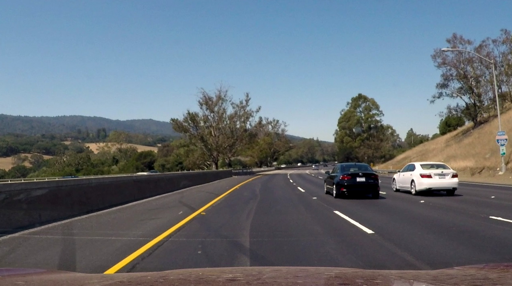
>**Edges**
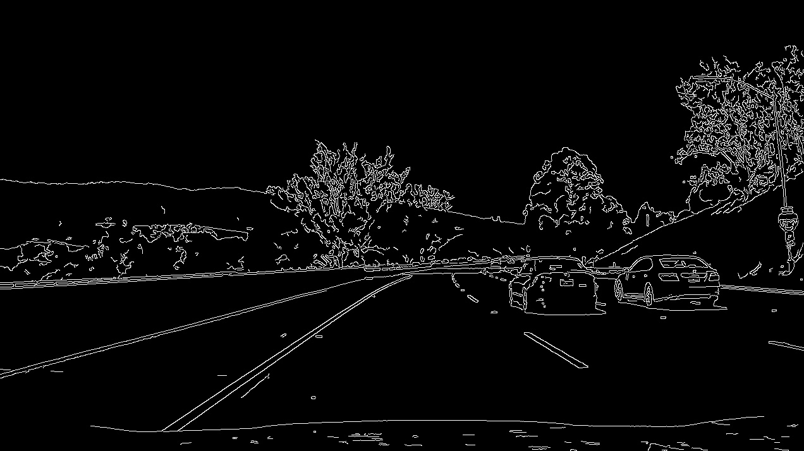
>**Lane**
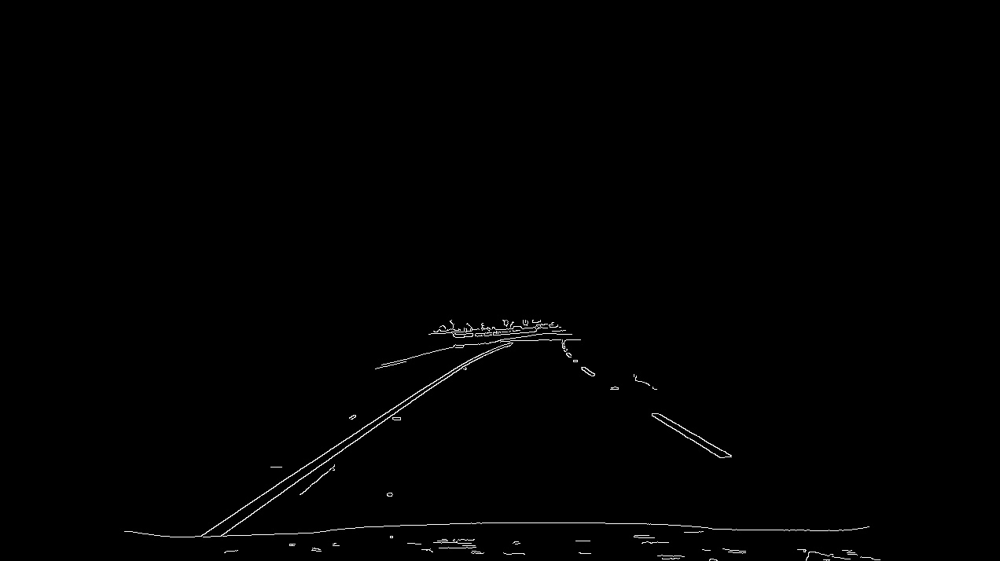

>**GAZE Image (0.8 MP PointGrey Mono Camera)**
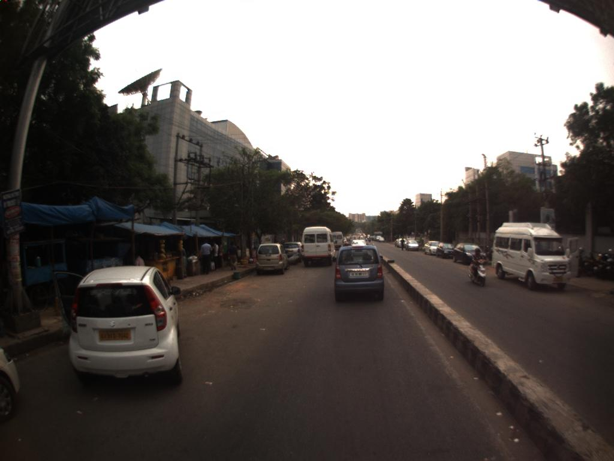
>**Edges**
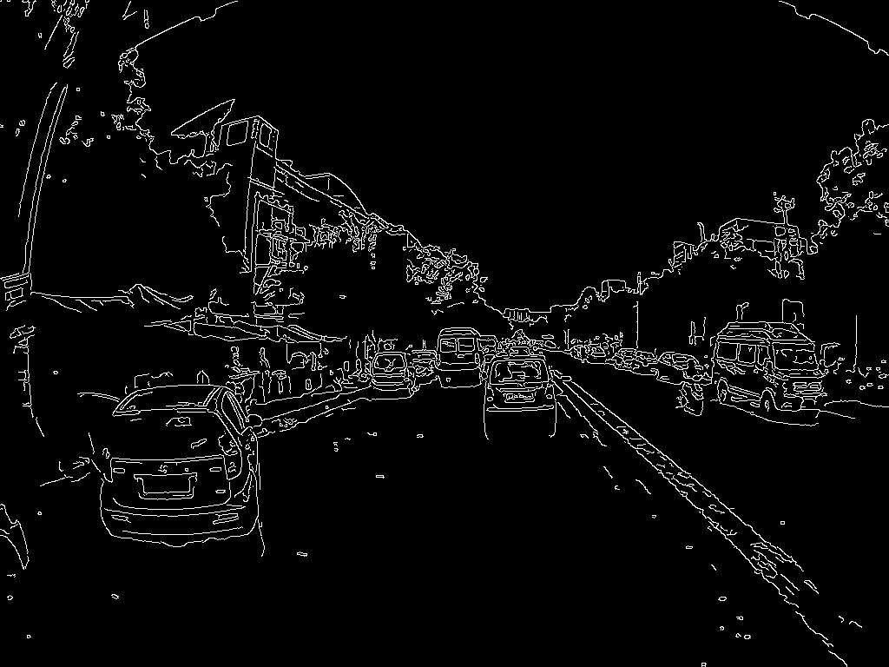
>**Lane**
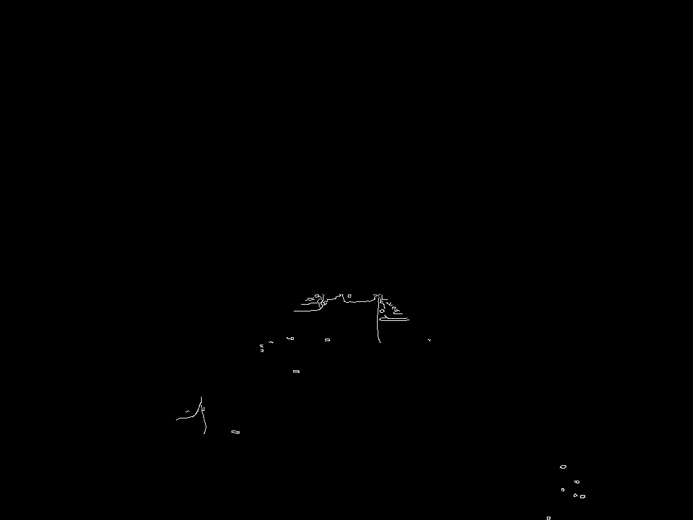

**Shape Detections**
>**GAZE Image (0.8 MP PointGrey Mono Camera)**

>**Shape (Contours)**
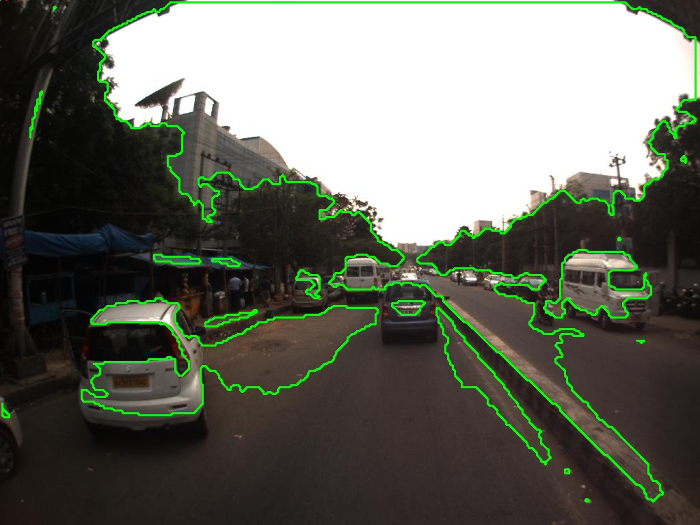
>**Shape (Contours with labels)**
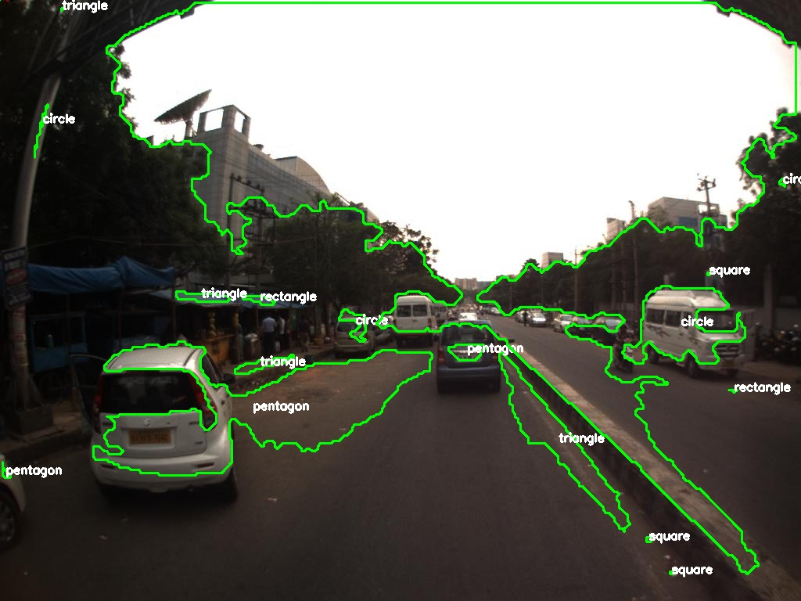

**Blurr Detection**
>**GAZE Image (0.8 MP PointGrey Mono Camera)**
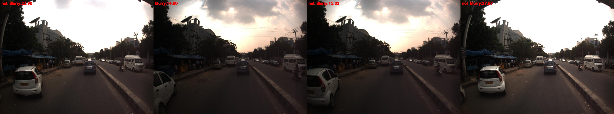

## CNN
* SegNet
	* Python
	* Caffe framework
	* Trained on CamVid dataset of 367 Images
	* 6 Days, 26K iterations
	* Unable to train on GPU due to memory issues
	* [SegNet Tutorial Reference](http://mi.eng.cam.ac.uk/projects/segnet/tutorial.html)
**SegNet CamVid Training Results**
>**Source Image**
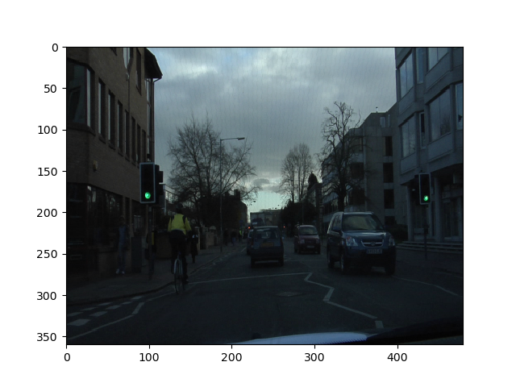
>**Ground Truth**
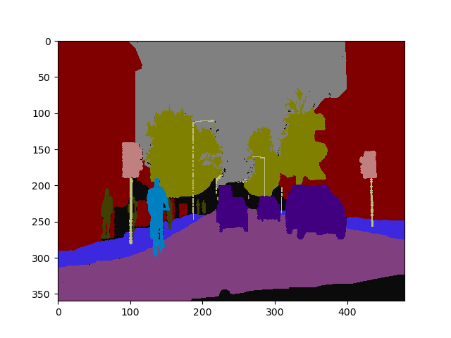
>**Prediction**
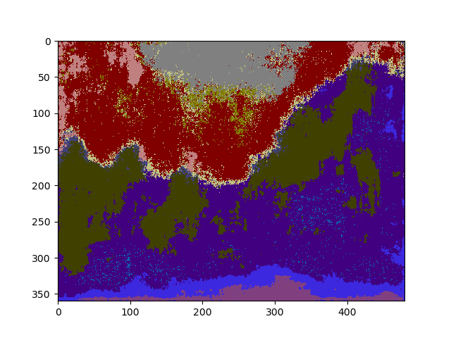

>**GAZE Image (0.8 MP PointGrey Mono Camera)**
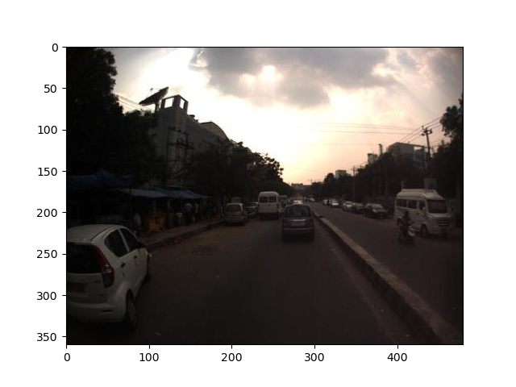
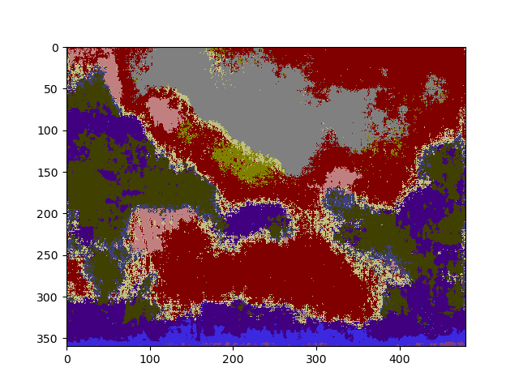
**Web Demo Output**
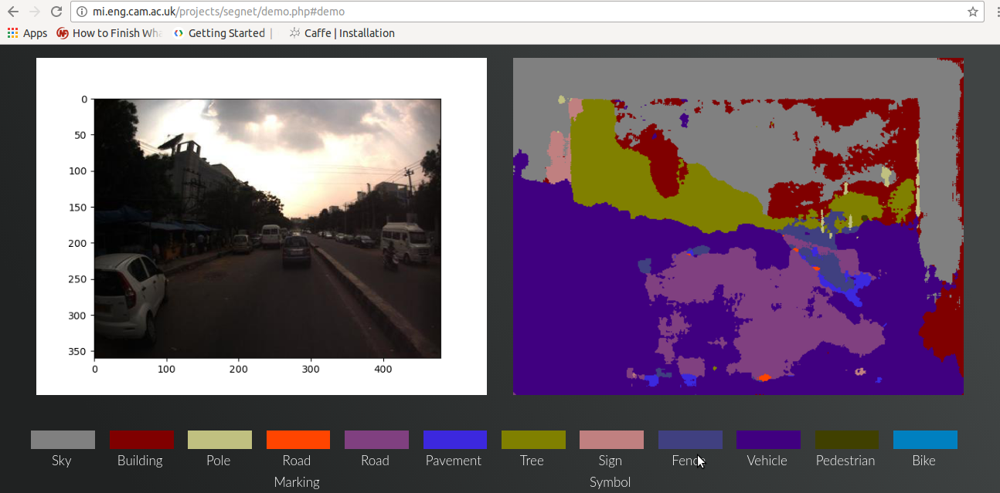