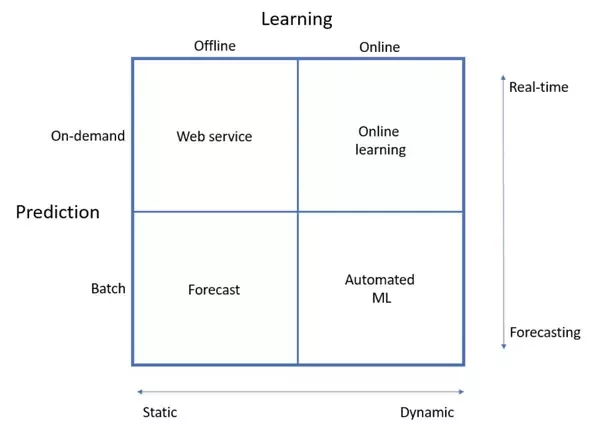

/*
Title: ML for Mobile and Web Applications
Decription: ML for Mobile and Web Applications
Author: Bhaskar Mangal
Date:
Tags: ML Production Pipeline, ML for Mobile and Web Applications
*/


## How to implement ML for Mobile and Web Apps
- https://www.analyticsvidhya.com/blog/2017/02/6-deep-learning-applications-beginner-python/
- https://us.pycon.org/2016/schedule/presentation/1614/
- https://www.credera.com/blog/credera-site/how-to-implement-machine-learning-in-your-apps/
- https://www.quora.com/How-can-I-implement-machine-learning-algorithms-in-a-web-application
- https://medium.com/@amirziai/a-flask-api-for-serving-scikit-learn-models-c8bcdaa41daa
- http://machinelearningmastery.com/deploy-machine-learning-model-to-production/


If the choice is PHP or Python for implementing ML algos, go with Python--no question.

Many core components of modern Machine Learning like logical regressions, linear regressions, nueral networks, etc... requires liner Algebra to implement efficiently (as far as I know)

PHP is not know for having a deverse and widely accepted range libraries for handling such math well, so implementing your algo in php is probably a poor choice.

Python has some great ones like numpy that are excellent for this purpose and a number of higher level libraries like tensorflow, theoano, keras, etc... to provide various levels ML abstraction.

### Embedding a Machine Learning Model into a Web Application
- https://cmry.github.io/notes/serialize
- https://github.com/cmry/cmry.github.io/blob/master/sources/serialize_sk.py
- http://www.stat.berkeley.edu/~ledell/docs/data_science_stack.html
- https://github.com/amirziai/sklearnflask/
- https://blog.algorithmia.com/cloud-hosted-deep-learning-models/

- https://www.quora.com/What-is-the-easiest-way-to-deploy-a-machine-learning-model-say-a-regression-for-production
Azure Machine Learning. It doesn’t take any parameters and there is no response. It simply imports some data from a database, runs a machine learning model in an R script and exports the results back to the database. That way, I can get a full set of predictions on-demand. This is a neat trick to sidestep the hassle of deploying models from R.


### Best Practices for ML Model deployment in Porduction
- online learning
- automated ML
- It is generally good practice to separate the models, that is, the hyperparameters and feature weights, from the rest of the workflow.
- There are model management frameworks based on both SQL databases and REST APIs.
- There are also things like the Openscoring library[2] , which uses a standard markup language known as PMML to store models.
- At the end of the day, there is no generic deployment scheme that fits every problem and every company. Deciding what practices to use, and implementing them, is at the heart of what machine learning engineering is all about. Data scientists tend to focus heavily on algorithms, but I think there are a lot of interesting problems to solve on the infrastructure and deployment side of machine learning as well
- https://www.quora.com/How-do-you-take-a-machine-learning-model-to-production

- At a high level
	– depending on what volume of incoming data you need to process
	- on the size of the model
	- on how often it's updated
	- on what stack/tools you're using, etc
- you've got two choices:
	- (a) use the same tools you used to build the model to run it
	- or (b) run it using different tools than you used to build it.
- **If your ground truth is inaccurate, you’ve already set an upper limit to how good your precision and recall can be. If your ground truth is grossly inaccurate, that upper limit is pretty low.**
- So the best advice we can offer in this case is to log everything. Throw it all in HDFS, whether you need it now or not. In the future, you can always use this data to backfill new data stores if you find it useful. This can be invaluable in responding to a new attack vector.
- **HDFS** - The Hadoop Distributed File System ( HDFS ) is a distributed file system designed to run on commodity hardware.
- version your trained models
- in-house experiments framework that we use to deploy new models and test them against subsets of user traffic to see how they are doing as we ramp up a new model.


- https://www.quora.com/Do-most-machine-learning-algorithms-run-in-batch-or-do-they-run-every-time-they-get-a-new-bit-of-data/answer/H%C3%A5kon-Hapnes-Strand

**First of all, we need to distinguish on the type of learning. There are two ways of training machine learning models:**

* **Offline learning**: The model is trained once on historical data. After the model is deployed to production, it remains constant, although it’s possible to re-train the model if it becomes unstable, which will often happen.

* **Online learning**: The model is constantly being updated as new data arrives. This is especially useful for time series data, such as sensor data or financial instruments, because an online learning algorithm can pick up temporal effects. It’s also useful for websites with huge amounts of data, such as Google or Quora.

**Secondly, we need to distinguish on how the algorithm makes predictions:**
* **Batch predictions**: The algorithm generates a table of predictions based on its input data. This is often good enough for data that is not time-dependent, or when the output isn’t required to be totally fresh all the time.
* **On-demand predictions**: Predictions are being made in real-time using the input data that is available at the time of the request, which typically comes in the form of a REST call.


Forecast
The most common way to practice machine learning is offline batch predictions. This is how Kaggle competitions are run, for instance. You get your input data as a file, train a model, and make a forecast. This is more like an experiment than actually putting something into production, although this paradigm is also common in business intelligence.

Web service
A more common way to embed machine learning into applications, is through a web service. Again, the model is trained on historical data, but it uses fresh data to make predictions. It seems strange to call a web service model offline, but it’s only the actual training that’s performed offline. The service always uses the latest data available to make predictions, but the model remains constant.

Automated machine learning
A very hot topic these days is automated machine learning. That includes automating the entire training, cross-validation and model selection process. By doing that, you can have an algorithm that retrains itself and makes repeated batch predictions in intervals, using the latest data available to both train the model and generate predictions. This methodology can’t be used in real-time, though, because it takes time to train the model(s). It’s probably the least utilized method out of the four.

Online learning
This is the most dynamic way to productionalize machine learning. The learning algorithm is hooked to a (big) data stream and continuously trains itself as new data comes in. A constantly updated model is immediately accessible as a web service. Technically, this is the most challenging setup to achieve, and it has mostly been used by the big players so far.

- https://www.quora.com/What-is-the-easiest-way-to-deploy-a-machine-learning-model-say-a-regression-for-production

**How the deployment is done in self-driving cars, robots or drones?**
> by Marek Bardoński, Senior Deep Learning Research Engineer at NVIDIA
I’ll describe it on a Tesla’s car example - other objects have a similar process.

After the company have a model designed and trained in one of the popular deep learning frameworks, it’s exported to the NVIDIA’s inference tool - TensorRT - and compiled as a library for inference. Then, the computer in the car equipped with one or more GPUs (eg. DrivePX2) have a control program calling this library each time the inference is required.

It’s reading input from the camera, and calling TensorRT via API to provide inference - recognizing what’s on the image or outputting the image segments. Everything is done as C++ API calls and often it’s on a real-time operating system like QNX.

https://en.wikipedia.org/wiki/QNX

Another example was my first attempt at using deep learning that actually did not reach into production (yet, it will in time). I managed to achieve excellent classification performance, far exceeding everything available at the time. However like most early adopters, we did not have the available GPU resources to use in production and using the CPU did not meet the runtime requirements. We resorted to dumping the deep algorithm and using the classics until we got the hardware infrastructure.

So you see, my answer is look at it like any project and ballance the complexities of schedule available resources and meeting user requirements.

- http://machinelearningmastery.com/building-a-production-machine-learning-infrastructure/

In industry, faster is always better and slower has to be justified, meaning accuracy can often take a back seat.
Experiments drive understanding.

**AirBnB Casse Study**
- https://medium.com/airbnb-engineering/architecting-a-machine-learning-system-for-risk-941abbba5a60
We can get around the drawbacks of R while maintaining its advantages by building a pipeline based on Python and scikit-learn. Scikit-learn is a Python package that supports many standard machine learning models, and includes helpful utilities for validating models and performing feature transformations. We find that Python is a more natural language than R for ad-hoc data manipulation and feature extraction.
Deployment and testing can also be performed automatically in Python by using its standard network libraries to interface with Openscoring. Standard model performance tests (precision recall, ROC curves, etc.) are carried out using sklearn’s built-in capabilities. Sklearn does not support PMML export out of the box, so have written an in-house exporter for particular sklearn classifiers. When the PMML file is uploaded to Openscoring, it is automatically tested for correspondence with the scikit-learn model it represents. Because feature-transformation, model building, model validation, deployment and testing are all carried out in a single script, a data scientist or engineer is able to quickly iterate on a model based on new features or more recent data, and then rapidly deploy the new model into production.
- Our process was very successful for some models, but for others we encountered poor precision-recall. Initially we considered whether we were experiencing a bias or a variance problem, and tried using more data and more features. However, after finding no improvement, we started digging deeper into the data, and found that the problem was that our ground truth was not accurate.
- A unique challenge of working at a hyper-growth company is that landscape fundamentally changes year-over-year, and pipelines need to adjust to account for this. As our data and logging pipelines improve, investing in improved learning algorithms will become more worthwhile, and we will likely shift to testing new algorithms, incorporating online learning, and expanding on our model building framework to support larger data sets
- some of the most important opportunities to improve our models are based on insights into our unique data, feature selection, and other aspects our risk systems that we are not able to share publicly.

**[Uber: michelangelo ML platform](https://eng.uber.com/michelangelo/)**
> Must Read

We designed Michelangelo specifically to provide scalable, reliable, reproducible, easy-to-use, and automated tools to address the following six-step workflow:  
* Manage data
* Train models
* Evaluate models
  - Keeping track of these trained models (e.g. who trained them and when, on what data set, with which hyper-parameters, etc.), evaluating them, and comparing them to each other are typically big challenges when dealing with so many models and present opportunities for the platform to add a lot of value.
  - The information is easily available to the user through a web UI and programmatically through an API, both for inspecting the details of an individual model and for comparing one or more models with each other.
  - **For every model that is trained in Michelangelo, we store a versioned object in our model repository in Cassandra that contains a record of:**
    - Who trained the model
    - Start and end time of the training job
    - Full model configuration (features used, hyper-parameter values, etc.)
    - Reference to training and test data sets
    - Distribution and relative importance of each feature
    - Model accuracy metrics
    - Standard charts and graphs for each model type (e.g. ROC curve, PR curve, and confusion matrix for a binary classifier)
    - Full learned parameters of the model
    - Summary statistics for model visualization
* Deploy models
  - end-to-end support for managing model deployment via the UI or API and three modes in which a model can be deployed:
* Make predictions
* Monitor predictions

## Online Machine Learning
- https://en.wikipedia.org/wiki/Online_machine_learning

## ML APIs
- https://www.kdnuggets.com/2015/12/machine-learning-data-science-apis.html
- https://www.credera.com/blog/credera-site/how-to-implement-machine-learning-in-your-apps/
- https://www.quora.com/How-can-I-implement-machine-learning-algorithms-in-a-web-application

## ML Courses
- https://medium.freecodecamp.org/every-single-machine-learning-course-on-the-internet-ranked-by-your-reviews-3c4a7b8026c0


# End-to-End ML Application
**References:**
> TBD: relative links not working in pico cms
- [python-in-nutshell](python-in-nutshell.md)
- [data-visualization-in-python](data-visualization-in-python.md)

## Web-frameworks available

* **Python**
  - Flask
  - Django
  - Falcon
  - Hug and many more
* **R**
  - plumber


## HTTP server
http://gunicorn.org/

Gunicorn 'Green Unicorn' is a Python WSGI HTTP Server for UNIX. It's a pre-fork worker model. The Gunicorn server is broadly compatible with various web frameworks, simply implemented, light on server resources, and fairly speedy.
```bash
sudo pip install gunicorn
```

## Example: Hello world
- https://groups.google.com/forum/#!topic/comp.lang.python/tEBMAJ41Wag
```python
#!/usr/bin/env python
def main():
  print "Content-type: text/html"
  print ""
  print "Hello world!"
#
if __name__ == "__main__":
  main()
```
Start Http Server
```
gunicorn --bind 0.0.0.0:8000 hello-world:app
curl http://localhost:8000/hello-world.py
```

## Python with Apache
- https://python-forum.io/Thread-Run-Python-CGI-from-Apache?pid=1675
- https://www.digitalocean.com/community/tutorials/how-to-set-up-an-apache-mysql-and-python-lamp-server-without-frameworks-on-ubuntu-14-04

```bash
# disable multithreading processes
#
sudo a2dismod mpm_event
#
# give Apache explicit permission to run scripts
#
sudo a2enmod mpm_prefork cgi
#
# modify the actual Apache configuration, to explicitly declare Python files as runnable file and allow such executables
#
sudo vi /etc/apache2/sites-enabled/000-default.conf
```

Add the following right after the first line, which reads <VirtualHost *:80\>.
```bash
#
sudo a2enmod cgi
#
sudo vi sudo vi /etc/apache2/mods-available/php7.0.conf
#
<Directory /home/*/public_html/*/cgi-bin>
    Options +ExecCGI
    SetHandler cgi-script
    AddHandler cgi-script .py 
</Directory>
#
```

## Flask
- https://www.tutorialspoint.com/flask/
- https://github.com/jay3dec/PythonFlaskMySQLApp---Part-1
- https://code.tutsplus.com/tutorials/creating-a-web-app-from-scratch-using-python-flask-and-mysql--cms-22972

### Flask with Apache
- https://www.digitalocean.com/community/tutorials/how-to-deploy-a-flask-application-on-an-ubuntu-vps
- http://csparpa.github.io/blog/2013/03/how-to-deploy-flask-applications-to-apache-webserver.html

### WSGI: modwsgi
- https://code.google.com/archive/p/modwsgi/wikis/QuickConfigurationGuide.wiki

**WSGI Application Script File**
WSGI is a specification of a generic API for mapping between an underlying web server and a Python web application. WSGI itself is described by Python PEP 0333. The purpose of the WSGI specification is to provide a common mechanism for hosting a Python web application on a range of different web servers supporting the Python programming language.

**Mounting The WSGI Application**
There are a number of ways that a WSGI application hosted by mod_wsgi can be mounted against a specific URL. These methods are similar to how one would configure traditional CGI applications.

Require **WSGI module**
```bash
sudo apt-get install libapache2-mod-wsgi python-dev
#
sudo a2enmod wsgi
```
-http://modwsgi.readthedocs.io/en/develop/configuration-directives/WSGIScriptAlias.html
```bash
<IfModule mod_userdir.c>
    <Directory /home/*/public_html>
        #php_admin_flag engine Off
    </Directory>
    <Directory /home/*/public_html/*/cgi-bin>
        Options +ExecCGI
        SetHandler cgi-script
        AddHandler cgi-script .py 
    </Directory>
    <Directory /home/*/public_html/*/wsgi-bin>
        Options +ExecCGI
        SetHandler wsgi-script
        AddHandler wsgi-script .wsgi
    </Directory>
</IfModule>
```
## Errors

**Template Not Found**
- https://stackoverflow.com/questions/23435150/python-flask-render-template-not-found
- https://stackoverflow.com/questions/23846927/flask-unable-to-find-templates

**Errors/Warnings in setup/execution**
- The installed version of numexpr 2.4.3 is not supported in pandas and will be not be used. The minimum supported version is 2.4.6
- UserWarning: Trying to unpickle estimator DecisionTreeClassifier from version pre-0.18 when using version 0.18.1. This might lead to breaking code or invalid results. Use at your own risk.

## Tutorials
- http://flask.pocoo.org/docs/0.12/quickstart/#rendering-templates

## WebApps with Flask
- https://www.fullstackpython.com/web-analytics.html
- http://blog.yhat.com/posts/pandas-google-analytics.html

## Serialization

### pickle
- It's similar to creating .rda files in R Programming.

### dill
- https://pypi.python.org/pypi/dill
dill extends python’s pickle module for serializing and de-serializing python objects to the majority of the built-in python types. Serialization is the process of converting an object to a byte stream, and the inverse of which is converting a byte stream back to on python object hierarchy.

**Install: dill**
```bash
sudo pip install dill
```

### h5py
- h5py could also be an alternative.

## Creating ML API using Flask
- https://github.com/pratos/flask_api
- https://www.analyticsvidhya.com/blog/2017/09/machine-learning-models-as-apis-using-flask/
- [Machine Learning models as APIs using Flask](https://render.githubusercontent.com/view/ipynb?commit=dac6eb737b58b73f9b9b323a9a39c0d1fe8cbfee&enc_url=68747470733a2f2f7261772e67697468756275736572636f6e74656e742e636f6d2f707261746f732f666c61736b5f6170692f646163366562373337623538623733663962396233323361396133396330643166653863626665652f6e6f7465626f6f6b732f4d4c2532304d6f64656c732532306173253230415049732532307573696e67253230466c61736b2e6970796e62&nwo=pratos%2Fflask_api&path=notebooks%2FML+Models+as+APIs+using+Flask.ipynb&repository_id=103313016&repository_type=Repository#no1)


## Paid Courses
https://www.udemy.com/machine-learning-course-with-python/?couponCode=CODESTARS&siteID=rjqiUzH_Hec-2IXJ8GHGJe3fyubxBjnbnw&LSNPUBID=rjqiUzH%2FHec

## Example Apps
* https://github.com/delsner/flask-angular-data-science

## Dataset / Data source/ Datasource for ML
https://en.wikipedia.org/wiki/List_of_datasets_for_machine_learning_research