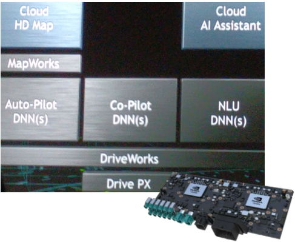
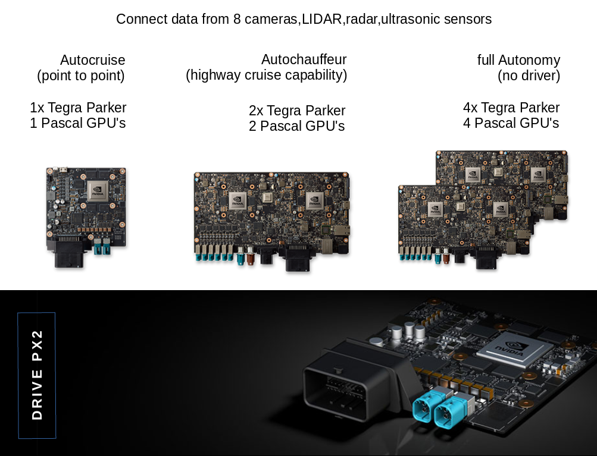
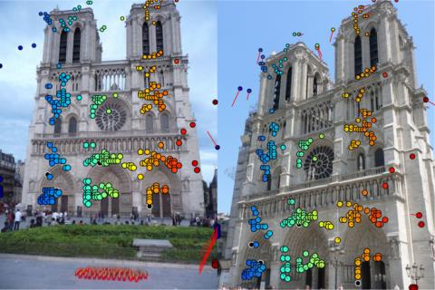
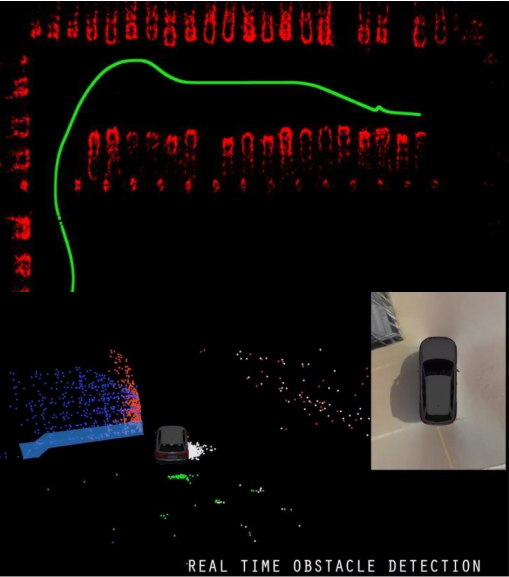
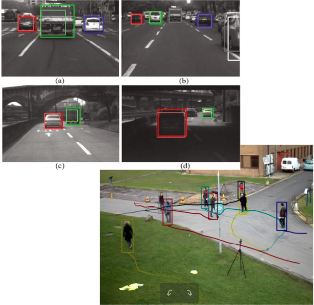

**Table of Contents**
* TOC
{:toc}

## Nvidia Driveworks

### CES keynote 2017
> CES keynote 2017 - Driveworks Demo by [Miguel Sainz](http://www.msainz.org/)

> @[Alt CES keynote 2017 - Driveworks Demo by Miguel Sainz](https://www.youtube.com/watch?v=iIcCyxN_RC0)
[Click here for Complete CES keynote 2017](https://www.youtube.com/watch?v=jmY2LXy-hXU)

**What the car percieves?**
It's the mental model of all the sensors around the car, where is the car, what's around it; accumilating all the sensors and building a mental model of what it is you are perceiving.

It can perceive the environment surrounding the car and reason about where the car is, where's everything else around the car, where everything will be there in near future, we can predict supported by apriority knowledge of the environment, of what is true - HD map in the cloud, can compare with what is perceived and prior knowledge

**Xavier - AI supercomputer (single chip)**
* Can take multiple sensor inputs
* New operating system - driveworks
* Nvidia’s Volta Graphics Card

## Nvidia DRIVE PX2
* The **Nvidia Drive PX** is a series of computers aimed at providing autonomous car and driver assistance functionality powered by deep learning.
* **DRIVE PX 2** is the open AI car computing platform.
> 
Driveworks is like an OS for DRIVE PX

* * *

>
DRIVE PX2 Configurations

## Nvidia Driveworks **SDK 0.1.2** for PC
At the time of this writing, SDK 0.1.2 is avaiable for PC, and SDK 0.2 is avaiable only for DRIVE PX2.

### Requirements
* Ubuntu 14.04
* Requires CUDA Compute Capability >= 5.0
* Nvidia Drivers
* CUDA Toolkit 8.0
* cuDNN
* TensorRT
* OpenGL

### Modules

**SDK 0.1.2 Modules:-**
* 2D Feature Tracker
* Rendering/Visualization pipeline for debug and display
* Grid based fusion / occupancy grid module
* 2D Object Tracking
* Structure From Motion and Egomotion
* DNN inference engines

#### 2D Feature Tracker
Highly optimized high quality 2D feature detector and tracker.
**Features:-**
* Pyramid Sparse Optical Flow
* Harris Corner Detector
* Feature Managment
* Multi-Frame Tracking
* Uniform Sampling w/ Minimal Distance
* Max Feature Count
* Motion Prediction Models

**Modules:-**
* Pyramid generator
* 2D tracker with feature management

> 
2D Feature Tracker 2

***

>**Sample Camera Tracker**

  <video controls="controls" allowfullscreen="true" poster="images/driveworks-pics/2dfeature-tracker-1.png">
    <source src="file:///home/bhaskar/Documents/ppts/May-2017/driveworks-video-for-samples-recorded-screencast/sample_camera_tracker.m4v" type="video/mp4">
  </video>

#### Structure From Motion (SfM)
Highly optimized 3D triangulation code from 2D tracker features.
**Features:-**
* Pyramid Sparse Optical Flow
* Harris Corner Detector
* Feature Managment
* Multi-Frame Tracking
* Uniform Feature Sampling
* Ackerman Motion Model
* Feature Motion Prediction
* 3D triangulation bootstrapping
* 6DOF Visual Odometry
* Multi-Baseline Triangulation

>**SfM, Egomotion**
, Egomotion")

***
>**Sample Triangulation, SfM**

  <video controls="controls" allowfullscreen="true" poster="images/driveworks-pics/sfm-dw.png" title="Structure From Motion (SfM), Sample Triangulation">
    <source src="file:///home/bhaskar/Documents/ppts/May-2017/driveworks-video-for-samples-recorded-screencast/sample_triangulation.m4v" type="video/mp4">
  </video>

***

>**Sample Camera Multiple Replay, Ego Motion**

  <video controls="controls" allowfullscreen="true" poster="images/driveworks-pics/ego-motionn-dw.png" title="Ego Motion">
    <source src="file:///home/bhaskar/Documents/ppts/May-2017/driveworks-video-for-samples-recorded-screencast/sample_camera_multiple_replay.m4v" type="video/mp4">
  </video>

#### 2D & 3D Occupancy Map
Generate accurate occupancy maps of surroundings of the vehicle for obstacles and free space detection
**Features:-**
* 2D map generation from point clouds
* Aging and pseudo-probabilistic updates
* Basic blurring for distance field computation
* Basic point cloud clustering
	- 3D clustering
	- 2D connected components clustering

>**2D & 3D Occupancy Map**

***

>**Sample Occupancy Grid**

  <video controls="controls" allowfullscreen="true" poster="images/driveworks-pics/occupancy-grid-2.png" title="Occupancy Grid/Map">
    <source src="file:///home/bhaskar/Documents/ppts/May-2017/driveworks-video-for-samples-recorded-screencast/sample_occupancy_grid.m4v" type="video/mp4">
  </video>

#### 2D Object Tracking
Supports for:-
* Bounding box tracking
* Bounding box merging from external source

>**2D Object Tracking**

#### DNN inference engines
Inference engine abstraction supporting Caffe (Deep Learning Framework) and GIE (GPU Inference Engine) optimized networks.

**Features:-**
Various detectors for:-
* Unique interface
* No dependencies
* Data blob conditioning module for common cases
* GIE optimizer command line too

> 
DNN inference engines

#### Rendering Helpers
Various helpers for:-
* Image thumbnails
* Text rendering
* 2D/3D Pointcloud rendering (color, textured)
* 2D/3D line rendering (color, textured)
* 2D/3D bounding boxes

> 
Rendering Helpers

>**Sample LiDAR Replay**

  <video controls="controls" allowfullscreen="true" poster="images/driveworks-pics/lidar-replay.png" title="LiDAR Replay">
    <source src="file:///home/bhaskar/Documents/ppts/May-2017/driveworks-video-for-samples-recorded-screencast/sample_lidar_replay.m4v" type="video/mp4">
  </video>

#### Misc
>**Sensor Info Sample**

## References
* [nvidia-and-zenrin-collaborate-on-ai-powered-hd-mapping-for-japan](http://nvidianews.nvidia.com/news/nvidia-and-zenrin-collaborate-on-ai-powered-hd-mapping-for-japan)
* [here-nvidia-partner-on-ai-technology-for-hd-mapping-from-cloud-to-car](http://nvidianews.nvidia.com/news/here-nvidia-partner-on-ai-technology-for-hd-mapping-from-cloud-to-car)
* [Audi to use NVIDIA tech to create advanced self-driving cars](https://www.dvhardware.net/article65754.html)
* [AnandTech: ces-2017-nvidia-keynote-live-blog](http://www.anandtech.com/show/10999/ces-2017-nvidia-keynote-live-blog)
* [Nvidia CES keynote 2017 - Driveworks Demo](https://www.youtube.com/watch?v=iIcCyxN_RC0) by [Miguel Sainz](http://www.msainz.org/)
* [Complete Nvidia CES keynote 2017](https://www.youtube.com/watch?v=jmY2LXy-hXU)
* [GPU Tech Conf covering Driveworks Integration: Silicon Valley – May 8 to 11 2017](https://gputechconf2017.smarteventscloud.com/connect/search.ww#loadSearch-searchPhrase=Driveworks&searchType=session&tc=0&sortBy=titleSort&p=)

## Keywords
* GIE – GPU Inference Engine
GIE optimizes the trained neural networks for run-time performance and delivers GPU-accelerated inference for web/mobile, embedded and automotive applications.
	- [production-deep-learning-nvidia-gpu-inference-engine](https://devblogs.nvidia.com/parallelforall/production-deep-learning-nvidia-gpu-inference-engine/)
* [Caffe – Deep Learning Framework](http://caffe.berkeleyvision.org/)

