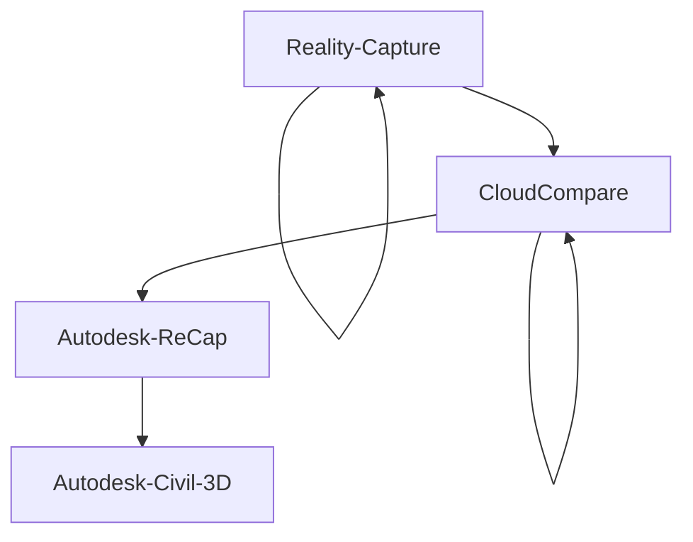
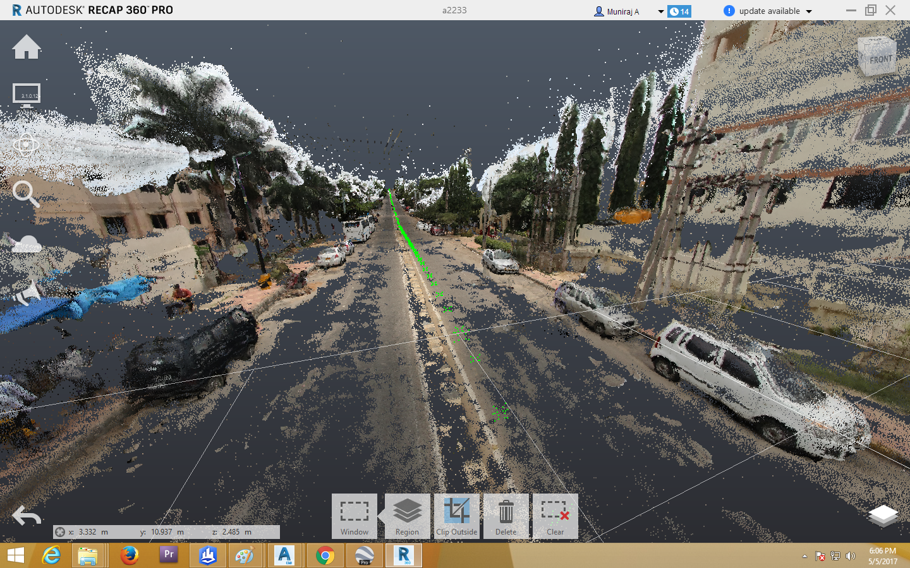
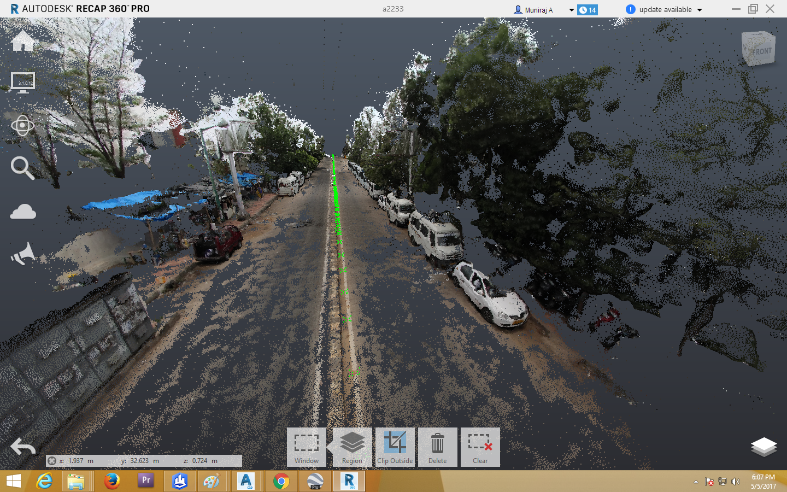
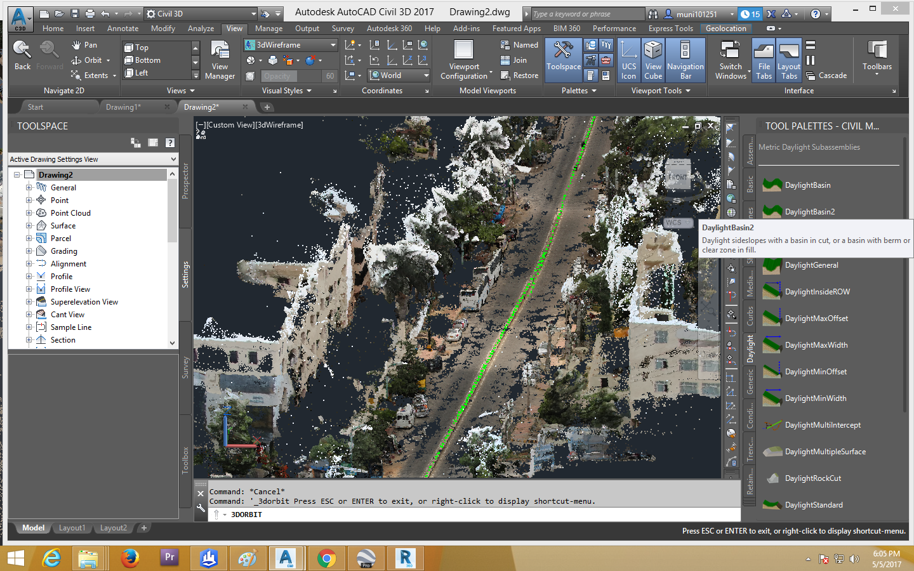
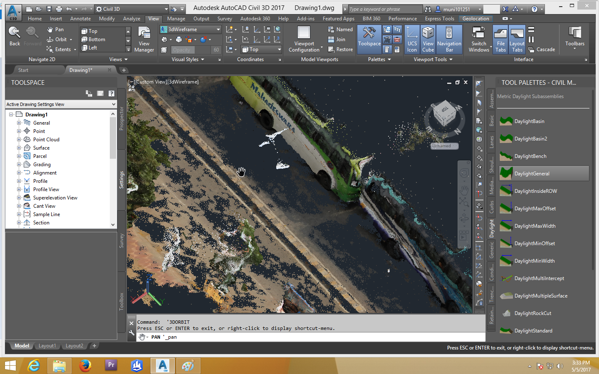
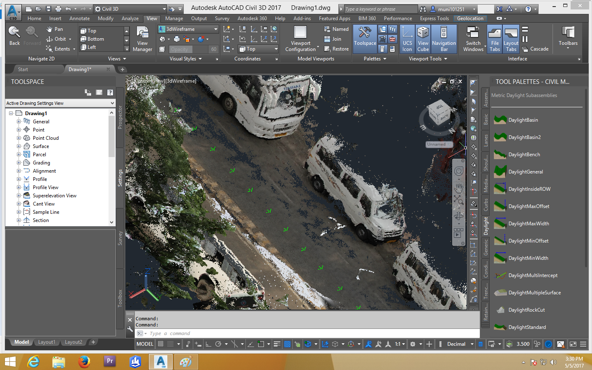
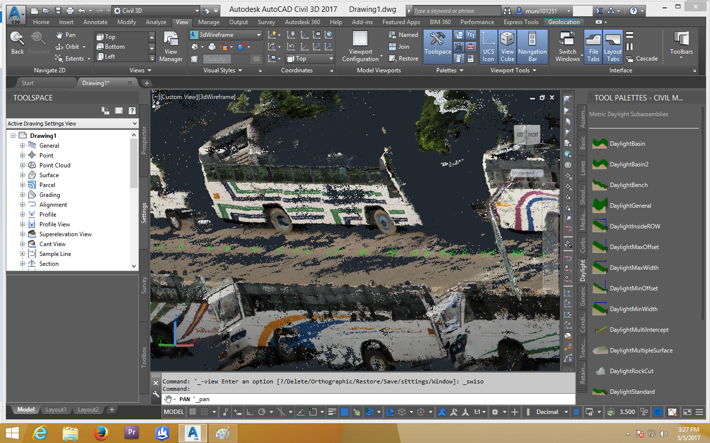
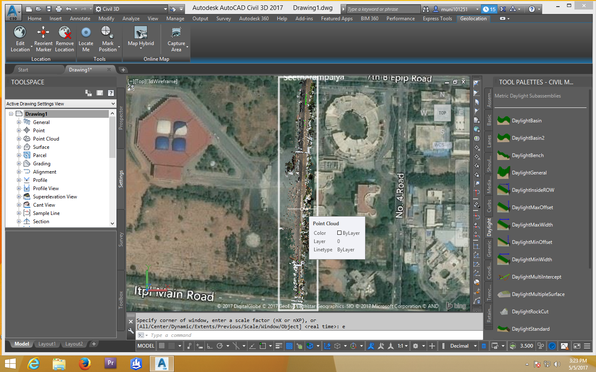

**Table of Contents**
* TOC
{:toc}

## Point Cloud Data

* **Toolchain:**
	* Reality Capture (RC)
	* CloudCompare (CC)
	* Autodesk - ReCap, Civil 3D

* **Workflow:**

### Some samples
* >
* >
* >
* >
* >
* >
* >
