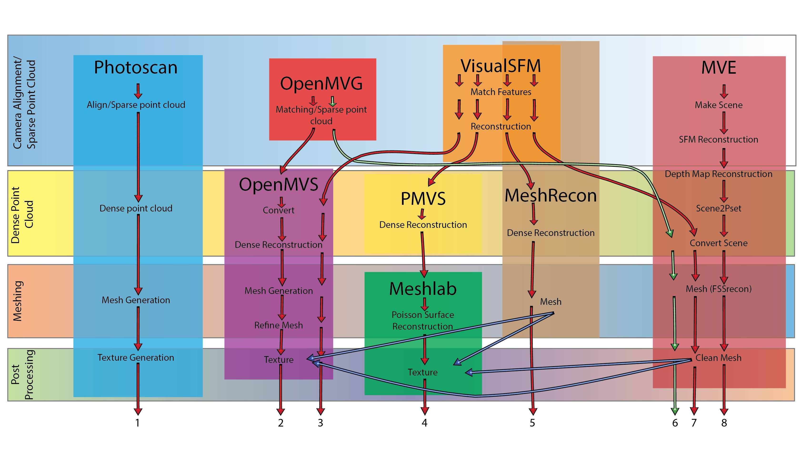
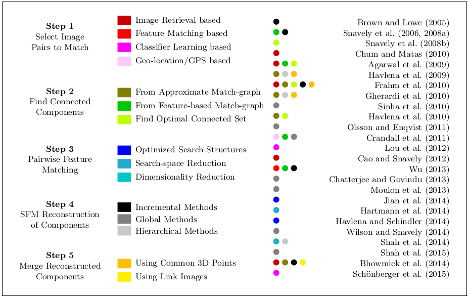

**Table of Contents**
* TOC
{:toc}


## Art of Photogrammetry

## Introduction
Photogrammetry is the science of using photographs to obtain measurements and models of real-world objects and scenes. 
- http://www.nrcan.gc.ca/node/9407
- http://scarnecchia.github.io/GSD_calculator/

**Contiguous photos with 80% overlap**
• Move camera between shots
• Minimize/eliminate moving shadows
  – Static light source
  – Diffuse light

**What’s necessary**
• 5+ megapixel camera
• Wider lenses (50 mm or less)
• Maximize depth of field
• Aperture between F8 and F16
• This varies with lens
• Tip: use aperture priority mode
• Include scale in a few extra photos or precisely measure and record a few features
• Color checker


- https://geonet.esri.com/thread/41657
- https://info.photomodeler.com/blog/camera-fundamentals-and-parameters-in-photogrammetry/

Photogrammetry software will either know these internal characteristics beforehand (by completing a calibration procedure), or will figure them out during processing of the scene (referred to as auto-calibration or self/field calibration)

Many types of capture devices can provide source images for photogrammetry, including iPhones or other cellphones, point and shoot cameras, DSLRs, surveillance cameras, and more.

## Hardware Requirements
- https://support.capturingreality.com/hc/en-us/community/posts/115000788731-What-is-the-computer-requirements-
- https://www.pugetsystems.com/recommended/Recommended-Systems-for-Agisoft-PhotoScan-145/Hardware-Recommendations
- http://www.agisoft.com/downloads/system-requirements/


### RC - Reality Capture
For turntable photogrammetry a normal gaming rig is more than adequate.
- decent i7/i9 CPU, Geforce GTX 1060, 70 or 80, 16-32GB RAM.
- good for up to around 500ish 12MP+ photos 

For large scale environment scans
- server CPU, one or more GPUs, 64-128GB RAM or more.
- keep an eye on your license and how many cpu cores and GPUs it supports.

In either case you need to keep in mind that the GPU must support CUDA, so AMD/ATI is a no-go.

### Hardware Pricing
1.
Windows 10 64 bit
16GB RAM
128 gb SSD for the OS
1TB HDD for main (programs and data were run from the HDD).
nVidia GTX 970 GPU.
Intel Core i7-4790K CPU (4 cores/8 threads, up to 4.4Ghz).

2.
Windows 10 64 bit
32GB RAM
Intel Core i7
Nvidia 980Ti with 6GB vRAM

## Photogrammetry pipeline

### Open Source

>**Reference:**
[DR PETER L. FALKINGHAM : trying-all-the-free-photogrammetry](https://pfalkingham.wordpress.com/2016/09/14/trying-all-the-free-photogrammetry/)



#### Visual SfM, CloudCompare, MeshLab, Blender
- http://www.instructables.com/id/Make-a-3D-model-from-pictures/
- https://www.youtube.com/watch?v=V4iBb_j6k_g
- http://abcb.fyi/visualsfm-tutorial
- https://d32ogoqmya1dw8.cloudfront.net/files/getsi/teaching_materials/high-rez-topo/visual_sfm_tutorial.pdf
- http://ccwu.me/vsfm/doc.html
- https://www.researchgate.net/figure/258246473_fig2_Figure-2-3D-model-generated-using-vanishing-points-computation-RG04

## VisulaSfM - Installation

### On Windows
- http://francemapping.free.fr/Portfolio/Prog3D/CMVS.html
- http://opensourcephotogrammetry.blogspot.in/2010/12/new-package-available-for-windows.html
- http://www.di.ens.fr/cmvs/documentation.html
- http://ccwu.me/vsfm/install.html
- http://ccwu.me/vsfm/doc.html#other_stereo_tools

### On Linux (Ububtu)
- http://ccwu.me/vsfm/install.html#linux
- http://www.10flow.com/2012/08/15/building-visualsfm-on-ubuntu-12-04-precise-pangolin-desktop-64-bit/
```bash
sudo apt-get install libgtk2.0-dev libboost-all-dev libdevil-dev libatlas-cpp-0.6-dev libatlas-dev libcminpack-dev libgfortran3 libgsl0-dev libparmetis-dev libmetis-edf-dev imagemagick
```
**SMVS**
- https://github.com/flanggut/smvs

**colmap**
- https://github.com/colmap/colmap
- Install
  - https://github.com/colmap/colmap/blob/master/doc/install.rst

**ceres-solver**
- http://ceres-solver.org/
Ceres Solver [1] is an open source C++ library for modeling and solving large, complicated optimization problems. It can be used to solve Non-linear Least Squares problems with bounds constraints and general unconstrained optimization problems. It is a mature, feature rich, and performant library that has been used in production at Google since 2010. For more, see Why?.

**openMVS**
- http://cdcseacave.github.io/openMVS/

**E-foto**
- http://www.efoto.eng.uerj.br/en

++Installation++
e-foto: error while loading shared libraries: libshp.so.2: cannot open shared object file: No such file or directory


## Large Scale Photogrammetry
>**Reference:**
[Multistage SFM: A Coarse-to-Fine Approach for 3D Reconstruction](Multistage_SFM3d.pdf)


## Datasets
- https://www.dropbox.com/sh/y2by0r2toavfcqc/AAB-bzSisa-_phDdoP0FfVP9a?dl=0
- https://colmap.github.io/datasets.html

## References
- https://pfalkingham.wordpress.com/blog/
- https://gist.github.com/patriciogonzalezvivo/0cc2d0fb6e9af9040eff
- http://www.tested.com/art/makers/460057-tested-dark-art-photogrammetry/
- https://hackaday.io/project/9792/instructions
- https://forum.sketchfab.com/t/new-fast-photogrammetry-software-realitycapture/5042/26
- [Mesh Racon](http://zhuoliang.me/meshrecon.html)
- [BigSfM](http://www.cs.cornell.edu/projects/bigsfm/)

### Blogs
- https://smathermather.com/tag/structure-from-motion/
- https://smathermather.com/category/optics/camera-calibration/page/2/

### Presentations
- https://www.slideshare.net/PetteriTeikariPhD/emerging-3d-scanning-technologies-for-proptech

### Tutorials
- https://pfalkingham.wordpress.com/2016/09/14/trying-all-the-free-photogrammetry/
- https://pfalkingham.wordpress.com/2017/04/04/photogrammetry-testing-8-colmap/
- https://pfalkingham.wordpress.com/2017/05/26/photogrammetry-testing-11-visualsfm-openmvs/
- https://pfalkingham.wordpress.com/2016/10/03/photogrammetry-testing-2-visualsfm-and-meshrecon/

#### VisualSfM
- [visual_sfm_tutorial.pdf](visual_sfm_tutorial.pdf)

### Research Papers
- [2014_3d_reconstruction_software_comparison_for_short_sequences_spie.pdf](2014_3d_reconstruction_software_comparison_for_short_sequences_spie.pdf)
- [Multistage SFM: A Coarse-to-Fine Approach for 3D Reconstruction](Multistage_SFM3d.pdf)
- [RepMatch: Robust Feature Matching and Pose
for Reconstructing Modern Cities](RepMatch.pdf)

### Google search pharses
- visualSfM steps
- BigSfM

## Build Errors

### OpenMVS Installation Errors
```bash
/usr/include/eigen3/Eigen/src/Core/Matrix.h:296:31: error: no matching function for call to ‘Eigen::Matrix<float, 3, 1>::_init1(const SEACAVE::TPoint3<float>&)’
       Base::template _init1<T>(x);
       ~~~~~~~~~~~~~~~~~~~~~~~~^~~
/home/bhaskar/Documents/visualSFM/openMVS/libs/MVS/SceneRefine.cpp:430:30:   required from here
/usr/include/eigen3/Eigen/src/Core/PlainObjectBase.h:753:30: error: invalid use of incomplete type ‘struct Eigen::internal::enable_if<false, SEACAVE::TPoint3<float> >’
In file included from /usr/include/eigen3/Eigen/Core:295:0,
                 from /home/bhaskar/Documents/visualSFM/openMVS/libs/MVS/../Common/Types.h:122,
                 from /home/bhaskar/Documents/visualSFM/openMVS/libs/MVS/../Common/Common.h:176,
                 from /home/bhaskar/Documents/visualSFM/openMVS/libs/MVS/Common.h:42,
                 from /home/bhaskar/Documents/visualSFM/openMVS/libs/MVS/cotire/MVS_CXX_prefix.cxx:4,


/home/bhaskar/Documents/visualSFM/openMVS/libs/MVS/SceneRefine.cpp:430:30:   required from here
/usr/include/eigen3/Eigen/src/Core/PlainObjectBase.h:762:30: error: invalid use of incomplete type ‘struct Eigen::internal::enable_if<false, SEACAVE::TPoint3<float>*>’
In file included from /usr/include/eigen3/Eigen/Core:295:0,
                 from /home/bhaskar/Documents/visualSFM/openMVS/libs/MVS/../Common/Types.h:122,
                 from /home/bhaskar/Documents/visualSFM/openMVS/libs/MVS/../Common/Common.h:176,
                 from /home/bhaskar/Documents/visualSFM/openMVS/libs/MVS/Common.h:42,
                 from /home/bhaskar/Documents/visualSFM/openMVS/libs/MVS/cotire/MVS_CXX_prefix.cxx:4,
                 from /home/bhaskar/Documents/visualSFM/openMVS/libs/MVS/cotire/MVS_CXX_prefix.hxx:4:
/usr/include/eigen3/Eigen/src/Core/util/Meta.h:131:45: note: declaration of ‘struct Eigen::internal::enable_if<false, SEACAVE::TPoint3<float>*>’
 template<bool Condition, typename T> struct enable_if;
                                             ^~~~~~~~~


/home/bhaskar/Documents/visualSFM/openMVS/libs/MVS/SceneRefine.cpp:430:30:   required from here
/usr/include/eigen3/Eigen/src/Core/PlainObjectBase.h:811:30: error: invalid use of incomplete type ‘struct Eigen::internal::enable_if<false, SEACAVE::TPoint3<float> >’
In file included from /usr/include/eigen3/Eigen/Core:295:0,
                 from /home/bhaskar/Documents/visualSFM/openMVS/libs/MVS/../Common/Types.h:122,
                 from /home/bhaskar/Documents/visualSFM/openMVS/libs/MVS/../Common/Common.h:176,
                 from /home/bhaskar/Documents/visualSFM/openMVS/libs/MVS/Common.h:42,
                 from /home/bhaskar/Documents/visualSFM/openMVS/libs


/home/bhaskar/Documents/visualSFM/openMVS/libs/MVS/SceneRefine.cpp:430:30:   required from here
/usr/include/eigen3/Eigen/src/Core/PlainObjectBase.h:822:30: error: invalid use of incomplete type ‘struct Eigen::internal::enable_if<false, SEACAVE::TPoint3<float>*>’
In file included from /usr/include/eigen3/Eigen/Core:295:0,
                 from /home/bhaskar/Documents/visualSFM/openMVS/libs/MVS/../Common/Types.h:122,
                 from /home/bhaskar/Documents/visualSFM/openMVS/libs/MVS/../Common/Common.h:176,
                 from /home/bhaskar/Documents/visualSFM/openMVS/libs/MVS/Common.h:42,
                 from /home/bhaskar/Documents/visualSFM/openMVS/libs/MVS/cotire/MVS_CXX_prefix.cxx:4,
                 from /home/bhaskar/Documents/visualSFM/openMVS/libs/MVS/cotire/MVS_CXX_prefix.hxx:4:


/home/bhaskar/Documents/visualSFM/openMVS/libs/MVS/SceneRefine.cpp:442:147:   required from here
/usr/include/eigen3/Eigen/src/Core/CoreEvaluators.h:697:8: warning: ignoring attributes on template argument ‘Eigen::internal::packet_traits<float>::type {aka __vector(4) float}’ [-Wignored-attributes]
libs/MVS/CMakeFiles/MVS.dir/build.make:126: recipe for target 'libs/MVS/CMakeFiles/MVS.dir/SceneRefine.cpp.o' failed
make[2]: *** [libs/MVS/CMakeFiles/MVS.dir/SceneRefine.cpp.o] Error 1
CMakeFiles/Makefile2:481: recipe for target 'libs/MVS/CMakeFiles/MVS.dir/all' failed
make[1]: *** [libs/MVS/CMakeFiles/MVS.dir/all] Error 2
Makefile:127: recipe for target 'all' failed
make: *** [all] Error 2


https://github.com/cdcseacave/openMVS/issues/164

http://eigen.tuxfamily.org/index.php?title=Main_Page#Download


recipe for target 'cmTC_9aff9/fast' failed

 error: unrecognized command line option '-Wshorten-64-to-32'

‘Q_WS_WIN’ was not declared in this scope
```

## Misc
- [-finds-boost-but-the-imported-targets-not-available-for-boost-version](https://stackoverflow.com/questions/42123509/cmake-finds-boost-but-the-imported-targets-not-available-for-boost-version)
```bash
dpkg -S /usr/include/boost/version.hpp
#
dpkg -s libboost-dev | grep 'Version'
#
find /usr -name "boost"
```
## glTf
http://52.4.31.236/convertmodel.html
https://github.com/KhronosGroup/glTF/issues

## Image Processing
https://inspirit.github.io/jsfeat/
https://github.com/inspirit/jsfeat
https://github.com/NICTA/cesium-simple-photogrammetry

## IMAGE TO POINT CLOUD METHOD OF 3D-MODELING


http://www.hexahedria.com/2015/01/23/augmented-shanahan-detection/


### Vectorization
https://www.int-arch-photogramm-remote-sens-spatial-inf-sci.net/XXXIX-B3/13/2012/isprsarchives-XXXIX-B3-13-2012.pdf

https://books.google.co.in/books?id=suAFCAAAQBAJ&pg=PA164&lpg=PA164&dq=edge+detection+to+3d+vectorization&source=bl&ots=Ns-j-OOsCh&sig=RZlhAPS_lCUoK7SnVlnBJBoLSsg&hl=en&sa=X&ved=0ahUKEwjch9z2qLPXAhVH6Y8KHS4IAvAQ6AEITTAG#v=onepage&q=edge%20detection%20to%203d%20vectorization&f=false

## Mappilary
### ComputerVision, AI, ML
http://blog.mapillary.com/product/2017/08/08/visualizing-ai-detections-for-improved-map-editing.html
http://blog.mapillary.com/tech/2017/07/21/challenges-for-building-maps-and-automotive-ai.html
http://blog.mapillary.com/community/2017/06/28/amsterdam-in-360-from-imagery-to-map-data-in-seven-days.html

#### HUman in the loop
http://blog.mapillary.com/update/2017/10/12/human-in-the-loop.html

### Semantic Segmentation
http://blog.mapillary.com/update/2016/09/27/semantic-segmentation-object-recognition.html
https://help.mapillary.com/hc/en-us/articles/115000967191#detections-list
https://a.mapillary.com/#retrieve-image-detections
http://blog.mapillary.com/update/2016/09/27/semantic-segmentation-object-recognition.html


### Triangulation
https://help.mapillary.com/hc/en-us/articles/115002332165-Map-objects
https://help.mapillary.com/hc/en-us/categories/115000239905


## POINT CLOUD SERVER (PCS) : POINT CLOUDS IN-BASE MANAGEMENT AND PROCESSING
https://www.isprs-ann-photogramm-remote-sens-spatial-inf-sci.net/II-3-W5/531/2015/isprsannals-II-3-W5-531-2015.pdf
https://github.com/Oslandia/lopocs
https://github.com/pgpointcloud/pointcloud

IMRaD is an acronym for Introduction – Method – Results – and – Discussion. The IMRaD format is a way of structuring a scientific article. It is often used in health care and the natural sciences. Unlike theses in the social sciences, the IMRaD format does not include a separate theory chapte


sokogskriv.no/en/writing/structure/the-imrad-format/

https://github.com/hobu/greyhound

 


We use PostgreSQL 9.3,
PostGIS 2.2, PgPointCloud 1.0, Python 2.7, and a recent (2014)
version of Numpy and Scipy.


 AL stands for aerial lidar
 TL for terrestrial lidar
 SPC for stereo point cloud


The ASCII values are streamed to a ’psql’ process that is connected to the database.

’massive parallel loading’

Result We load Vosges and Paris data set through ’massive
parallel loading’, and stereo through ’out of database grouping’
(Table 2). For both methods, the bottleneck is not the CPU but
the input/output (I/O). Indeed, the point files are read over the
network, and the point tables are stored on the SSD, but the final
patch table is stored on the regular disk, which also limits how
many threads can write data on it at the same time.

will make sense for subsequent uses of the point cloud. Groups

http://w3.impa.br/~diego/software/rply
http://lastools.com
http://www.github.com/dranjan/python-plyfile
PostgreSQL TOAST
http://www.postgresql.org/docs/current/static/storage-toast.html

http://opendata.paris.fr/page/home
http://professionnels.ign.fr/bdtopo
https://github.com/Remi-C/Postgres_Day_2014_10_RemiC/tree/master/presentation

https://www.pdal.io/development/compilation/dependencies.html


We can afford to have very large groups as a result of the PostgreSQL TOAST storage system.

We created several visualisations for the Paris dataset, ranging
from 5MByte to 100kByte, each adapted to a different scale. (see
Figure 7)
• 1:25 to 1:1500: Precise, occlusions visible (∼1m).
• 1:1500 to 1:15k: Help to understand road network structure
(∼8m).
• 1:15k to 1:200k: Use the trajectory. If not available, fabricate
a trajectory-ersatz through basic straight skeleton
• ≥1:200k: A simple point with text attributes for details.


Trajectory can be used for filtering point clouds
==================
 libra rising, virgo moon, sun in agaurius, cusp of pisces


 -------------------------

 This warning is for project developers.  Use -Wno-dev to suppress it.

-- Could NOT find PCL_TESTS_2D (missing:  PCL_TESTS_2D_LIBRARY PCL_TESTS_2D_INCLUDE_DIR) 
-- Could NOT find PCL_TESTS_COMMON (missing:  PCL_TESTS_COMMON_LIBRARY PCL_TESTS_COMMON_INCLUDE_DIR) 
-- Could NOT find PCL_TESTS_FEATURES (missing:  PCL_TESTS_FEATURES_LIBRARY PCL_TESTS_FEATURES_INCLUDE_DIR) 
-- Could NOT find PCL_TESTS_FILTERS (missing:  PCL_TESTS_FILTERS_LIBRARY PCL_TESTS_FILTERS_INCLUDE_DIR) 
-- Could NOT find PCL_TESTS_GEOMETRY (missing:  PCL_TESTS_GEOMETRY_LIBRARY PCL_TESTS_GEOMETRY_INCLUDE_DIR) 
-- Could NOT find PCL_TESTS_IO (missing:  PCL_TESTS_IO_LIBRARY PCL_TESTS_IO_INCLUDE_DIR) 
-- Could NOT find PCL_TESTS_KDTREE (missing:  PCL_TESTS_KDTREE_LIBRARY PCL_TESTS_KDTREE_INCLUDE_DIR) 
-- Could NOT find PCL_TESTS_KEYPOINTS (missing:  PCL_TESTS_KEYPOINTS_LIBRARY PCL_TESTS_KEYPOINTS_INCLUDE_DIR) 
-- Could NOT find PCL_TESTS_PEOPLE (missing:  PCL_TESTS_PEOPLE_LIBRARY PCL_TESTS_PEOPLE_INCLUDE_DIR) 
-- Could NOT find PCL_TESTS_OCTREE (missing:  PCL_TESTS_OCTREE_LIBRARY PCL_TESTS_OCTREE_INCLUDE_DIR) 
-- Could NOT find PCL_TESTS_OUTOFCORE (missing:  PCL_TESTS_OUTOFCORE_LIBRARY PCL_TESTS_OUTOFCORE_INCLUDE_DIR) 
-- Could NOT find PCL_TESTS_RECOGNITION (missing:  PCL_TESTS_RECOGNITION_LIBRARY PCL_TESTS_RECOGNITION_INCLUDE_DIR) 
-- Could NOT find PCL_TESTS_REGISTRATION (missing:  PCL_TESTS_REGISTRATION_LIBRARY PCL_TESTS_REGISTRATION_INCLUDE_DIR) 
-- Could NOT find PCL_TESTS_SEARCH (missing:  PCL_TESTS_SEARCH_LIBRARY PCL_TESTS_SEARCH_INCLUDE_DIR) 
-- Could NOT find PCL_TESTS_SURFACE (missing:  PCL_TESTS_SURFACE_LIBRARY PCL_TESTS_SURFACE_INCLUDE_DIR) 
-- Could NOT find PCL_TESTS_SEGMENTATION (missing:  PCL_TESTS_SEGMENTATION_LIBRARY PCL_TESTS_SEGMENTATION_INCLUDE_DIR) 
-- Could NOT find PCL_TESTS_SAMPLE_CONSENSUS (missing:  PCL_TESTS_SAMPLE_CONSENSUS_LIBRARY PCL_TESTS_SAMPLE_CONSENSUS_INCLUDE_DIR) 
-- Could NOT find PCL_TESTS_VISUALIZATION (missing:  PCL_TESTS_VISUALIZATION_LIBRARY PCL_TESTS_VISUALIZATION_INCLUDE_DIR) 
-- Numpy output: /usr/local/lib/python2.7/dist-packages/numpy/core/include
1.13.1

-- Performing Test SQLITE3_HAS_LOAD_EXTENSION
-- Performing Test SQLITE3_HAS_LOAD_EXTENSION - Success
-- 
-- The following features have been enabled:

 * GeoWave plugin , Read and Write data using GeoWave
 * Greyhound plugin , read points from a Greyhound server
 * Hexbin plugin , determine boundary and density of a point cloud
 * Icebridge plugin , read data in the Icebridge format
 * OpenSceneGraph plugin , read/write OpenSceneGraph objects
 * PCL plugin , provides PCL-based readers, writers, filters, and kernels
 * PostgreSQL PointCloud plugin , read/write PostgreSQL PointCloud objects
 * SQLite plugin , read/write SQLite objects
 * Python plugin , add features that depend on python
 * Unit tests , PDAL unit tests

-- The following OPTIONAL packages have been found:

 * JSONCPP (required version >= 1.6.2)
 * LibXml2
 * Curl
 * JNI
 * PkgConfig
 * OpenGL
 * VTK
 * Boost (required version >= 1.52)

-- The following REQUIRED packages have been found:

 * GDAL (required version >= 1.9.0)
   Provides general purpose raster, vector, and reference system support
 * GEOS (required version >= 3.3)
   Provides general purpose geometry support
 * GeoTIFF
 * ZLIB
   Compression support in BPF
 * Hexer
 * HDF5
 * PCL (required version >= 1.7) , Point Cloud Library , <http://pointclouds.org>
   Enables PCD reader/writer, PCLVisualizer, PCLBlock filter, ICP filter, and ground, pcl, smooth, and view kernels
 * PostgreSQL
 * PythonLibs
 * NumPy (required version >= 1.5)
 * OSG
 * SQLite3
 * PythonInterp
 * Threads , The thread library of the system

-- The following features have been disabled:

 * Bash completion , completion for PDAL command line
 * CPD plugin , Coherent Point Drift (CPD) computes rigid or nonrigid transformations between point sets
 * Matlab plugin , write data to a .mat file
 * MrSID plugin , read data in the MrSID format
 * NITF plugin , read/write LAS data wrapped in NITF
 * RiVLib plugin , read data in the RXP format
 * MBIO plugin , add features that depend on MBIO

-- The following OPTIONAL packages have not been found:

 * Jace

-- The following RECOMMENDED packages have not been found:

 * LASzip
   Provides LASzip compression

-- Configuring done
-- Generating done
-- Build files have been written to: /home/bhaskar/Documents/pdal/build


https://github.com/hobu/laz-perf

Scanning dependencies of target tree
[ 10%] Building CXX object entwine/tree/CMakeFiles/tree.dir/builder.cpp.o
In file included from /home/bhaskar/Documents/entwine/entwine/tree/builder.cpp:37:0:
/home/bhaskar/Documents/entwine/entwine/util/compression.hpp:145:11: error: ‘LazPerfCompressor’ in namespace ‘pdal’ does not name a template type
     pdal::LazPerfCompressor<CompressionStream> m_compressor;
           ^~~~~~~~~~~~~~~~~
entwine/tree/CMakeFiles/tree.dir/build.make:62: recipe for target 'entwine/tree/CMakeFiles/tree.dir/builder.cpp.o' failed
make[2]: *** [entwine/tree/CMakeFiles/tree.dir/builder.cpp.o] Error 1
CMakeFiles/Makefile2:193: recipe for target 'entwine/tree/CMakeFiles/tree.dir/all' failed
make[1]: *** [entwine/tree/CMakeFiles/tree.dir/all] Error 2
Makefile:149: recipe for target 'all' failed
make: *** [all] Error 2


https://github.com/connormanning/entwine/issues/63

When you ran cmake to build PDAL, did you add -DWITH_LAZPERF=On? That switch is necessary for PDAL to have laz-perf available.


https://github.com/hobu/nitro

Coherent Point Drift (CPD) is a point-set registration algorithm, originally developed by Andriy Myronenko et al. This is a C++ library that runs CPD.

CPD can be compared to Iterative Closest Point, another point-set registration algorithm that is widely used. While ICP minimizes point-to-point distances, CPD uses a Gaussian Mixture Model to minimize the error between a point and all other points. If you're thinking that this is very computationally intensive, you're right — both the CPD algorithm and the underlying error calculations take a lot of time, which is why we've created fgt to speed up those Gauss transforms. We hope this library provides a freer and more performant alternative to the original reference Matlab implementation.

**points2grid**
https://github.com/CRREL/points2grid
points2grid generates Digital Elevation Models (DEM) using a local gridding method.

**lidar2dems**
http://applied-geosolutions.github.io/lidar2dems/doc/installation.html

http://scigeo.org/articles/howto-install-latest-geospatial-software-on-linux.html


https://github.com/locationtech/geowave
GeoWave is working to bridge geospatial software with distributed compute systems.

http://locationtech.github.io/geowave/
http://locationtech.github.io/geowave/devguide.html#building-code
https://locationtech.github.io/geowave/userguide.html#pdal-plugin-configuration
https://github.com/PDAL/PDAL/blob/master/scripts/linux-install-scripts/geowave.sh

```bash
mvn clean install -Dfindbugs.skip=true -Dformatter.skip=true -DskipITs=true -DskipTests=true
mvn package -P geowave-tools-singlejar -Dfindbugs.skip=true -Dformatter.skip=true -DskipITs=true -DskipTests=true
```

https://github.com/PDAL/PDAL/tree/master/scripts/linux-install-scripts


[INFO] BUILD FAILURE
[INFO] ------------------------------------------------------------------------
[INFO] Total time: 01:14 min
[INFO] Finished at: 2018-01-12T16:02:16+05:30
[INFO] Final Memory: 222M/476M
[INFO] ------------------------------------------------------------------------
[ERROR] Plugin org.apache.maven.plugins:maven-shade-plugin:2.2 or one of its dependencies could not be resolved: Failed to read artifact descriptor for org.apache.maven.plugins:maven-shade-plugin:jar:2.2: Could not transfer artifact org.apache.maven.plugins:maven-shade-plugin:pom:2.2 from/to geowave-maven-releases (http://geowave-maven.s3-website-us-east-1.amazonaws.com/release): geowave-maven.s3-website-us-east-1.amazonaws.com: Temporary failure in name resolution: Unknown host geowave-maven.s3-website-us-east-1.amazonaws.com: Temporary failure in name resolution -> [Help 1]
[ERROR] 
[ERROR] To see the full stack trace of the errors, re-run Maven with the -e switch.
[ERROR] Re-run Maven using the -X switch to enable full debug logging.
[ERROR] 
[ERROR] For more information about the errors and possible solutions, please read the following articles:
[ERROR] [Help 1] http://cwiki.apache.org/confluence/display/MAVEN/PluginResolutionException


https://github.com/gadomski/cpd
Fast Gauss transforms.
https://github.com/gadomski/fgt


Thank You for Payment, Transactions completed successfully …
Transaction Id :438357213


**hobu**
https://hobu.co/

**jace**
https://github.com/jwomeara/jace
Jace is a toolkit designed to make it easy to write JNI-based programs. Jace consists of a C++ runtime library, and a set of tools written in Java. Because Jace is not a framework, it leaves all possible options open to the developer.


[ 30%] Built target pdal_base
Scanning dependencies of target pdal_plugin_writer_geowave
[ 31%] Building CXX object plugins/geowave/CMakeFiles/pdal_plugin_writer_geowave.dir/io/GeoWaveWriter.cpp.o
/home/bhaskar/Documents/PDAL-1.4.0-src/plugins/geowave/io/GeoWaveWriter.cpp:40:23: fatal error: jace/Jace.h: No such file or directory
 #include <jace/Jace.h>
                       ^
compilation terminated.
plugins/geowave/CMakeFiles/pdal_plugin_writer_geowave.dir/build.make:62: recipe for target 'plugins/geowave/CMakeFiles/pdal_plugin_writer_geowave.dir/io/GeoWaveWriter.cpp.o' failed
make[2]: *** [plugins/geowave/CMakeFiles/pdal_plugin_writer_geowave.dir/io/GeoWaveWriter.cpp.o] Error 1
CMakeFiles/Makefile2:236: recipe for target 'plugins/geowave/CMakeFiles/pdal_plugin_writer_geowave.dir/all' failed
make[1]: *** [plugins/geowave/CMakeFiles/pdal_plugin_writer_geowave.dir/all] Error 2
Makefile:160: recipe for target 'all' failed
make: *** [all] Error 2


http://lists.osgeo.org/pipermail/pdal/2015-September/000727.html


Step 2 - Install Jace
First, we need to install Jace v1.3.0. This is the software that is used to generate the C++ proxy classes.

$ cd jace
$ git checkout tags/v1.3.0
$ mvn clean install -Dsources

# generate sources only
mvn install -Dsources

# generate sources and platform specific binaries
mvn install -P <platform*>

* Run "mvn help:all-profiles" to list available build platforms


Step 3 - Generate GeoWave Jace Proxies
Here, we will specify a Maven profile that specifies that we are building jace proxies.

$ cd geowave
$ mvn clean package -pl deploy -am -P generate-geowave-jace -DskipTests
This generates the source and header files required to build GeoWave. To build the library, simply run cmake, followed by make.

mvn package -P geowave-tools-singlejar -Dfindbugs.skip=true -Dformatter.skip=true -DskipITs=true -DskipTests=true

~/Documents/geowave/deploy/target/dependency/jace/build


https://stackoverflow.com/questions/17613901/warning-the-requested-profile-projectname-could-not-be-activated-because-it-do

## Blogs
**smathermather**: Very Interesting
https://smathermather.com/category/pdal/

http://opendronemap.org/

https://www.crunchbase.com/organization/earthmine

https://cesiumjs.org/demos/Entwine/
https://greyhound.io/

https://greyhound.io/administration.html

[ 57%] Building CXX object greyhound/CMakeFiles/app.dir/main.cpp.o
In file included from /home/bhaskar/Documents/greyhound/greyhound/main.cpp:3:0:
/usr/local/include/entwine/util/stack-trace.hpp: In function ‘void entwine::stackTrace()’:
/usr/local/include/entwine/util/stack-trace.hpp:74:33: error: ‘cout’ is not a member of ‘std’
     for (const auto& l : lines) std::cout << l << std::endl;
                                 ^~~
/usr/local/include/entwine/util/stack-trace.hpp: In lambda function:
/usr/local/include/entwine/util/stack-trace.hpp:88:13: error: ‘cout’ is not a member of ‘std’
             std::cout << "Got error " << sig << std::endl;
             ^~~
greyhound/CMakeFiles/app.dir/build.make:134: recipe for target 'greyhound/CMakeFiles/app.dir/main.cpp.o' failed
make[2]: *** [greyhound/CMakeFiles/app.dir/main.cpp.o] Error 1
CMakeFiles/Makefile2:85: recipe for target 'greyhound/CMakeFiles/app.dir/all' failed
make[1]: *** [greyhound/CMakeFiles/app.dir/all] Error 2
Makefile:127: recipe for target 'all' failed
make: *** [all] Error 2

In the following file include iostream

sudo vi /usr/local/include/entwine/util/stack-trace.hpp

#include <iostream>

https://cesiumjs.org/demos/divvy/


http://potree.entwine.io/

Seems to use these three components -

https://entwine.io/ - data organization library for massive point clouds
https://github.com/hobu/greyhound - point cloud streaming framework
https://github.com/potree/potree - webgl viewer for large point clouds

https://site.altizure.com/earth

https://github.com/DMS-Aus/earthmine-qgis

https://github.com/OpenDroneMap/WebODM
http://docs.webodm.org/#introduction

https://www.youtube.com/watch?v=v1E4xkCXbi0

http://photogrammetric-vision.weebly.com/software.html*watc

## Imagning and Photography
https://en.wikipedia.org/wiki/High-dynamic-range_imaging
https://lifehacker.com/5815742/basics-of-photography-the-complete-guide
http://www.eyefi.com/


http://gdlp01.c-wss.com/gds/4/0300003224/01/PSSX210IS_CUG_EN.pdf

### Canon SX210 IS
- HRD Imaging
https://www.flickr.com/groups/1315841@N25/discuss/72157626078334712/

 CHDK (Canon Hack Development Kits)
http://chdk.wikia.com/wiki/CHDK
http://www.komku.org/2010/05/how-to-install-chdk-on-canon-digital.html
Download CHDK
http://mighty-hoernsche.de/

Firmware Revision               : 1.00 rev 3.00

http://www.komku.org/2010/05/how-to-install-chdk-on-canon-digital.html
https://scribblesandsnaps.com/2010/11/16/install-chdk-on-your-canon-camera-using-linux/
https://chdk.setepontos.com/index.php?topic=12302.0
http://chdk.wikia.com/wiki/UBASIC/Scripts


https://lifehacker.com/5942229/unlock-the-secret-pro-features-of-your-canon-point-and-shoot-camera-with-chdk


Time Lapse Videos


* Time Lapse: The time lapse script, titled INTERVAL.BAS or INTERVAL.LUA, takes pictures on a certain interval.
* Motion Detection: The MOTION.BAS and MOTION.LUA scripts each take a picture whenever motion is detected in front of your camera.
* HDR: High Dynamic Range, or HDR, is a feature that takes multiple images with different parameters, so you can put them together and get fantastic looking photos. The HDR script in CHDK takes three photos: a normal one, a light one, and a dark one. You can then use Photoshop or other software to combine the three images into a high dynamic range shot.


**Rendering a depth map from the 3D model**
http://www.depthmask.com/


http://3dstereophoto.blogspot.in/2014/02/semi-automatic-2d-to-3d-conversion.html
https://books.google.co.in/books?id=q9bui6-A3UMC&pg=PA85&lpg=PA85&dq=stereo+vision+based+mobile+mapping+system&source=bl&ots=SkOUr6ibm8&sig=9YAfo33aGAprvrX0CgVAzys3ezk&hl=en&sa=X&ved=0ahUKEwiYid2z3d_YAhXMuo8KHZScBjAQ6AEIXzAH#v=onepage&q=stereo%20vision%20based%20mobile%20mapping%20system&f=false

## Vision Based MMS
https://www.int-arch-photogramm-remote-sens-spatial-inf-sci.net/XXXIX-B5/453/2012/isprsarchives-XXXIX-B5-453-2012.pdf
https://www.int-arch-photogramm-remote-sens-spatial-inf-sci.net/XL-1/13/2014/isprsarchives-XL-1-13-2014.pdf
http://ieeexplore.ieee.org/document/5507286/?reload=true


https://justgetflux.com/


## Mappilary
https://github.com/mapillary/mapillary_tools/blob/master/python/lib/exifedit.py


Roadmap
1. Environment setup
- virtual environment python 2 and 3
- pip install for python3


## OpenSfM
https://github.com/tomMoral/loky

sudo pip install loky
sudo pip install exifread
sudo pip install xmltodict

pyopengv

http://laurentkneip.github.io/opengv/
https://github.com/laurentkneip/opengv

http://opendronemap.github.io/odm/pages/about.html

- http://opensfm.readthedocs.io/en/latest/using.html
```bash
bin/opensfm_run_all data/berlin
sudo python -m SimpleHTTPServer
# http://localhost:8000/viewer/reconstruction.html#file=/data/berlin/reconstruction.meshed.json
# dense pcd/mesh
bin/opensfm undistort data/berlin
bin/opensfm compute_depthmaps data/berlin
#This will run dense multiview stereo matching and produce a denser point cloud stored in data/berlin/depthmaps/merged.ply. You can visualize that point cloud using MeshLab or any other viewer that supports PLY files.
```

http://sylvana.net/jpegcrop/exif_orientation.html
https://www.dropbox.com/sh/3vabbmrhqqbagp5/AABi14O2tWMbxAX91jaaQY77a?dl=0
https://developers.google.com/streetview/spherical-metadata


* Normalized coordinates are independent of the resolution of the image and give better numerical stability for some multi-view geometry algorithms than pixel coordinates.

https://github.com/3DReconstruction

https://blog.mapillary.com/update/2016/10/31/denser-3d-point-clouds-in-opensfm.html?source=techstories.org
https://blog.mapillary.com/update/2016/09/27/semantic-segmentation-object-recognition.html


## OpenDroneMap
https://github.com/OpenDroneMap/OpenDroneMap/
http://www.cs.cmu.edu/~reconstruction/opendronemap.html


https://github.com/OpenDroneMap/OpenDroneMap/wiki/Installation
```bash
git clone  https://github.com/OpenDroneMap/OpenDroneMap.git
cd OpenDroneMap
bash configure.sh install
mkdir build && cd build && cmake .. && make && cd ..
```

https://github.com/OpenDroneMap/odm_data
https://github.com/OpenDroneMap/odm_data_rv_nir
https://github.com/OpenDroneMap/OpenDroneMap/wiki/Running-OpenDroneMap

### WebODM
https://github.com/OpenDroneMap/WebODM
```bash
git clone https://github.com/OpenDroneMap/WebODM --config core.autocrlf=input
cd WebODM
./webodm.sh start
```


http://davidmburke.com/2011/08/10/mail-merge-in-libreoffice/
https://www.dpreview.com/products/sony/compacts/sony_dschx5/specifications


https://github.com/OpenDroneMap/OpenDroneMap/issues/337


**ORB_SLAM**
https://github.com/raulmur/ORB_SLAM
**ORB_SLAM2**
https://github.com/raulmur/ORB_SLAM2
ORB-SLAM2 is a real-time SLAM library for Monocular, Stereo and RGB-D cameras that computes the camera trajectory and a sparse 3D reconstruction (in the stereo and RGB-D case with true scale). It is able to detect loops and relocalize the camera in real time. We provide examples to run the SLAM system in the KITTI dataset as stereo or monocular, in the TUM dataset as RGB-D or monocular, and in the EuRoC dataset as stereo or monocular. We also provide a ROS node to process live monocular, stereo or RGB-D streams. The library can be compiled without ROS. ORB-SLAM2 provides a GUI to change between a SLAM Mode and Localization Mode, see section 9 of this document.
git clone https://github.com/raulmur/ORB_SLAM2.git ORB_SLAM2

**Pangolin**
https://github.com/stevenlovegrove/Pangolin
Pangolin is a lightweight portable rapid development library for managing OpenGL display / interaction and abstracting video input. At its heart is a simple OpenGl viewport manager which can help to modularise 3D visualisation without adding to its complexity, and offers an advanced but intuitive 3D navigation handler. Pangolin also provides a mechanism for manipulating program variables through config files and ui integration, and has a flexible real-time plotter for visualising graphical data.

**g2o**
https://github.com/RainerKuemmerle/g2o.git
g2o is an open-source C++ framework for optimizing graph-based nonlinear error functions. g2o has been designed to be easily extensible to a wide range of problems and a new problem typically can be specified in a few lines of code. The current implementation provides solutions to several variants of SLAM and BA.


ODM_BUILD_OpenCV
ODM_BUILD_PCL
ODM_BUILD_GFlags
ODM_BUILD_Ceres
ODM_BUILD_VTK7

does NOT support .pth files error: bad install directory or PYTHONPATH

Dumper.cpp:(.text+0x877): undefined reference to `LASunzipper::LASunzipper()'

https://github.com/plasmodic/ecto

Ecto is a hybrid C++/Python development framework for constructing and maintaining pipelines. In Ecto, pipelines are constructed in terms of processing units, Cells, connected by data paths, Tendrils, that form Directed Acyclic Graphs, Plasms. Cells are typically written in C++, tendrils may be any type, and the plasm may be executed in a variety of clever ways. Python is uses as a the graph DSL.

Ecto may be found useful in domains such as perception, audio, or robotics.

To get started see the online docs at http://plasmodic.github.io/ecto/


116 
117 set(custom_libs OpenGV
118         OpenSfM
119         CMVS
120         Catkin
121         Ecto
122         PDAL

MvsTexturing
https://github.com/nmoehrle/mvs-texturing
git clone https://github.com/nmoehrle/mvs-texturing.git

Lidar2dems
https://github.com/Applied-GeoSolutions/lidar2dems
git clone https://github.com/Applied-GeoSolutions/lidar2dems.git
http://applied-geosolutions.github.io/lidar2dems/doc/installation.html

/bin/sh: 1: /home/bhaskar/Documents/OpenDroneMap/SuperBuild/install/bin/texrecon: not found
Traceback (most recent call last):
  File "/home/bhaskar/Documents/OpenDroneMap/run.py", line 47, in <module>
    plasm.execute(niter=1)
  File "/home/bhaskar/Documents/OpenDroneMap/scripts/mvstex.py", line 135, in process
    '{keepUnseenFaces}'.format(**kwargs))
  File "/home/bhaskar/Documents/OpenDroneMap/opendm/system.py", line 34, in run
    raise Exception("Child returned {}".format(retcode))
Exception: Child returned 127


https://github.com/OpenDroneMap/OpenDroneMap/issues/189
No module named opensfm.exif

sudo ln -s /usr/lib/x86_64-linux-gnu/libproj.so.9.1.0 /usr/lib/libproj.so
ln -s /home/bhaskar/Documents/OpenSfM /home/bhaskar/Documents/OpenDroneMap/SuperBuild/src/opensfm

* **Gaze Run**

**Mount samba as dir**
```bash
sudo apt install nfs-common 
sudo apt install smb4k 
sudo mount -t cifs //10.4.71.121/samba5 /mnt/samba121 -o username=bhaskar,workgroup=click2viewmap.com
#
ln -s /mnt/samba121/Bangalore/prod/Bangalore_Gaze_Raw_Data/IMAGEDATA/December-17/bang-121217-T1/11/33/03 /home/bhaskar/Documents/photogrammetry/odm/gaze/113303
#
./run.sh -i /home/bhaskar/Documents/photogrammetry/odm/gaze/113303 gaze-113303
#
```


http://10.4.71.121/stage/maze/vs/trackSticker.php?action=getRawTracks&city=bangalore&dateStr=bang-030118-T1&mode=gazeTracks
http://10.4.71.121/stage/maze/vs/trackSticker.php?action=getNdt&dateStr=bang-030118-T1&dirFix=12%2F27%2F20&mode=gazeTracks&city=bangalore
http://10.4.71.121/stage/maze/vs/trackSticker.php?action=getNdt&dateStr=bang-030118-T1&dirFix=12/27/40&mode=gazeTracks&city=bangalore

http://10.4.71.121/stage/maze/vs/trackSticker.php?action=getNdtImage&city=bangalore&mode=gazeTracks&dateStr=bang-121217-T1&dirFix=11%2F39%2F37&imageName=121217_113937_14970_zed_r_008.jpg


Hi Anand,

As discussed yesterday, Kindly look into the pricing for the following hardware configuration.
We need to Up our CPU for photogrammetry project but within the budget of 1Lakh for Hardware.

I have collected the hardware requirements looking into research papers and recommendations from photogrammetry software providers.
We need to pick up based on our budget which is better for our requirements.

1.
Windows 10 64 bit
16GB RAM
128 gb SSD for the OS
1TB HDD for main (programs and data were run from the HDD).
nVidia GTX 970 GPU.
Intel Core i7-4790K CPU (4 cores/8 threads, up to 4.4Ghz).

2.
Windows 10 64 bit
32GB RAM
Intel Core i7
Nvidia 980Ti with 6GB vRAM


## Hardware Requirements
- https://support.capturingreality.com/hc/en-us/community/posts/115000788731-What-is-the-computer-requirements-
- https://www.pugetsystems.com/recommended/Recommended-Systems-for-Agisoft-PhotoScan-145/Hardware-Recommendations
- http://www.agisoft.com/downloads/system-requirements/
- https://pfalkingham.wordpress.com/2016/09/14/trying-all-the-free-photogrammetry/

### RC - Reality Capture
For turntable photogrammetry a normal gaming rig is more than adequate.
- decent i7/i9 CPU, Geforce GTX 1060, 70 or 80, 16-32GB RAM.
- good for up to around 500ish 12MP+ photos 

For large scale environment scans
- server CPU, one or more GPUs, 64-128GB RAM or more.
- keep an eye on your license and how many cpu cores and GPUs it supports.

In either case you need to keep in mind that the GPU must support CUDA, so AMD/ATI is a no-go.


**mapillary rig setup**
* https://help.mapillary.com/hc/en-us/categories/115000239905
* https://help.mapillary.com/hc/en-us/articles/115001471709

IMAGE-BASED RENDERING OF LOD1 3D CITY MODELS FOR TRAFFIC-AUGMENTED IMMERSIVE STREET-VIEW NAVIGATION
* https://www.isprs-ann-photogramm-remote-sens-spatial-inf-sci.net/II-3-W3/7/2013/isprsannals-II-3-W3-7-2013.pdf

case study: determine the global positions of POI features that appear on two overlapping images

Developing an internet platform for accessing the position and orientation parameters of panoramas in order to determine the global positions of POI features that appear on two overlapping images by intersection, and to determine the position of the exposure center of a panorama from at least three known points by resection. 

FEATURE POSITIONING ON GOOGLE STREET VIEW PANORAMAS 
* http://www.ce.nchu.edu.tw/Pic/Writings/2104_2103_1084-Final-isprsannals-I-4-305-2012.pdf

GOOGLE STREET VIEW: Capturing the World at Street Level


Check the timeline of technology development:
* http://www.tiki-toki.com/timeline/entry/350328/Google-Street-View/

Google Street View began in March 2001 with The Stanford CityBlock Project.

Street view is a Google feature which puts the individual at the street level by giving them the impression of being there.
Google Street View was launched in 2007. Immersive Media technology is behind the images captured by Street View, which uses an 11-lens camera that takes photos in 11 directions.


STANDFORD CITYBLOCK PROJECT, Mar 2001 to Jun 2006

The Stanford CityBlock Project started with Google co-founder, Larry Page. Using a camcorder, he filmed some building facades around the Bay Area in California. Taking into consideration that this type of street-level images contained a lot of information, he was inspired by Google's mission, which is to organize information and make it accessible to everyone (Anguelov et al., 2010). Page asked his team to find out a way to condense the footage he had gotten using only some images, and in order to solve this challenge they used 'multi-perspective panoramas'. To develop this idea more in depth, the team asked for funding and in November 2002 they got it from Google and Stanford University. In June 2006 this project was over and its technology was incorporated into Street View. The picture shows what a multi-perspective panorama is (Garg et al., 2013). During the CityBlock project, different types of cars and vehicles were equipped with cameras, lasers, GPS and computers to get as many images as necessary for all the steps of the project. Three phases of vehicles were used during the project, in order to accommodate the needs of the project and quality of images they needed (Anguelov et al., 2010).

LAUCH OF DODECA 2360, Feb 2004

Immersive Media Company launched the first 360˚ full digital camera system. It is a camera that has 11 lens, and takes photos in 11 directions, being able to capture 30 frames per second of high-resolution photography. This is the technology behind Google Street View.
HYPERLAPSE, Apr 2013

Hyperlapse is the junction of timelapse with videos that add camera movement. Basically you can choose two points in Google Maps and the hyperlapse video will be created. A company called Teehan + Lex Labs has developed a tool that creates interactive hyperlapse videos using Google Street View, generating amazing movies. An example is also the short stop motion video made using Street View as well.


Other papers:
* http://www.vincent-net.com/luc/papers/10ieeecomputer_theworldatstreetlevel.pdf
* http://slideplayer.com/slide/6297331/


## Georeferencing PCD
* https://gis.stackexchange.com/questions/168761/georeference-xyz-point-cloud
* http://www.agisoft.com/forum/index.php?topic=4132.0
* https://community.topoi.org/documents/95181/583855/Georeferencing_BT_Pointclouds.pdf/55ebd4c8-6dc5-4bc2-87b4-ac758132a2cc
* https://www.cadlinecommunity.co.uk/hc/en-us/articles/115000978749-How-to-Geo-Reference-Point-Cloud-in-Recap-360
* http://www.cloudcompare.org/forum/viewtopic.php?t=728
* http://www.cloudcompare.org/doc/wiki/index.php?title=Global_Shift_and_Scale 
* http://www.cloudcompare.org/doc/wiki/index.php?title=Rasterize


## OpenSfM
* https://github.com/mapillary/OpenSfM

### Installation
**Building from source**

  Found existing installation: networkx 2.1
    Uninstalling networkx-2.1:
      Successfully uninstalled networkx-2.1
  Found existing installation: python-dateutil 2.7.2
    Uninstalling python-dateutil-2.7.2:
      Successfully uninstalled python-dateutil-2.7.2
Successfully installed cloudpickle-0.4.0 exifread-2.1.2 gpxpy-1.1.2 loky-1.2.1 networkx-1.11 py-1.5.3 pyproj-1.9.5.1 pytest-3.0.7 python-dateutil-2.6.0 xmltodict-0.10.2

python setup.py build
bin/opensfm_run_all data/berlin


https://github.com/mapillary/OpenSfM/issues/184
cmake .. -DCMAKE_C_FLAGS=-fPIC -DCMAKE_CXX_FLAGS=-fPIC


I also encountered this problem (Ubuntu 16.04). What happened in my case was that I had updated to the newest version of ceres-solver and then I started getting the error. So, I reverted back to ceres-solver-1.10.0 and it fixed the problem. Hope that helps someone!


**Boost.Python**
https://github.com/boostorg/python/tree/master
http://boostorg.github.io/python/doc/html/index.html
git clone https://github.com/boostorg/python.git boost-python

**faber**
* https://github.com/stefanseefeld/faber
```bash
git clone https://github.com/stefanseefeld/faber.git
cd faber
python setup.py build
```

**boost**
* https://theboostcpplibraries.com/introduction-installation
* https://codeyarns.com/2017/01/24/how-to-build-boost-on-linux/

sudo ./bootstrap.sh --prefix=/usr/local --with-libraries=all
sudo ./b2 install
sudo ./b2 install -j 8

$ sudo ./bootstrap.sh --prefix=/usr/local

$ export PATH=$PATH:/usr/local/include/:/usr/local/lib/

## References
- International Archives of the Photogrammetry, Remote Sensing and Spatial Information Sciences - ISPRS Archives

## Opensource Photogrammetry
* https://link.springer.com/article/10.1186/s40965-017-0027-2
* http://3dom.fbk.eu/projects/graphos
* http://3dom.fbk.eu/projects/spherical-photogrammetry
* https://volta.fbk.eu/

## alicevision
* https://alicevision.github.io/
* https://github.com/alicevision/meshroom
* https://github.com/alicevision/AliceVision
* https://sketchfab.com/AliceVision

## Misc
* 3D Face: https://github.com/limingatunc/face3d
* https://github.com/limingatunc?tab=repositories

## MicMac
* https://github.com/micmacIGN/micmac
* https://micmac.ensg.eu/index.php/Install
* https://github.com/micmacIGN/InterfaceCEREMA/tree/master/InterfaceCEREMA

## GRAPHOS - C/C++
* https://github.com/itos3d/GRAPHOS

## nframes
* https://www.nframes.com/

## Spherical Photogrammetry
* http://3dom.fbk.eu/projects/spherical-photogrammetry
* http://3dom.fbk.eu/sites/3dom.fbk.eu/files/pdf/barazzetti_etal_VAST2010.pdf

- Images are then stitched together and eventually the derived panorama is projected on a virtual sphere.
- Several commercial packages are also available to perform this task (Realviz Stitcher, PTgui, Autopano, etc.)
- Generally, the radial image distortion can be also compensated during the stitching process
- The projection sphere of these panoramic images is mapped in the cartographic plane with the so-called longitude-latitude representation (or equi-rectangular projection) [Sny87] from which the angular directions can be drawn
- If multiple panoramas of the same scene, acquired from different point of view, are available, the 3D reconstruction of the scene can be achieved
- The high resolution content of the panoramas allows for highly detailed 3D reconstructions while their large field-of-view limits the number of acquisitions.

## 3d-scan-exterior-environments
https://lesterbanks.com/2018/01/photoscan-3d-scan-exterior-environments/

## De-baking, de-lighting
https://www.unrealengine.com/en-US/blog/imperfection-for-perfection-part-2


## Research
* http://levneba.com/
* https://www.researchgate.net/publication/321730206_The_evaluation_of_photogrammetry-based_DSM_from_low-cost_UAV_by_LiDAR-based_DSM
* https://www.tested.com/art/makers/460057-tested-dark-art-photogrammetry/


## References
* https://www.allegorithmic.com/blog/go-scan-world-photogrammetry-smartphone
* [INDOOR PHOTOGRAMMETRY AIDED WITH UWB NAVIGATION](https://www.researchgate.net/publication/325470046_INDOOR_PHOTOGRAMMETRY_AIDED_WITH_UWB_NAVIGATION)


