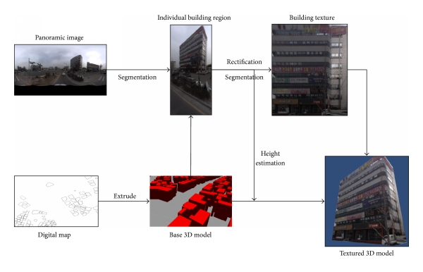
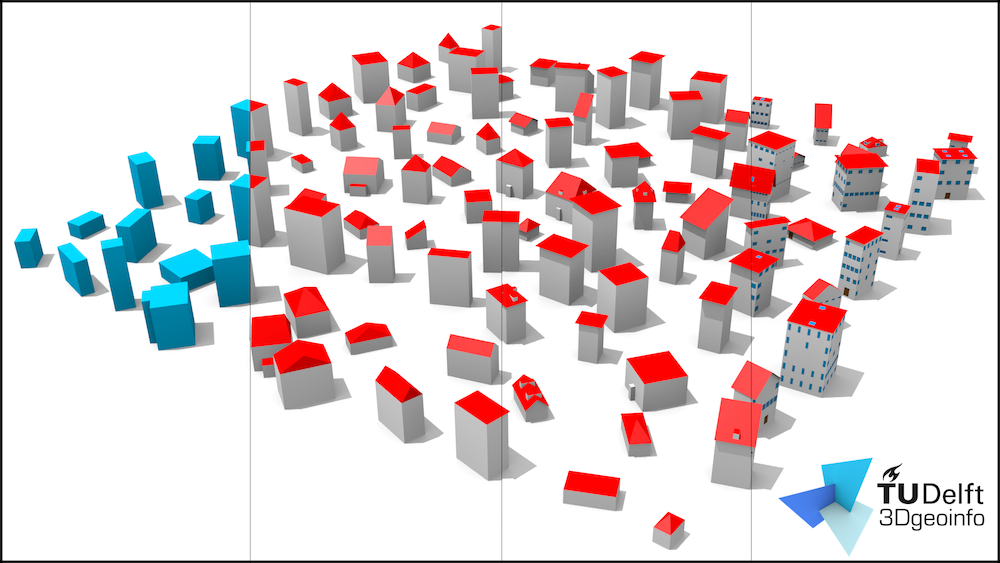
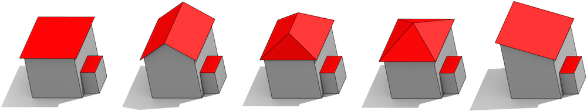

/*
Title: Procedural Modelling
Decription: Procedural Modelling
Author: Bhaskar Mangal
Date: 
Tags: Procedural Modeling
*/

#City Level 3D Modeling

**keywords**
* Procedural Modeling
* Generative Modelling
* Generative Modelling Language (GML)
* Procedural content generation (PCG)
* Procedural City Modelling

**Potential usage:**
- dynamic cities containing events and traffic flows!

**Example - WebGL**
* http://jeromeetienne.github.io/threex.proceduralcity/examples/demo.html

**Pixel City**

@[Alt Pixel City](https://www.youtube.com/watch?v=-d2-PtK4F6Y)

* Tutorial on Pixel City Creation - **Automatic 3D city modeling**
- http://www.geeks3d.com/20090615/pixel-city-procedurally-generated-city-in-opengl/

@[Alt Automatic 3D city modeling](https://www.youtube.com/watch?v=mSp4Jhq67vM)

**How to Create a City in Blender**

@[ Alt How to Create a City in Blender](https://www.youtube.com/watch?v=XCEN0qQOsIA)

## [Mobile Mapping System to 3D Model](383270.pdf)
**High Level Workflow**

## City Engine
[ppt](CityEngine.pdf)
- Rule based procedural modelling

## LoD - Level of Details

## Procedural Modeling

Procedural modeling is an umbrella term for a number of techniques in computer graphics to create 3D models and textures from sets of rules. L-Systems, fractals, and generative modeling are procedural modeling techniques since they apply algorithms for producing scenes.

## Generative Modelling
- Generative Modelling Language (GML) in computer graphics and generative computer programming is a very simple programming language for the concise description of complex 3D shapes.
- generative models are models described by mathematical functions and operators arranged in a hierarchy. What distinguishes it is the set of operators that are available.
- To this end, generative modeling offers a mathematically closed set of operators made up of the standard hierarchical operations for rigid objects (push, pop, rotate, translate, name object, etc.), constructive solid geometry operations (intersection, union, subtraction), and operators for creating time-dependent surfaces and other shapes (such as sweep operators, differentiation, integration, inverse functions, constraint solution, constrained minimization).
**References**
* https://publikationsserver.tu-braunschweig.de/receive/dbbs_mods_00000008
* http://www.gg.caltech.edu/genmod/gen_mod_page.html

## Procedural content generation (PCG)
- http://pcg.wikidot.com/
PCG is the programmatic generation of game content using a random or pseudo-random process that results in an unpredictable range of possible game play spaces.

## Procedural City Modelling
* [Automatic 3D City Modeling Using a Digital Map and Panoramic Images from a Mobile Mapping System](https://www.hindawi.com/journals/mpe/2014/383270/)
* [Facade](https://en.wikipedia.org/wiki/Facade_pattern)
* [urban-procedural-modeling](https://www.cs.purdue.edu/cgvlab/urban/urban-procedural-modeling.html)
* https://varcity.ethz.ch/

## Rendering Engines
Renderers would be things like:
* LuxRender
* Indigo
* Maxwell
* Octane

## Tutorials
* https://en.wikipedia.org/wiki/Procedural_modeling
* https://en.wikipedia.org/wiki/L-system
* https://en.wikipedia.org/wiki/Fractal
* https://en.wikipedia.org/wiki/Generative_Modelling_Language
* http://www.generative-modeling.org/
* http://www.techdrivein.com/2011/08/5-open-source-3d-modelling-rendering.html
* http://www.makehuman.org/download.php
* http://www.k-3d.org/
* http://www.k-3d.org/wiki/Debian_Packages
* https://www.blenderguru.com/articles/render-engine-comparison-cycles-vs-giants
* https://www.blender.org/download/external-renderers/
* http://blender90.com/tools-resources/best-3d-render-engines-blender-2017/
* http://b-processor.dk/
* https://www.freecadweb.org/
* http://www.wings3d.com/
* https://stackoverflow.com/questions/155069/how-does-one-get-started-with-procedural-generation
* https://www.shadertoy.com/
* http://pcg.wikidot.com/
* https://apps.ubuntu.com/cat/department/3d/
* https://www.freecadweb.org/wiki/Download
* http://alternativeto.net/software/citycad/
* https://gis.stackexchange.com/questions/58133/seeking-open-source-software-similiar-to-esri-city-engine
* https://www.citygml.org/
* http://www.virtualcitysystems.de/en/products/buildingreconstruction
* http://www.skylineswiki.com/Beginner%27s_guide
* http://arc-team-open-research.blogspot.in/2012/12/virtual-terrain-project.html
**DEM**
* http://www.journalijar.com/uploads/381_IJAR-11104.pdf
* http://stereofx.org/terrain.html
* http://www.archeos.eu/

