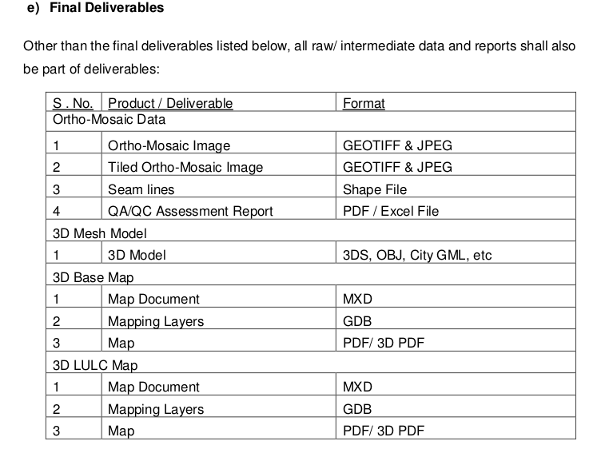
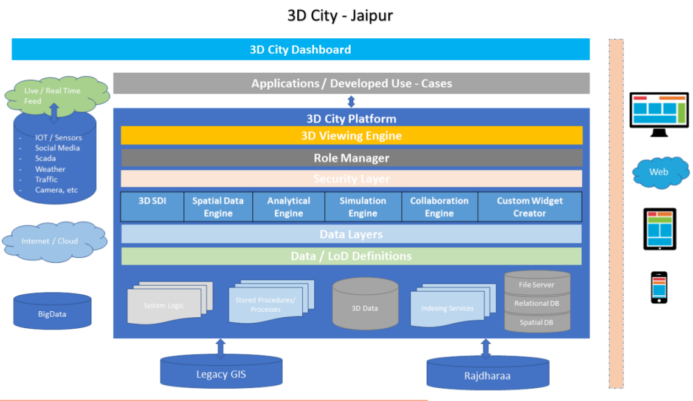

**Table of Contents**
* TOC
{:toc}

## Smart Cities

## 3D Map Design Principles for Urban City

Classic 2D map design
- parameters and the process itself are well known
- standardized for a long time

3D map design
- process dealing with a creation of 3D maps
- standardization is still ongoing and in development

Aim:
- Outline the already deployed principles in the 3D map’s creation process
- elaborates a workflow of such a process with certain cartographic and other variables.

The 3D Map creation comes from:
* the concept phase
* through modeling stage
* follows by symbolization step
* the final visualization

The process contains:

- data preparation
  - steps from concept to visualization
- definition of cartographic aspects
  - which are divided into the variables together with their definition and design
- derivation of cartographic principles for a design of 3D maps

## Challanges
- technical issues of a visualization of 3D data

**Smart Cities**

Ministry of Urban Development (MoUD)

opendata.arcgis.com
https://en.wikipedia.org/wiki/Lavasa

http://giftgujarat.in/
https://en.wikipedia.org/wiki/Gujarat_International_Finance_Tec-City

a planner can see how a building casts shadows on its surroundings. This can be used to decide where best to plant trees to mitigate heat in the area.

There are challenges that the agency is dealing with in using such a detailed system. Image gathering is one issue. Although advanced techniques like satellite imagery and remote sensing with laser are useful for gathering data on terrain, more intensive modelling techniques have to be used for creating high quality models of the buildings. “For planning we want a very realistic view. For that kind of an experience, we need to do a lot of ground survey and take photographs, so we need to have a team of highly trained people to do that,” Quek said.

While governments have been using digital 2D maps to plan services for  a number of years now, perhaps it is time to consider if an investment in 3D maps could bring higher returns.

The OGC leads the development of geospatial interoperability standards. Esri is a long-standing, active OGC participant, helping GIS users to seamlessly work together.

ArcGIS 10.3 release is now certified as Open Geospatial Consortium, Inc. (OGC), compliant
continued commitment to standards-based interoperability.

## ‘3D City’ of Jaipur
The developed solution is intended to enable various state line departments to:
- create, visualize, simulate, plan and execute in a complete 3D GIS environment the following items:
  - large scale infrastructure development
  - transportation planning
  - cadastral and land planning
  - town planning
  - modelling
  - impact assessments
- This system will help the city administration to see the city in a holistic view
- All concerned city development departments can work in unison
- The 3D City would also enable a mechanism for impact assessment based on decisions taken by the city administrators with ability to showcase changes in real time with simulation & realistic visualization
- This deployed solution shall be part of RajDharaa, an unified state wide GIS enabled Decision Support System
- 3D visual representation of the city and also allow the administration and department stakeholders to plan, simulate, visualize & monitor various city development initiatives and decision making

### Available Infrastructure

i. Rajasthan State Data Centre (RSDC) for Storage, Staging & Production
environment.
ii. BigData/ Hadoop environment.

RISL/ DoIT&C have deployed the following platform for creation, publishing, viewing & monitoring of GIS & Modelling related services.
i. Esri’s ArcGIS Platform for creation, publishing and viewing of GIS related services
ii. Intergraph Software Platform for Image Processing & Hosting. [http://hexagon.com/](http://hexagon.com/)
iii. Autodesk Infrastructure Design Suite Ultimate for creation, publishing and viewing Point Cloud data, 3D Models and related services.
iv. GeoCortex for GIS based workflow for works monitoring.

**RajDharaa**
The Primary objective of establishing RajDharaa is to design & develop a state-wide web based Geo Portal to acquire, process, store, distribute and improve the utilization of geospatial data and develop Data Clearing House, which would be a gateway of spatial data being generated by various agencies of the Government of Rajasthan. The proposed system would consist of policies, framework, hardware, Software, application, data, modelling and methods that deals with spatially referenced and geographically tagged / linked data / information as well as non-spatial  data for creating multi-dimensional decision support system.

**Projection System being used in RajDharaa:**
- WGS-84 Datum
- Horizontal Datum: UTM-43 North
- Vertical Datum: MSL

### SCOPE OF WORK, DELIVERABLES & TIMELINES
**Integrated Project Management Application**
- http://www.cmmiconsultantblog.com/cmmi-faqs/what-is-integrated-project-management-ipm-under-cmmi-maturity-level-3/
- https://www.pmi.org/learning/library/integrated-project-management-organization-6443
- resource requirements and other management documents such as Precedence diagrams, Resource histograms, Gantt charts, Work Breakdown Structure (WBS), Project lifecycle.

#### Scope of Work
- RISL intends to establish a ‘GIS based enterprise 3D Platform’ here in after referred as ‘3D City’ for Jaipur.
- The related services will include:
  * data acquisition of
    - Aerial Imagery
    - LiDAR scanning
  * generation of realistic scale-to-fit 3D Models
  * installation & configuration of 3D City platform
  * unified dashboard
  * other services
  * also required to develop specified use-cases

**Integration**
- Integration may take place through any standard or suggested IT methodology such as direct connection, web services, API’s, etc. the bidder has to be prepared for all integration related challenges.
- All the software/ application/ solution to be installed should be integrated with Single Sign On (SSO) since beginning
- The selected bidder may use other third party applications/ plugins/ platform(s) to deploy 3D City solution at RISL/ DoIT&C. However, in this case, the selected bidder shall establish the required third party applications/ plugins/ platform(s) in RISL / DoIT&C.
- The 3D City platform shall also be integrated with other GIS applications developed under Rajdharaa with ability to consume services from various state & centre level projects / programs.
- The suggested 3D City platform shall be **OGC complaint** and consume data / services from heterogeneous platform / products.
- The 3D City platform shall also **leverage BigData/ Hadoop environment** available at RSDC to cater large heterogeneous & complex data.

**Deployment**
- install the platform both in the staging and production environment
- integration of the 3D City platform with the existing department applications

#### Identified Area / Area of Interest (AoI)
- Jaipur District has an approx. area of over 11,000 Sq. Km
- Out of this, an area of approximately 3,000 Sq. Km. has been identified for Jaipur Region Master Plan Development – 2025

#### Project Lifecycle
**Project Initiation**
-P roject Plan presentation
  o Resource Deployment Schedule
  o Equipment Details
- Permission / Approvals
- Project Management tool installation & training
- Initiation of Establishment of On-Site Processing/
- Hosting environment
- Project Kick-Off

**Reconnaissance Survey**
- Installation of 3D City Platform for viewing relevant data & initiation of Integration with other departmental applications
- Ground/ Field Survey
- Feasibility Study of available data
- Aerial/ Drone/ LiDAR evaluation with Pilot
- Submission of Survey Report & Presentation
- Approval of Survey Report

**Final Project Plan**
- Approach & Methodology Finalization
- Submission of Final Project Plan including
  o Amended Equipment Details
  o Amended / Final Resource Deployment Schedule

**Ground Control Network**
- GCP Establishment in integration with existing GCP network

**Data Acquisition**
- Aerial Photography + Airborne LiDAR
- Mobile LiDAR + Photo
- Data Cleansing, referencing, Mosaicking & QC

**3D City Model**
- Generation of DEM (DSM / DTM)
- Ortho-Mosaic, 3D Mesh Model
- 3D Base Map. 3D LULC Map
- Multiple LoD Models upto LoD 2.5

**3D City Platform**
- Deployment of DEM, Mesh Model, 3D Base Map, 3D-SDI, & 3D Models of multiple LoDs
- Evaluation of 3D City Platform, its features & Specification
- Go-Live of 3D City Platform with LoD 2.5 City Model

**Integration with existing 2D Data**
- Integration with 2D Data of Rajdharaa
- Evaluation of integrated data and approval
- Initiation of development of higher LoD Models

**Development of Identified Use-Cases: Phase-1**
- Development of Use-Cases
  o Urban Planning & Development
  o Emergency / Disaster Management
  o Infrastructure Asset Management
  o Utilities Mapping
- Evaluation of Use-cases, UAT & Go-Live

**Go-Live of Jaipur 3D City**
- Deployment of higher LoD Models
- Integration/ deployment of existing 3D Models of Heritage monuments
- Evaluation, UAT & Go-Live

**Development of Identified Use-Cases: Phase-2**
- Development of Use-Cases
  o Service Delivery Management
  o Planning & Simulation of Public Order, Safety, Law & Security Arrangements
  o Noise Emission Analysis
  o Traffic Management / Navigation Systems & Route Finding
  o Project Monitoring
  o Social Media Analytics

**Operation & Maintenance**
- Performance reports (Monthly / Quarterly / Annually)
- Platform/ System/ Data Updation on timely manner
- Development of custom use-cases

http://www.tandfonline.com/doi/full/10.1080/10095020.2016.1212517

we propose a registration method of the SfM mesh and the MLS point cloud for constructing the high-quality 3D urban model 
 Moving Least Squares (MLS) surface reconstruction method 

Aerial imagery shall be used for defining the geometry and photorealistic facades of cityscape including all sides of buildings and rooflines whereas the Airborne LiDAR shall be used to improve accuracy as well as for generating high precision DEM.

The Aerial Imagery shall also be supplemented with street level imagery as and when required.

the selected bidder is required to capture Oblique & Nadir imagery along with Airborne LiDAR (Nadir) data.

required to generate Digital Elevation Model (DEM including DSM & DTM).
generate the DEM using LiDAR data

**The extension / formats for the final DEM data shall be as per below:**

Product / Deliverable - Format
DTM - GEOTIFF & ASCIII format
DSM - GEOTIFF & ASCIII format
Breakline Data - Shape File
Contour - Shape File

**Generation of Intermediate Products**
* generate True-Ortho Mosaic

Since, Ortho photos are geometrically corrected, the same can be used as map layers or for layer mapping.
Ortho Mosaic shall be generated using the below inputs:
i. Digital imagery (raw High Resolution Images) received from multiple sources;
ii. Digital elevation model (DEM)
iii. Exterior orientation parameters from aerial triangulation or IMU

* 3D Mesh Model

create a 3D Mesh Model from the freshly acquired data. The specifications/ features of same shall be:
i. Shall be geo-referenced with the available GCN.
ii. Shall be seamless in nature.
iii. Shall depict all visible structure, asset, road, vegetation, etc.
iv. Shall be corrected to the values derived from DSM.

* 3D Base Map

required 3D Base Map shall be used as a map layer providing the functionality to enhance rendering performance of the 3D City Platform

The specifications of same shall be as under:
i. 3D Base Map shall be created on 1:400 scale.
ii. It shall have basic representation of mapping like North Arrow, Grid, Scale bar.
iii. Below layers shall be covered in creation of 3D Base Map and depicted by 3D
realistic texture:
 Transport Layers (Rail, Road, Metro, etc)
 Road shall be further classified in National highway, State highway, Major
roads, streets, etc.

Road, divider and footpath information shall be captured and depicted in
3D in actual shape and size
iv.
 Water Bodies (Lake, Pond, River, Canal, Reservoir, Water tanks)
 Important Landmarks
 Forest/Golf Course, etc.
All features shall be labelled properly and labels shall not be overlapped

* 3D LULC Map

The selected bidder shall create a 3D representation of the existing Land Use Land Cover (LULC). Specifications of same shall be as under:
i. 3D LULC Map shall be created on 1:400 scale
ii. It shall have basic representation of mapping like North Arrow, Grid, Scale bar.
iii. All existing layers of 2D LULC shall be covered in creation of 3D LULC Map.
However, refinement of layers may be taken-up on the basis of visual
representation.
iv. All features shall be labelled and shall not overlap.
v. Every layer shall be represented by 3D realistic texture.

**LoD**
- CityGML with modifications

* 3D City Models

develop a mix of Design (used in AEC Industry) and Real World (used in GIS Industry) models. Considering the use-cases to be developed and the utilization of the larger eco-system a BIM/ IFC model shall also be supported by the platform and solution.
* Features/ Specifications of the 3D City Model
* Models up to LoD 4 shall be optimised for visualisation over desktop / web / cloud / mobile
* Various Models Layers as per defined LoD - 3DS, City GML, Collada, OBJ, etc
* entire city in a virtual environment on a single unified system over the web.

Components of 3D City Platform
The larger components of the 3D City Platform are as per below:
a) 3D City Viewer
b) 3D City Analytical Engine
c) 3D Spatial Data Engine
d) 3D SDI
e) 3D Simulation Engine
f) 3D Collaboration Engine
g) 3D Spatial Database
h) Custom Widget Creator

### Specific Uses Cases: Page# 46

### Accuracy Specification: Page# 56

* **Absolute Accuracy - (@ 95% confidence level)**
  - Horizontal Accuracy
    3D Model: 25 cm
  - Vertical Accuracy
    3D Model: 20 cm
* **Relative Accuracy - (@ 95% confidence level)**
  - Horizontal Accuracy
  - Vertical Accuracy
* **Desired Quality / Resolution**

## 3D Standards
* http://www.web3d.org/
* http://www.web3d.org/standards

## 3D City Models
* https://en.wikipedia.org/wiki/3D_city_models

### Storage of 3D City Models
To store 3D city models, both file-based and database approaches are used. There is no single, unique representation schema due to the heterogeneity and diversity of 3d city model contents. 

Encoding of Components

### Construction of 3D City Models

**Level of Detail**
3D city models are typically constructed at various levels of detail (LOD) to provide notions of multiple resolutions and at different levels of abstraction.

For example, CityGML defines five LODs for building models:

LOD 0: 2.5D footprints
LOD 1: Buildings represented by block models (usually extruded footprints)
LOD 2: Building models with standard roof structures
LOD 3: Detailed (architectural) building models
LOD 4: LOD 3 building models supplemented with interior features.

Level of Detail description
LOD0 is the most basic mode used for landscape applications.

LOD1 is a common massing or block model of buildings with flat roof structures. It shows a 2D outline of the building with min, max or average height above 0 or DTM.

LOD2 is non-textured with differentiated roof structures, pitched roofs, no awnings of furniture. LOD2 is used for city areas and projects.

LOD3 is still non textured architectural models but comprise detailed wall and roof structures, possibly with doors, windows and bridges, etc. Sometimes contains facade detail. 

LOD4 is highly detailed interior structures and exterior for buildings.  LOD4 includes rooms, interior doors, stairs, and furniture.

LOD 1  block model
LOD 2 coarse exterior
LOD 3 fine exterior
LOD 4 interior
https://www.youtube.com/watch?v=3HNjU5pT5Ck

* https://en.wikipedia.org/wiki/Level_of_detail
In computer graphics, accounting for Level of detail[1][2][3] involves decreasing the complexity of a 3D model representation as it moves away from the viewer or according to other metrics such as object importance, viewpoint-relative speed or position.

Level of detail techniques increase the efficiency of rendering by decreasing the workload on graphics pipeline stages, usually vertex transformations. The reduced visual quality of the model is often unnoticed because of the small effect on object appearance when distant or moving fast.

algorithms 
* Continuous LOD (CLOD)
- The given "mesh" function is then continuously evaluated and an optimized version is produced according to a tradeoff between visual quality and performance.
* discrete LOD (DLOD) 
- is to provide various models to represent the same object. 

* Geomipmapping
https://en.wikipedia.org/wiki/Geomipmapping
Geomipmapping or geometrical mipmapping is a real-time block-based terrain rendering algorithm

http://vterrain.org/Packages/NonCom/

http://www.zephyrosanemos.com/
http://www.zephyrosanemos.com/windstorm/current/live-demo.html

Trigger Rally

GIS Geomipmapping
https://en.wikipedia.org/wiki/Terrain_rendering

## WebGL
* http://learningwebgl.com/blog/?p=5530
* http://learningthreejs.com/blog/2013/04/30/closing-the-gap-between-html-and-webgl/

## Level of detail in GIS and 3D city modelling[edit]

LOD is found in GIS and 3D city models as a similar concept. It indicates how thoroughly real-world features have been mapped and how much the model adheres to its real-world counterpart

Besides the geometric complexity
other metrics such as spatio-semantic coherence
resolution of the texture
attributes can be considered in the LOD of a model.

The analogy of "LOD-ing" in GIS is referred as generalization.

•
CityGML LODs are an industry standard for conveying the grade of 3D city models.
•
The 5 LODs are not defined precisely, and they are not sufficient for this purpose.
•
We present a refined series of 16 LODs that overcomes these issues.

http://www.sciencedirect.com/science/article/pii/S0198971516300436?via%3Dihub

Cartographic generalization, or map generalization, is a method for deriving a smaller-scale map from a larger scale map or map data

https://en.wikipedia.org/wiki/Digital_elevation_model
There is no universal usage of the terms digital elevation model (DEM), digital terrain model (DTM) and digital surface model (DSM) in scientific literature. In most cases the term digital surface model represents the earth's surface and includes all objects on it. In contrast to a DSM, the digital terrain model (DTM) represents the bare ground surface without any objects like plants and buildings (see the figure on the right)

DEM is often used as a generic term for DSMs and DTMs,[3] only representing height information without any further definition about the surface.[4] Other definitions equalise the terms DEM and DTM,[5] or define the DEM as a subset of the DTM, which also represents other morphological elements.[ 

DTM as a three-dimensional model (TIN)

https://en.wikipedia.org/wiki/Triangulated_irregular_network
A triangulated irregular network (TIN) is a digital data structure used in a geographic information system (GIS) for the representation of a surface. A TIN is a vector-based representation of the physical land surface or sea bottom, made up of irregularly distributed nodes and lines with three-dimensional coordinates (x, y, and z) that are arranged in a network of nonoverlapping triangles.

A DEM can be represented as a raster (a grid of squares, also known as a heightmap when representing elevation) or as a vector-based triangular irregular network (TIN).

While a DSM may be useful for landscape modeling, city modeling and visualization applications, a DTM is often required for flood or drainage modeling, land-use studies,[10] geological applications, and other applications.[11]

https://en.wikipedia.org/wiki/Digital_elevation_model

https://en.wikipedia.org/wiki/Building_information_modeling

Building information modeling (BIM) is a process involving the generation and management of digital representations of physical and functional characteristics of places. Building information models (BIMs) are files (often but not always in proprietary formats and containing proprietary data) which can be extracted, exchanged or networked to support decision-making regarding a building or other built asset. Current BIM software is used by individuals, businesses and government agencies who plan, design, construct, operate and maintain diverse physical infrastructures, such as water, refuse, electricity, gas, communication utilities, roads, bridges, ports, tunnels, etc.

https://en.wikipedia.org/wiki/Cadastre

http://www.virtualcitysystems.de/en/products/buildingreconstruction
http://www.virtualcitysystems.de/en/references#projects

One key challenge is to find building parts with their corresponding roof geometry. "Since fully automatic image understanding is very hard to solve, semi-automatic components are usually required to at least support the recognition of very complex buildings by a human operator."

Statistical approaches are common for roof reconstruction based on airborne laser scanning point clouds

Fully automated processes exist to generate LOD1 and LOD2 building models for large regions. For example, the Bavarian Office for Surveying and Spatial Information is responsible for about 8 million building models at LOD1 and LOD2

Visualization of 3D City Models
The visualization of 3D city models represents a core functionality required for interactive applications and systems based on 3D city models.

Examples of specialized real-time 3D rendering include:

Real-time 3D rendering of road networks on high resolution terrain models.[15]
Real-time 3D rendering of water surfaces with cartography-oriented design.[16]
Real-time 3D rendering of day and night sky phenomena.[17]
Real-time 3D rendering of grid-based terrain models.[18]
Real-time 3D rendering using different levels of abstraction, ranging between 2D map views and 3D views.[19]
Real-time 3D rendering of multiperspective views on 3D city models.[20][21

https://www.youtube.com/watch?v=OxJ2yuz9Qg4

[Creating a Smart 3D City Model from Start to Finish]
https://www.youtube.com/watch?v=MxT39BK1_iU
Real-Time Rendering of 3D City Models[edit]

[Multiperspective Views for Maps](https://www.youtube.com/watch?v=bT01QsZMYDE)

LoA - Level Of Abstractions

## IoT Sensor Data for Smart Cities

### Air Pollution
API:
https://airvisual.com/earth
https://www.airvisual.com/india/karnataka/bengaluru/saneguravahalli-kspcb

http://www.sciencemag.org/news/2016/11/watch-air-pollution-flow-across-planet-real-time
aqicn.org/map/india/
https://socialcops.com/
http://aqicn.org/map/india/#@g/19.5446/81.0571/5z
http://aqicn.org/city/india/bangalore/bwssb/
http://aqicn.org/city/india/bangalore/city-railway-station/

http://www.inear.se/tag/webgl/
http://bkcore.com/blog/3d/webgl-three-js-volumetric-light-godrays.html

**smoke**
https://codepen.io/teolitto/full/KwOVvL/
https://gamedevelopment.tutsplus.com/tutorials/how-to-write-a-smoke-shader--cms-25587

**heat distortion effect**
https://tympanus.net/codrops/2016/05/03/animated-heat-distortion-effects-webgl/

# Elevation Data
https://mapzen.com/documentation/elevation/elevation-service/#data-sources-and-known-issues

# Markdown, Static site generator
http://www.mkdocs.org/

# WebGL
https://solutiondesign.com/blog/-/blogs/webgl-and-three-js-texture-mappi-1

## Fonts in GPU
http://wdobbie.com/post/gpu-text-rendering-with-vector-textures/
https://developer.nvidia.com/gpugems/GPUGems3/gpugems3_ch25.html

https://medium.com/@evanwallace/easy-scalable-text-rendering-on-the-gpu-c3f4d782c5ac

https://blog.mapbox.com/improving-arabic-and-hebrew-text-in-map-labels-fd184cf5ebd1

https://github.com/mapbox/mapbox-gl-rtl-text

https://msdn.microsoft.com/en-us/library/windows/desktop/dd371554(v=vs.85).aspx
sluglibrary.com

https://aras-p.info/blog/2017/02/15/Font-Rendering-is-Getting-Interesting/

https://mapzen.com/blog/languages-of-india/
https://mapzen.com/blog/curved-labels/

https://www.npmjs.com/package/vectorize-text

### Pointers
Definitely, there's a problem links below would give you pointers on some possibilities, though there exist no cookie-cut solution here.

Couple of abstract thoughts:
- Covert text labels to text vectors vectorize text can be rendered in scale independent manner in WebGL
- Render on the 2D canvas and then use it

-> check out the mapzen techniques on curved labeling and Indian languages support

Must Reads:
https://mapzen.com/blog/languages-of-india/
https://mapzen.com/blog/curved-labels/

Few pointers:
https://aras-p.info/blog/2017/02/15/Font-Rendering-is-Getting-Interesting/
https://github.com/ds-hwang/wiki/wiki/GPU-Font-Rendering
https://blog.mapbox.com/improving-arabic-and-hebrew-text-in-map-labels-fd184cf5ebd1
http://wdobbie.com/post/gpu-text-rendering-with-vector-textures/
https://www.npmjs.com/package/vectorize-text

# 3D Maps

“A 3D map is determined as a digital, mathematical defined, three-dimensional virtual representation of the
Earth, surfaces, objects and phenomena in nature and society. Represented objects and phenomena are
classified, designed and visualized according to a particular purpose”, Bandrova (2001);

Looking at the above mentioned definitions, 3D maps are a special type of maps, portraying 3D data. Usual approach
of such a portrayal consists of showing:
A sphere as a reference surface for draping imagery or vector data in small scales;
Terrain (generalized) as a reference surface for draping, while zooming in medium scale;
Detailed terrain, draped 2D geodata, 3D features.

References
https://cartography-gis.com/docsbca/iccgis2016/ICCGIS2016-31.pdf
https://3d.bk.tudelft.nl/biljecki/Random3Dcity.html
http://www.opengeospatial.org/pressroom/pressreleases/2639

## Temperature sensor data
https://blog.ndustrial.io/temperature-gradient-maps-with-mapbox-gl-9f97fb44d5f2

## Refer: [Geospatial Visualizations in Web](data-visualization-in-web.md)
> This provides the tools, technologies for Geospatial Visualizations in Web

https://en.wikipedia.org/wiki/MATSim
http://www.matsim.org/about-matsim

## Weather Data
https://www.youtube.com/watch?v=jNKYlt6XhR8
https://github.com/IBMStreams/streamsx.weather

**IBM Weather API**
https://console.bluemix.net/catalog/
https://console.bluemix.net/docs/services/InsightsWeather/weather_tutorials_samples.html#tutorials_samples
https://console.bluemix.net/docs/services/InsightsWeather/weather_rest_apis.html#rest_apis

https://twcservice.au-syd.mybluemix.net/rest-api-deprecated/#!/twc_observations_timeseries/v2obstimes

[sample data is provided from this API]
https://twcservice.au-syd.mybluemix.net/rest-api-deprecated/#!/twc_forecast_hourly/v2fcsthourly24

The time-series weather observations data provides information about temperature, precipitation, wind, barometric pressure, visibility, ultraviolet (UV) radiation, and other related observation elements, including observation station, observation date/time, weather icon codes and phrases. The difference between time-series observations and current observations is the time period of the observation, which results in one or more observation data sets.

https://www.ibm.com/blogs/bluemix/2015/03/weather-means-business/

## IBM BlueMix Cloud Services
https://console.bluemix.net/docs/
https://console.bluemix.net/docs/services/Weather/weather_tutorials_samples.html#insights_weather_demo

## Streaming Analytics
https://www.ibm.com/blogs/bluemix/2016/06/better-analytics-with-apache-quarks/

## W3c - HTML - Javascript
https://www.w3schools.com/howto/howto_js_toggle_hide_show.asp